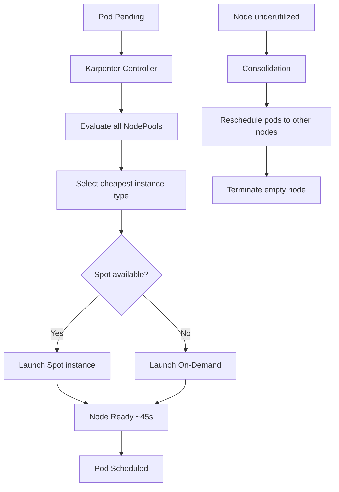

> 💡 **Quick Answer:** Deploy Karpenter for fast, flexible node autoscaling on AWS EKS. Configure NodePools, EC2NodeClasses, consolidation, and GPU provisioning with sub-minute node startup.

## The Problem

The Cluster Autoscaler is limited to predefined node groups with fixed instance types. When you need diverse instance types, fast scaling, and intelligent consolidation, Karpenter is the modern replacement — it provisions the right node for the workload in under 60 seconds.

## The Solution

### Install Karpenter

```bash
export KARPENTER_VERSION="1.1.0"
export CLUSTER_NAME="my-cluster"

# Install with Helm
helm upgrade --install karpenter oci://public.ecr.aws/karpenter/karpenter \
  --version "$KARPENTER_VERSION" \
  --namespace kube-system \
  --set "settings.clusterName=$CLUSTER_NAME" \
  --set "settings.interruptionQueue=$CLUSTER_NAME" \
  --set controller.resources.requests.cpu=1 \
  --set controller.resources.requests.memory=1Gi \
  --set controller.resources.limits.cpu=1 \
  --set controller.resources.limits.memory=1Gi \
  --wait
```

### NodePool and EC2NodeClass

```yaml
apiVersion: karpenter.sh/v1
kind: NodePool
metadata:
  name: general
spec:
  template:
    metadata:
      labels:
        workload-type: general
    spec:
      requirements:
        - key: kubernetes.io/arch
          operator: In
          values: ["amd64"]
        - key: karpenter.sh/capacity-type
          operator: In
          values: ["spot", "on-demand"]       # Prefer spot
        - key: karpenter.k8s.aws/instance-category
          operator: In
          values: ["m", "c", "r"]             # General, Compute, Memory
        - key: karpenter.k8s.aws/instance-generation
          operator: Gt
          values: ["5"]                        # Only gen 6+
        - key: karpenter.k8s.aws/instance-size
          operator: In
          values: ["xlarge", "2xlarge", "4xlarge"]
      nodeClassRef:
        group: karpenter.k8s.aws
        kind: EC2NodeClass
        name: default
  limits:
    cpu: "1000"
    memory: 4000Gi
  disruption:
    consolidationPolicy: WhenEmptyOrUnderutilized
    consolidateAfter: 1m
---
apiVersion: karpenter.k8s.aws/v1
kind: EC2NodeClass
metadata:
  name: default
spec:
  amiSelectorTerms:
    - alias: al2023@latest
  subnetSelectorTerms:
    - tags:
        karpenter.sh/discovery: my-cluster
  securityGroupSelectorTerms:
    - tags:
        karpenter.sh/discovery: my-cluster
  instanceStorePolicy: RAID0
  blockDeviceMappings:
    - deviceName: /dev/xvda
      ebs:
        volumeSize: 100Gi
        volumeType: gp3
        iops: 10000
        throughput: 250
        encrypted: true
```

### GPU NodePool

```yaml
apiVersion: karpenter.sh/v1
kind: NodePool
metadata:
  name: gpu
spec:
  template:
    metadata:
      labels:
        workload-type: gpu
    spec:
      requirements:
        - key: karpenter.k8s.aws/instance-category
          operator: In
          values: ["g", "p"]                  # GPU instances
        - key: karpenter.k8s.aws/instance-gpu-count
          operator: Gt
          values: ["0"]
        - key: karpenter.sh/capacity-type
          operator: In
          values: ["spot", "on-demand"]
      taints:
        - key: nvidia.com/gpu
          value: "true"
          effect: NoSchedule
      nodeClassRef:
        group: karpenter.k8s.aws
        kind: EC2NodeClass
        name: gpu
  limits:
    nvidia.com/gpu: "32"
  disruption:
    consolidationPolicy: WhenEmpty           # Don't disrupt running GPU workloads
    consolidateAfter: 5m
---
apiVersion: karpenter.k8s.aws/v1
kind: EC2NodeClass
metadata:
  name: gpu
spec:
  amiSelectorTerms:
    - alias: al2023@latest
  subnetSelectorTerms:
    - tags:
        karpenter.sh/discovery: my-cluster
  securityGroupSelectorTerms:
    - tags:
        karpenter.sh/discovery: my-cluster
  blockDeviceMappings:
    - deviceName: /dev/xvda
      ebs:
        volumeSize: 200Gi
        volumeType: gp3
        iops: 16000
        throughput: 500
        encrypted: true
```

### Consolidation Strategies

```yaml
# Aggressive consolidation — dev/test environments
disruption:
  consolidationPolicy: WhenEmptyOrUnderutilized
  consolidateAfter: 30s         # Fast consolidation

# Conservative — production
disruption:
  consolidationPolicy: WhenEmpty  # Only remove fully empty nodes
  consolidateAfter: 10m          # Wait 10 minutes

# Block disruption for critical workloads
# Add to your pods:
# karpenter.sh/do-not-disrupt: "true"
```

### Weighted NodePools (Cost Priority)

```yaml
# Karpenter picks the cheapest option automatically
# Use weight to prefer certain NodePools
apiVersion: karpenter.sh/v1
kind: NodePool
metadata:
  name: spot-preferred
spec:
  weight: 100                    # Higher weight = preferred
  template:
    spec:
      requirements:
        - key: karpenter.sh/capacity-type
          operator: In
          values: ["spot"]
---
apiVersion: karpenter.sh/v1
kind: NodePool
metadata:
  name: ondemand-fallback
spec:
  weight: 10                     # Lower weight = fallback
  template:
    spec:
      requirements:
        - key: karpenter.sh/capacity-type
          operator: In
          values: ["on-demand"]
```

### Monitoring Karpenter

```promql
# Key Karpenter metrics
karpenter_nodes_total                           # Total managed nodes
karpenter_pods_startup_duration_seconds         # Time from pending to running
karpenter_nodepool_usage                        # Resource usage per NodePool
karpenter_nodeclaims_disrupted_total            # Disruption events
karpenter_nodeclaims_created_total              # New nodes launched
karpenter_nodeclaims_terminated_total           # Nodes removed
```



## Common Issues

| Issue | Cause | Fix |
|-------|-------|-----|
| No nodes provisioned | IAM permissions missing | Check Karpenter controller role |
| Spot capacity errors | AZ exhausted | Add more instance types/sizes |
| Nodes not consolidating | PDB or do-not-disrupt annotation | Check pod annotations and PDBs |
| Wrong instance type selected | Requirements too narrow | Broaden instance-category/size |
| GPU nodes stay after job done | consolidateAfter too long | Reduce to 1-5m for GPU pool |

## Best Practices

- **Broaden instance requirements** — let Karpenter pick from dozens of types for best price
- **Use spot with on-demand fallback** via weighted NodePools
- **Separate GPU and CPU NodePools** — different consolidation policies
- **Set limits per NodePool** — prevent runaway scaling
- **Use `consolidationPolicy: WhenEmpty`** for stateful/GPU workloads
- **Monitor pod startup duration** — should be <90s including node launch

## Key Takeaways

- Karpenter provisions the right node for each workload in under 60 seconds
- No predefined node groups — Karpenter evaluates all instance types dynamically
- Consolidation automatically right-sizes your cluster and reduces costs
- Weighted NodePools let you prefer spot over on-demand with automatic fallback
- GPU-specific NodePools with taints ensure GPU nodes only run GPU workloads
