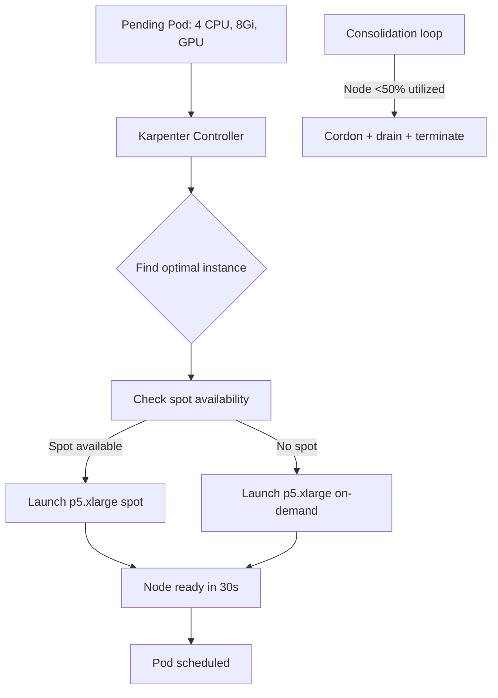

> 💡 **Quick Answer:** Replace Cluster Autoscaler with Karpenter for faster, smarter node provisioning. Right-sized instances, spot fallback, consolidation, and GPU-aware scaling.

## The Problem

Cluster Autoscaler scales node groups — Karpenter provisions individual nodes. It picks the optimal instance type, size, and purchase option (on-demand vs spot) for each pending pod. Nodes launch in seconds, not minutes.

## The Solution

### Step 1: Install Karpenter

```bash
# AWS EKS
export KARPENTER_VERSION="0.37.0"
export CLUSTER_NAME="my-cluster"

helm install karpenter oci://public.ecr.aws/karpenter/karpenter \
  --version "$KARPENTER_VERSION" \
  --namespace kube-system \
  --set "settings.clusterName=$CLUSTER_NAME" \
  --set "settings.interruptionQueue=$CLUSTER_NAME" \
  --set controller.resources.requests.cpu=1 \
  --set controller.resources.requests.memory=1Gi
```

### Step 2: Create NodePool

```yaml
apiVersion: karpenter.sh/v1beta1
kind: NodePool
metadata:
  name: default
spec:
  template:
    spec:
      requirements:
        - key: kubernetes.io/arch
          operator: In
          values: ["amd64", "arm64"]       # Consider ARM for cost savings
        - key: karpenter.sh/capacity-type
          operator: In
          values: ["spot", "on-demand"]    # Prefer spot, fallback to on-demand
        - key: karpenter.k8s.aws/instance-category
          operator: In
          values: ["c", "m", "r"]          # Compute, general, memory optimized
        - key: karpenter.k8s.aws/instance-generation
          operator: Gt
          values: ["5"]                     # Only gen 5+ instances
      nodeClassRef:
        apiVersion: karpenter.k8s.aws/v1beta1
        kind: EC2NodeClass
        name: default
  limits:
    cpu: 1000                               # Max 1000 vCPUs total
    memory: 4000Gi
  disruption:
    consolidationPolicy: WhenUnderutilized  # Auto-consolidate idle nodes
    expireAfter: 720h                       # Replace nodes every 30 days
---
# GPU NodePool — separate pool for GPU workloads
apiVersion: karpenter.sh/v1beta1
kind: NodePool
metadata:
  name: gpu
spec:
  template:
    spec:
      requirements:
        - key: karpenter.k8s.aws/instance-family
          operator: In
          values: ["p4d", "p5", "g5", "g6"]
        - key: karpenter.sh/capacity-type
          operator: In
          values: ["on-demand"]            # GPUs: on-demand only
      taints:
        - key: nvidia.com/gpu
          value: "true"
          effect: NoSchedule
      nodeClassRef:
        apiVersion: karpenter.k8s.aws/v1beta1
        kind: EC2NodeClass
        name: gpu-nodes
  limits:
    nvidia.com/gpu: 32                      # Max 32 GPUs total
```

### Step 3: EC2NodeClass

```yaml
apiVersion: karpenter.k8s.aws/v1beta1
kind: EC2NodeClass
metadata:
  name: default
spec:
  amiFamily: AL2023
  subnetSelectorTerms:
    - tags:
        karpenter.sh/discovery: my-cluster
  securityGroupSelectorTerms:
    - tags:
        karpenter.sh/discovery: my-cluster
  blockDeviceMappings:
    - deviceName: /dev/xvda
      ebs:
        volumeSize: 100Gi
        volumeType: gp3
        encrypted: true
```

### Karpenter vs Cluster Autoscaler

| Feature | Cluster Autoscaler | Karpenter |
|---------|-------------------|-----------|
| Scaling unit | Node group | Individual node |
| Instance selection | Fixed per group | Dynamic per pod |
| Provisioning speed | 2-5 minutes | 30-60 seconds |
| Spot handling | Per node group | Per node with fallback |
| Consolidation | Limited | Built-in |
| GPU awareness | Basic | Advanced |
| Multi-arch | Separate groups | Automatic |



## Best Practices

- **Start small and iterate** — don't over-engineer on day one
- **Monitor and measure** — you can't improve what you don't measure
- **Automate repetitive tasks** — reduce human error and toil
- **Document your decisions** — future you will thank present you

## Key Takeaways

- This is essential knowledge for production Kubernetes operations
- Start with the simplest approach that solves your problem
- Monitor the impact of every change you make
- Share knowledge across your team with internal runbooks
