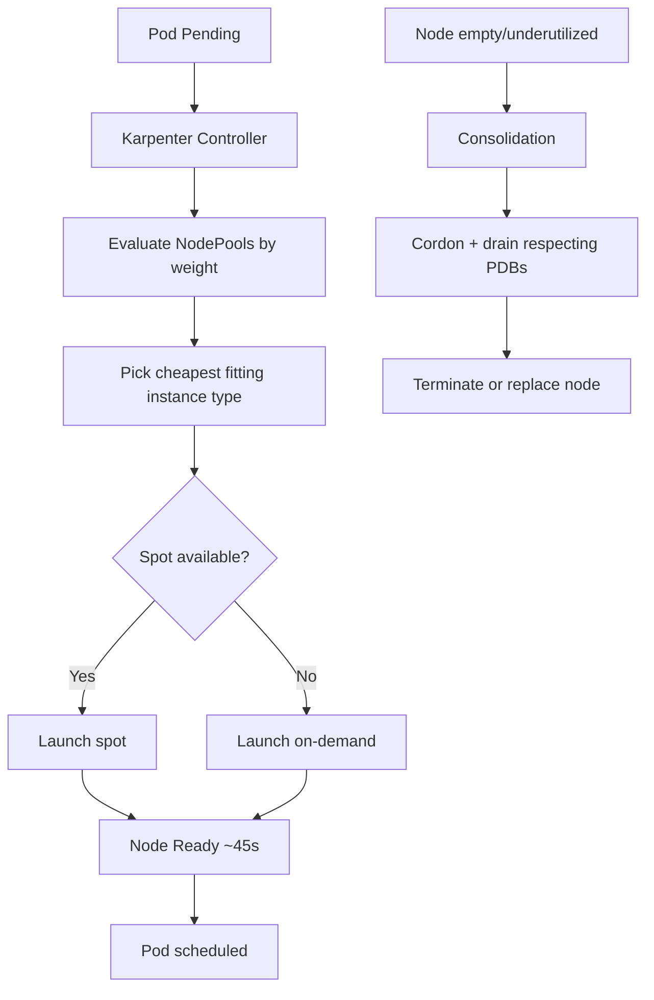

> 💡 **Quick Answer:** Karpenter watches for unschedulable pods and launches a right-sized EC2 instance for them directly (no node groups), typically in under 60 seconds. Install the Helm chart, create an `EC2NodeClass` (AMI, subnets, security groups) and a `NodePool` (allowed instance types, capacity type, limits, disruption policy). Use the `karpenter.sh/v1` / `karpenter.k8s.aws/v1` APIs — `v1beta1` and `consolidationPolicy: WhenUnderutilized` are gone since Karpenter 1.0.
>
> **Gotcha:** Karpenter respects PodDisruptionBudgets and the `karpenter.sh/do-not-disrupt: "true"` pod annotation during consolidation — a misconfigured PDB will stop nodes from ever being removed.

## Karpenter vs Cluster Autoscaler

Cluster Autoscaler scales predefined node groups (ASGs) with fixed instance types. Karpenter provisions individual nodes: it picks the instance type, size, AZ and purchase option (spot vs on-demand) for each batch of pending pods.

| Feature | Cluster Autoscaler | Karpenter |
|---------|-------------------|-----------|
| Scaling unit | Node group (ASG) | Individual node (NodeClaim) |
| Instance selection | Fixed per group | Dynamic per pending pods |
| Provisioning speed | 2-5 minutes | ~30-60 seconds |
| Spot handling | Per node group | Per node, with on-demand fallback |
| Consolidation | Scale-down of empty/underused nodes | Delete *or replace* with cheaper nodes |
| Multi-arch | Separate groups | Automatic (amd64 + arm64 in one pool) |
| Clouds | Most clouds + on-prem providers | AWS (GA), Azure (AKS NAP), others via providers |

## Install Karpenter

```bash
export KARPENTER_VERSION="1.1.0"
export CLUSTER_NAME="my-cluster"

helm upgrade --install karpenter oci://public.ecr.aws/karpenter/karpenter \
  --version "$KARPENTER_VERSION" \
  --namespace kube-system \
  --set "settings.clusterName=$CLUSTER_NAME" \
  --set "settings.interruptionQueue=$CLUSTER_NAME" \
  --set controller.resources.requests.cpu=1 \
  --set controller.resources.requests.memory=1Gi \
  --set controller.resources.limits.cpu=1 \
  --set controller.resources.limits.memory=1Gi \
  --wait
```

Prerequisites (IAM controller role via IRSA/Pod Identity, node role, SQS interruption queue, `karpenter.sh/discovery` tags on subnets and security groups) are created by the CloudFormation template in the Karpenter getting-started guide. Run the controller on a small managed node group or Fargate, not on nodes it manages.

## NodePool and EC2NodeClass

```yaml
apiVersion: karpenter.sh/v1
kind: NodePool
metadata:
  name: general
spec:
  template:
    metadata:
      labels:
        workload-type: general
    spec:
      requirements:
        - key: kubernetes.io/arch
          operator: In
          values: ["amd64", "arm64"]           # Graviton is usually cheaper
        - key: karpenter.sh/capacity-type
          operator: In
          values: ["spot", "on-demand"]       # Spot preferred when both allowed
        - key: karpenter.k8s.aws/instance-category
          operator: In
          values: ["m", "c", "r"]             # General, compute, memory
        - key: karpenter.k8s.aws/instance-generation
          operator: Gt
          values: ["5"]                        # Gen 6+
        - key: karpenter.k8s.aws/instance-size
          operator: In
          values: ["xlarge", "2xlarge", "4xlarge"]
      nodeClassRef:
        group: karpenter.k8s.aws
        kind: EC2NodeClass
        name: default
      expireAfter: 720h                        # Recycle nodes every 30 days
  limits:
    cpu: "1000"                                # Hard cap for this pool
    memory: 4000Gi
  disruption:
    consolidationPolicy: WhenEmptyOrUnderutilized
    consolidateAfter: 1m
---
apiVersion: karpenter.k8s.aws/v1
kind: EC2NodeClass
metadata:
  name: default
spec:
  role: KarpenterNodeRole-my-cluster
  amiSelectorTerms:
    - alias: al2023@latest                     # Pin a version in production
  subnetSelectorTerms:
    - tags:
        karpenter.sh/discovery: my-cluster
  securityGroupSelectorTerms:
    - tags:
        karpenter.sh/discovery: my-cluster
  instanceStorePolicy: RAID0                   # Use local NVMe for ephemeral storage
  blockDeviceMappings:
    - deviceName: /dev/xvda
      ebs:
        volumeSize: 100Gi
        volumeType: gp3
        iops: 10000
        throughput: 250
        encrypted: true
```

`instanceStorePolicy: RAID0` stripes any instance-store NVMe disks and uses them for kubelet/containerd ephemeral storage, so pods get fast scratch space and the EBS root volume can stay small.

## GPU NodePool

```yaml
apiVersion: karpenter.sh/v1
kind: NodePool
metadata:
  name: gpu
spec:
  template:
    metadata:
      labels:
        workload-type: gpu
    spec:
      requirements:
        - key: karpenter.k8s.aws/instance-family
          operator: In
          values: ["g5", "g6", "p4d", "p5"]
        - key: karpenter.sh/capacity-type
          operator: In
          values: ["on-demand"]               # Training: avoid spot interruptions
      taints:
        - key: nvidia.com/gpu
          value: "true"
          effect: NoSchedule
      nodeClassRef:
        group: karpenter.k8s.aws
        kind: EC2NodeClass
        name: gpu
  limits:
    nvidia.com/gpu: "32"
  disruption:
    consolidationPolicy: WhenEmpty            # Don't disrupt running GPU jobs
    consolidateAfter: 5m
---
apiVersion: karpenter.k8s.aws/v1
kind: EC2NodeClass
metadata:
  name: gpu
spec:
  role: KarpenterNodeRole-my-cluster
  amiSelectorTerms:
    - alias: al2023@latest                     # EKS-optimized accelerated AMI is selected for GPU instances
  subnetSelectorTerms:
    - tags:
        karpenter.sh/discovery: my-cluster
  securityGroupSelectorTerms:
    - tags:
        karpenter.sh/discovery: my-cluster
  blockDeviceMappings:
    - deviceName: /dev/xvda
      ebs:
        volumeSize: 200Gi                      # Model weights + large images
        volumeType: gp3
        iops: 16000
        throughput: 500
        encrypted: true
```

Allow `spot` in the GPU pool only for inference or checkpointed jobs that tolerate a 2-minute interruption notice.

## Consolidation Strategies

```yaml
# Aggressive — dev/test
disruption:
  consolidationPolicy: WhenEmptyOrUnderutilized
  consolidateAfter: 30s

# Conservative — production
disruption:
  consolidationPolicy: WhenEmpty
  consolidateAfter: 10m
  budgets:
    - nodes: "10%"                             # Max 10% of nodes disrupted at once
    - nodes: "0"                               # No voluntary disruption in business hours
      schedule: "0 9 * * mon-fri"
      duration: 8h
```

Protect a single pod from consolidation:

```yaml
metadata:
  annotations:
    karpenter.sh/do-not-disrupt: "true"
```

## Weighted NodePools (Spot First, On-Demand Fallback)

```yaml
apiVersion: karpenter.sh/v1
kind: NodePool
metadata:
  name: spot-preferred
spec:
  weight: 100                    # Higher weight is tried first
  template:
    spec:
      requirements:
        - key: karpenter.sh/capacity-type
          operator: In
          values: ["spot"]
      nodeClassRef:
        group: karpenter.k8s.aws
        kind: EC2NodeClass
        name: default
---
apiVersion: karpenter.sh/v1
kind: NodePool
metadata:
  name: ondemand-fallback
spec:
  weight: 10
  template:
    spec:
      requirements:
        - key: karpenter.sh/capacity-type
          operator: In
          values: ["on-demand"]
      nodeClassRef:
        group: karpenter.k8s.aws
        kind: EC2NodeClass
        name: default
```

## Monitoring

```bash
kubectl get nodepools,nodeclaims
kubectl describe nodeclaim <name>          # Launch errors, capacity issues
kubectl logs -n kube-system -l app.kubernetes.io/name=karpenter -f
```

```promql
karpenter_nodes_total                          # Managed nodes
karpenter_pods_startup_duration_seconds        # Pending -> Running
karpenter_nodepools_usage                      # Resource usage per NodePool
karpenter_nodeclaims_disrupted_total           # Disruption events
karpenter_nodeclaims_created_total
karpenter_nodeclaims_terminated_total
```


```mermaid
graph TD
    A[Pod Pending] --> B[Karpenter Controller]
    B --> C[Evaluate NodePools by weight]
    C --> D[Pick cheapest fitting instance type]
    D --> E{Spot available?}
    E -->|Yes| F[Launch spot]
    E -->|No| G[Launch on-demand]
    F --> H[Node Ready ~45s]
    G --> H
    H --> I[Pod scheduled]
    J[Node empty/underutilized] --> K[Consolidation]
    K --> L[Cordon + drain respecting PDBs]
    L --> M[Terminate or replace node]
```

## Common Issues

| Issue | Cause | Fix |
|-------|-------|-----|
| No nodes provisioned | IAM permissions or missing discovery tags | Check controller logs and `kubectl describe nodeclaim` |
| `InsufficientInstanceCapacity` | Spot/AZ exhausted | Broaden instance families/sizes and AZs |
| Nodes never consolidate | PDB with 0 allowed disruptions or `do-not-disrupt` | Check PDBs and pod annotations |
| NodePool validation errors after upgrade | Still using `v1beta1` fields | Migrate to `v1` (`consolidationPolicy: WhenEmptyOrUnderutilized`, `nodeClassRef.group`) |
| GPU nodes stay after jobs finish | `consolidateAfter` too long | Reduce to 1-5m for the GPU pool |

## Best Practices

- **Broaden instance requirements** — more instance types means better spot availability and price
- **Separate GPU and CPU NodePools** with different taints and consolidation policies
- **Set `limits` on every NodePool** to prevent runaway scaling
- **Use disruption budgets** so consolidation never drains too many nodes at once
- **Pin AMI versions** in production instead of `@latest`, and roll them via drift
- **Watch pod startup duration** — should be under ~90s including node launch

## Frequently Asked Questions

### What is Karpenter?

Karpenter is an open-source (CNCF, originally AWS) node autoscaler. It watches unschedulable pods, computes what capacity they need, and launches matching instances directly through the cloud API instead of resizing node groups. It also removes or replaces underused nodes (consolidation).

### Should I replace Cluster Autoscaler with Karpenter?

On EKS, usually yes: faster scale-up, no node-group sprawl, and better spot and bin-packing. Keep Cluster Autoscaler on clouds or on-prem platforms Karpenter doesn't support, or where you must use fixed, pre-approved node groups. Don't run both against the same nodes.

### How does Karpenter consolidation work?

With `WhenEmptyOrUnderutilized`, Karpenter deletes nodes whose pods fit elsewhere, or replaces a node with a cheaper one. With `WhenEmpty`, it only removes nodes with no non-DaemonSet pods. `consolidateAfter` sets how long a node must be eligible first; disruption `budgets` cap how many nodes can be disrupted at once.

### What does karpenter.sh/do-not-disrupt do?

On a pod, it blocks voluntary disruption (consolidation, drift, expiration) of the node running it. On a node, it blocks disruption of that node. Involuntary events such as spot interruption still terminate it.

### What is instanceStorePolicy in EC2NodeClass?

`instanceStorePolicy: RAID0` makes Karpenter configure all instance-store NVMe disks as a RAID0 array and use it for ephemeral storage (containerd and kubelet). Without it, instance-store disks are left unused.
