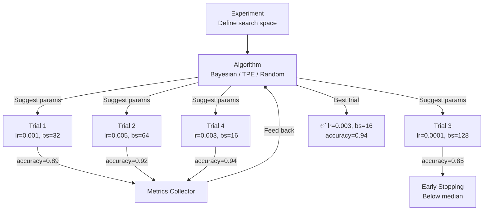

> 💡 **Quick Answer:** Create a Katib `Experiment` defining the search space (learning rate, batch size, layers), objective metric, and search algorithm. Katib runs parallel trials as Kubernetes Jobs, tracks metrics, and identifies optimal hyperparameters automatically.

## The Problem

Hyperparameter tuning is tedious and GPU-expensive. Data scientists manually try combinations of learning rate, batch size, model depth, and regularization — running hundreds of training jobs. Katib automates this with intelligent search algorithms that converge faster than random or grid search.

## The Solution

### Katib Experiment

```yaml
apiVersion: kubeflow.org/v1beta1
kind: Experiment
metadata:
  name: resnet-tuning
  namespace: kubeflow
spec:
  objective:
    type: maximize
    goal: 0.95
    objectiveMetricName: accuracy
    additionalMetricNames:
      - loss
  algorithm:
    algorithmName: bayesianoptimization
  parallelTrialCount: 4
  maxTrialCount: 30
  maxFailedTrialCount: 3
  parameters:
    - name: learning-rate
      parameterType: double
      feasibleSpace:
        min: "0.0001"
        max: "0.01"
    - name: batch-size
      parameterType: int
      feasibleSpace:
        min: "16"
        max: "128"
    - name: optimizer
      parameterType: categorical
      feasibleSpace:
        list: ["adam", "sgd", "adamw"]
    - name: dropout
      parameterType: double
      feasibleSpace:
        min: "0.1"
        max: "0.5"
  trialTemplate:
    primaryContainerName: training
    trialParameters:
      - name: learningRate
        reference: learning-rate
      - name: batchSize
        reference: batch-size
      - name: optimizer
        reference: optimizer
      - name: dropout
        reference: dropout
    trialSpec:
      apiVersion: batch/v1
      kind: Job
      spec:
        template:
          spec:
            containers:
              - name: training
                image: registry.example.com/resnet-train:1.0
                command:
                  - python
                  - train.py
                  - --lr=${trialParameters.learningRate}
                  - --batch-size=${trialParameters.batchSize}
                  - --optimizer=${trialParameters.optimizer}
                  - --dropout=${trialParameters.dropout}
                resources:
                  limits:
                    nvidia.com/gpu: 1
            restartPolicy: Never
  earlyStopping:
    algorithmName: medianstop
    algorithmSettings:
      - name: min_trials_required
        value: "5"
      - name: start_step
        value: "3"
```

### Search Algorithms

| Algorithm | Best For | Trials Needed |
|-----------|----------|---------------|
| `random` | Broad exploration | Many (50+) |
| `grid` | Small discrete space | Exhaustive |
| `bayesianoptimization` | Continuous parameters | Few (15-30) |
| `tpe` | Mixed parameter types | Moderate (20-40) |
| `cmaes` | Continuous optimization | Few (15-30) |
| `hyperband` | Early stopping + resource | Moderate |

### Monitor Progress

```bash
# Watch experiment status
kubectl get experiment resnet-tuning -n kubeflow -w

# Get best trial
kubectl get experiment resnet-tuning -n kubeflow \
  -o jsonpath='{.status.currentOptimalTrial}'

# List all trials
kubectl get trial -n kubeflow -l katib.kubeflow.org/experiment=resnet-tuning
```



## Common Issues

**Trials stuck in Pending — no GPU available**

Reduce `parallelTrialCount` or add more GPU nodes. Each trial runs as a separate Job needing GPU resources.

**Metrics not collected from trials**

Katib needs to parse metrics from pod logs. Ensure your training script prints metrics in the expected format: `accuracy=0.94` or use a custom metrics collector.

## Best Practices

- **Bayesian optimization** for most use cases — converges faster than random/grid
- **Start with wide search space** — narrow after initial exploration
- **Enable early stopping** — kills unpromising trials early, saves GPU hours
- **`parallelTrialCount: 4`** — balance between speed and GPU availability
- **Log metrics to stdout** — Katib's default collector parses pod logs

## Key Takeaways

- Katib automates hyperparameter tuning with intelligent search algorithms
- Bayesian optimization needs 15-30 trials vs 100+ for random search
- Each trial runs as a Kubernetes Job — parallel execution on GPU nodes
- Early stopping (medianstop) kills underperforming trials — saves 30-50% GPU time
- Framework-agnostic: works with PyTorch, TensorFlow, or any training script
