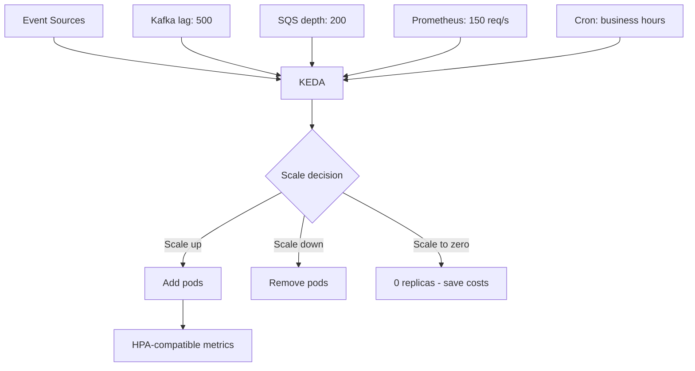

> 💡 **Quick Answer:** Scale Kubernetes workloads based on external events with KEDA. Covers Kafka, RabbitMQ, Prometheus, cron, and AWS SQS scalers for zero-to-N scaling.

## The Problem

HPA only scales on CPU and memory. KEDA extends Kubernetes autoscaling to scale on any event source — message queue depth, database connections, Prometheus metrics, cron schedules, or custom metrics. It also scales to zero, eliminating idle resource costs.

## The Solution

### Step 1: Install KEDA

```bash
helm repo add kedacore https://kedacore.github.io/charts
helm repo update

helm install keda kedacore/keda \
  --namespace keda --create-namespace \
  --set prometheus.metricServer.enabled=true
```

### Step 2: Scale on Kafka Queue Depth

```yaml
apiVersion: keda.sh/v1alpha1
kind: ScaledObject
metadata:
  name: kafka-consumer-scaler
spec:
  scaleTargetRef:
    name: kafka-consumer        # Deployment to scale
  minReplicaCount: 0            # Scale to zero when idle!
  maxReplicaCount: 50
  pollingInterval: 15
  cooldownPeriod: 300
  triggers:
    - type: kafka
      metadata:
        bootstrapServers: kafka.default.svc:9092
        consumerGroup: my-consumer-group
        topic: orders
        lagThreshold: "100"     # Scale up when lag > 100
        activationLagThreshold: "5"  # Activate from 0 when lag > 5
```

### Step 3: Scale on Prometheus Metrics

```yaml
apiVersion: keda.sh/v1alpha1
kind: ScaledObject
metadata:
  name: http-scaler
spec:
  scaleTargetRef:
    name: web-api
  minReplicaCount: 1
  maxReplicaCount: 20
  triggers:
    - type: prometheus
      metadata:
        serverAddress: http://prometheus.monitoring.svc:9090
        query: |
          sum(rate(http_requests_total{service="web-api"}[2m]))
        threshold: "100"        # Scale up at 100 req/s per replica
        activationThreshold: "5"
```

### Step 4: Cron-Based Scaling

```yaml
apiVersion: keda.sh/v1alpha1
kind: ScaledObject
metadata:
  name: business-hours-scaler
spec:
  scaleTargetRef:
    name: web-frontend
  minReplicaCount: 1
  maxReplicaCount: 20
  triggers:
    - type: cron
      metadata:
        timezone: Europe/Paris
        start: 0 8 * * 1-5      # Scale up 8AM weekdays
        end: 0 20 * * 1-5       # Scale down 8PM weekdays
        desiredReplicas: "10"
    - type: cron
      metadata:
        timezone: Europe/Paris
        start: 0 20 * * *       # Evening
        end: 0 8 * * *          # Morning
        desiredReplicas: "2"
```

### Step 5: Scale on AWS SQS

```yaml
apiVersion: keda.sh/v1alpha1
kind: ScaledObject
metadata:
  name: sqs-processor
spec:
  scaleTargetRef:
    name: queue-processor
  minReplicaCount: 0
  maxReplicaCount: 100
  triggers:
    - type: aws-sqs-queue
      metadata:
        queueURL: https://sqs.eu-west-1.amazonaws.com/123456789/orders
        queueLength: "5"       # 1 pod per 5 messages
        awsRegion: eu-west-1
      authenticationRef:
        name: aws-credentials
---
apiVersion: keda.sh/v1alpha1
kind: TriggerAuthentication
metadata:
  name: aws-credentials
spec:
  secretTargetRef:
    - parameter: awsAccessKeyID
      name: aws-secrets
      key: access-key
    - parameter: awsSecretAccessKey
      name: aws-secrets
      key: secret-key
```



## Best Practices

- **Start small and iterate** — don't over-engineer on day one
- **Monitor and measure** — you can't improve what you don't measure
- **Automate repetitive tasks** — reduce human error and toil
- **Document your decisions** — future you will thank present you

## Key Takeaways

- This is essential knowledge for production Kubernetes operations
- Start with the simplest approach that solves your problem
- Monitor the impact of every change you make
- Share knowledge across your team with internal runbooks
