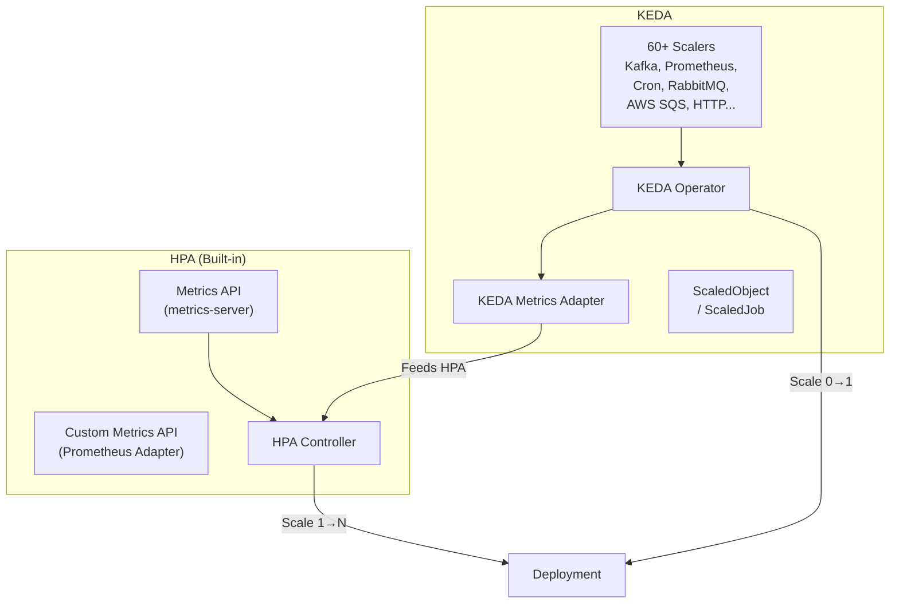

> 💡 **Quick Answer:** **HPA** scales on CPU/memory and simple custom metrics via Metrics API. **KEDA** wraps HPA and adds 60+ event sources: Kafka lag, RabbitMQ queue depth, Prometheus queries, cron schedules, Azure/AWS/GCP services, and more. KEDA also scales to zero. Use HPA for CPU/memory-based scaling; use KEDA when you need scale-to-zero or event-driven triggers.

## The Problem

HPA is limited to metrics available through the Kubernetes Metrics API. To scale on Kafka consumer lag, SQS queue depth, or Prometheus query results, you need a metrics adapter — which is complex to set up per source. KEDA provides a unified autoscaling framework with 60+ built-in scalers, plus the ability to scale Deployments to zero replicas.



## The Solution

### Comparison Table

| Feature | HPA | KEDA |
|---------|-----|------|
| **Scale to zero** | ❌ (min 1) | ✅ |
| **Scale from zero** | ❌ | ✅ |
| **CPU/Memory triggers** | ✅ native | ✅ (wraps HPA) |
| **Custom metrics** | Requires adapter | 60+ built-in scalers |
| **Kafka consumer lag** | Needs Prometheus Adapter | Built-in scaler |
| **Queue depth (RabbitMQ/SQS)** | Needs custom adapter | Built-in scaler |
| **Cron schedule** | ❌ | ✅ |
| **Prometheus queries** | Needs adapter | Built-in scaler |
| **HTTP request rate** | Needs adapter | KEDA HTTP Add-on |
| **Scale Jobs (batch)** | ❌ | ✅ (ScaledJob) |
| **Multiple triggers** | One metric type per HPA | Multiple triggers per ScaledObject |
| **Cooldown control** | stabilizationWindow | cooldownPeriod + pollingInterval |
| **Installation** | Built-in | Helm install |

### Install KEDA

```bash
helm repo add kedacore https://kedacore.github.io/charts
helm install keda kedacore/keda \
  --namespace keda \
  --create-namespace \
  --version 2.16.0
```

### HPA Example (CPU-Based)

```yaml
apiVersion: autoscaling/v2
kind: HorizontalPodAutoscaler
metadata:
  name: web-hpa
spec:
  scaleTargetRef:
    apiVersion: apps/v1
    kind: Deployment
    name: web-app
  minReplicas: 2
  maxReplicas: 20
  metrics:
    - type: Resource
      resource:
        name: cpu
        target:
          type: Utilization
          averageUtilization: 70
  behavior:
    scaleDown:
      stabilizationWindowSeconds: 300
```

### KEDA: Scale on Kafka Consumer Lag

```yaml
apiVersion: keda.sh/v1alpha1
kind: ScaledObject
metadata:
  name: kafka-consumer
spec:
  scaleTargetRef:
    name: kafka-consumer
  minReplicaCount: 0               # Scale to zero!
  maxReplicaCount: 50
  pollingInterval: 15
  cooldownPeriod: 300
  triggers:
    - type: kafka
      metadata:
        bootstrapServers: kafka:9092
        consumerGroup: my-consumer-group
        topic: orders
        lagThreshold: "100"        # Scale when lag > 100
```

### KEDA: Scale on Prometheus Query

```yaml
apiVersion: keda.sh/v1alpha1
kind: ScaledObject
metadata:
  name: api-scaler
spec:
  scaleTargetRef:
    name: api-server
  minReplicaCount: 1
  maxReplicaCount: 30
  triggers:
    - type: prometheus
      metadata:
        serverAddress: http://prometheus:9090
        query: |
          sum(rate(http_requests_total{service="api-server"}[2m]))
        threshold: "100"           # Scale at 100 req/s per pod
        activationThreshold: "5"   # Activate from 0 at 5 req/s
```

### KEDA: Scale on Cron Schedule

```yaml
apiVersion: keda.sh/v1alpha1
kind: ScaledObject
metadata:
  name: business-hours-scaler
spec:
  scaleTargetRef:
    name: web-app
  minReplicaCount: 1
  maxReplicaCount: 20
  triggers:
    # Scale up during business hours
    - type: cron
      metadata:
        timezone: "America/New_York"
        start: "0 8 * * 1-5"      # 8 AM weekdays
        end: "0 18 * * 1-5"       # 6 PM weekdays
        desiredReplicas: "10"
    # Minimum overnight
    - type: cron
      metadata:
        timezone: "America/New_York"
        start: "0 18 * * 1-5"
        end: "0 8 * * 2-6"
        desiredReplicas: "2"
```

### KEDA: ScaledJob for Batch Work

```yaml
# Scale Jobs (not Deployments) for batch processing
apiVersion: keda.sh/v1alpha1
kind: ScaledJob
metadata:
  name: queue-processor
spec:
  jobTargetRef:
    template:
      spec:
        containers:
          - name: processor
            image: myorg/queue-processor:v2.0
            env:
              - name: QUEUE_URL
                value: "amqp://rabbitmq:5672"
        restartPolicy: Never
  pollingInterval: 10
  maxReplicaCount: 100
  triggers:
    - type: rabbitmq
      metadata:
        host: amqp://rabbitmq:5672
        queueName: tasks
        queueLength: "5"           # 1 Job per 5 messages
```

### KEDA + HPA Together: Multiple Signals

```yaml
# KEDA can combine multiple triggers (max wins)
apiVersion: keda.sh/v1alpha1
kind: ScaledObject
metadata:
  name: multi-trigger
spec:
  scaleTargetRef:
    name: api-server
  minReplicaCount: 2
  maxReplicaCount: 50
  triggers:
    # CPU-based (same as HPA)
    - type: cpu
      metricType: Utilization
      metadata:
        value: "70"
    # Plus: scale on request rate
    - type: prometheus
      metadata:
        serverAddress: http://prometheus:9090
        query: sum(rate(http_requests_total{app="api-server"}[2m]))
        threshold: "50"
    # Plus: scale on queue depth
    - type: rabbitmq
      metadata:
        host: amqp://rabbitmq:5672
        queueName: async-tasks
        queueLength: "10"
  # KEDA uses the HIGHEST replica count from all triggers
```

## Decision Guide

### Use HPA When:
- You only need **CPU/memory scaling**
- You already have **metrics-server** installed
- You want **zero dependencies** beyond built-in K8s
- Your workloads never need to scale to **zero**

### Use KEDA When:
- You need **scale-to-zero** (save costs during idle)
- You scale on **external events**: Kafka, queues, Prometheus, cron
- You need **multiple scaling triggers** on one workload
- You want to scale **Jobs** (not just Deployments)
- You manage **event-driven microservices**

### Use Both When:
- KEDA manages event triggers + scale-to-zero
- HPA continues handling CPU/memory for other workloads
- They coexist on the same cluster (KEDA creates HPAs internally)

## Common Issues

| Issue | Cause | Fix |
|-------|-------|-----|
| KEDA not scaling from 0 | Activation threshold not reached | Lower `activationThreshold` |
| Scale-down too aggressive | Short cooldown | Increase `cooldownPeriod` |
| Kafka scaler auth failure | Missing SASL credentials | Add `authenticationRef` with TriggerAuthentication |
| HPA and KEDA conflict | Both target same Deployment | Remove HPA; KEDA creates its own |
| Prometheus query returns NaN | Metric doesn't exist yet | Set `activationThreshold` and handle startup |

## Best Practices

- **Start with KEDA if event-driven** — retrofitting is harder than starting right
- **Use `activationThreshold`** — controls when KEDA creates pods from zero
- **Set reasonable `cooldownPeriod`** — 300s prevents flapping for most workloads
- **Use TriggerAuthentication** — never put credentials in ScaledObject metadata
- **Monitor KEDA itself** — KEDA exposes Prometheus metrics for its own health
- **Combine CPU + event triggers** — handles both traffic spikes and queue backlogs

## Key Takeaways

- HPA is built-in and handles CPU/memory scaling well
- KEDA extends HPA with 60+ event sources and scale-to-zero
- KEDA creates HPAs internally — they work together, not against each other
- ScaledJob enables autoscaling batch Jobs (not just Deployments)
- For event-driven workloads (queues, streams, cron), KEDA is the clear choice
- Both are production-ready; KEDA is a CNCF graduated project since 2024
