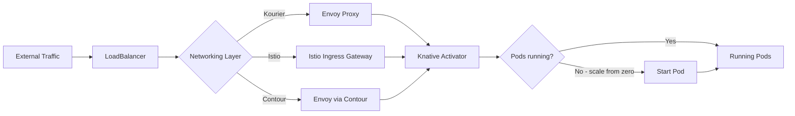
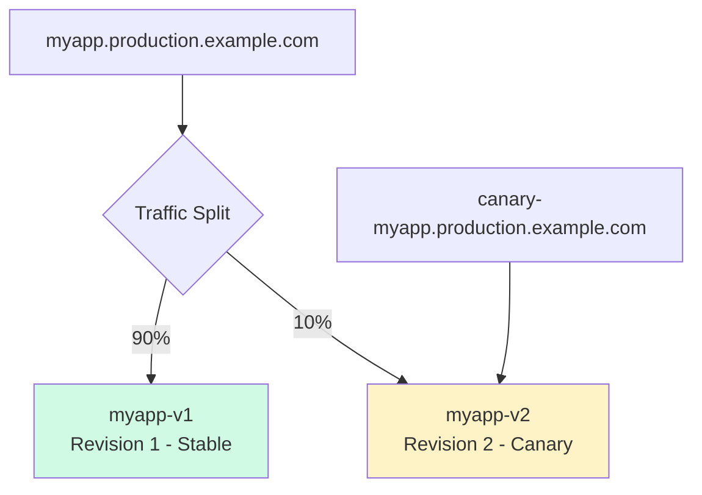

> 💡 **Quick Answer:** Knative uses its own ingress layer (not Kubernetes Ingress). Install a networking plugin — Kourier (lightweight), Istio (full mesh), or Contour (Gateway API) — then configure domains and TLS via ConfigMaps in `knative-serving`. Each Knative Service gets a URL like `myapp.namespace.example.com` automatically.

## The Problem

You deployed Knative Serving but your services aren't reachable from outside the cluster. Knative doesn't use standard Kubernetes Ingress resources — it has its own networking abstraction. You need to choose a networking layer, configure DNS, set up TLS, and control external visibility for your serverless workloads.

## The Solution

### Knative Networking Architecture



### Step 1: Choose and Install a Networking Layer

#### Option A: Kourier (Recommended — Lightweight)

```bash
# Install Knative Serving
kubectl apply -f https://github.com/knative/serving/releases/download/knative-v1.16.0/serving-crds.yaml
kubectl apply -f https://github.com/knative/serving/releases/download/knative-v1.16.0/serving-core.yaml

# Install Kourier networking
kubectl apply -f https://github.com/knative/net-kourier/releases/download/knative-v1.16.0/kourier.yaml

# Configure Knative to use Kourier
kubectl patch configmap/config-network \
  -n knative-serving \
  --type merge \
  -p '{"data":{"ingress-class":"kourier.ingress.networking.knative.dev"}}'

# Verify
kubectl get pods -n kourier-system
# NAME                                     READY   STATUS
# 3scale-kourier-gateway-5b4cb8d6d-abc12   1/1     Running
# 3scale-kourier-control-7f8b9c6d4-def34   1/1     Running

# Get the external IP
kubectl get svc kourier -n kourier-system
# NAME      TYPE           CLUSTER-IP    EXTERNAL-IP     PORT(S)
# kourier   LoadBalancer   10.96.1.50    203.0.113.10    80:31080/TCP,443:31443/TCP
```

#### Option B: Istio (Service Mesh)

```bash
# Install Istio first
istioctl install --set profile=minimal

# Install Knative Istio networking
kubectl apply -f https://github.com/knative/net-istio/releases/download/knative-v1.16.0/net-istio.yaml

# Configure
kubectl patch configmap/config-network \
  -n knative-serving \
  --type merge \
  -p '{"data":{"ingress-class":"istio.ingress.networking.knative.dev"}}'

# External IP from Istio
kubectl get svc istio-ingressgateway -n istio-system
```

#### Option C: Contour (Gateway API Native)

```bash
# Install Contour
kubectl apply -f https://github.com/knative/net-contour/releases/download/knative-v1.16.0/contour.yaml
kubectl apply -f https://github.com/knative/net-contour/releases/download/knative-v1.16.0/net-contour.yaml

# Configure
kubectl patch configmap/config-network \
  -n knative-serving \
  --type merge \
  -p '{"data":{"ingress-class":"contour.ingress.networking.knative.dev"}}'
```

#### OpenShift: Use OpenShift Serverless (Pre-Configured)

```bash
# OpenShift Serverless uses Kourier by default via the operator
# Just install via OperatorHub and create KnativeServing:
cat << EOF | oc apply -f -
apiVersion: operator.knative.dev/v1beta1
kind: KnativeServing
metadata:
  name: knative-serving
  namespace: knative-serving
spec:
  ingress:
    kourier:
      enabled: true
  config:
    network:
      ingress-class: kourier.ingress.networking.knative.dev
EOF
```

### Step 2: Configure Custom Domains

```yaml
# config-domain ConfigMap
apiVersion: v1
kind: ConfigMap
metadata:
  name: config-domain
  namespace: knative-serving
data:
  # Default domain for all services
  # Format: {service}.{namespace}.{domain}
  example.com: ""

  # Namespace-specific domain
  staging.example.com: |
    selector:
      matchLabels:
        environment: staging

  # Default sslip.io for development (auto-resolves to IP)
  # sslip.io: ""
```

**Result:** A Knative Service named `myapp` in namespace `production` gets the URL:
`https://myapp.production.example.com`

### Step 3: Set Up DNS

#### Option A: Wildcard DNS (Recommended for Production)

```bash
# Point *.example.com to the ingress external IP
EXTERNAL_IP=$(kubectl get svc kourier -n kourier-system -o jsonpath='{.status.loadBalancer.ingress[0].ip}')
echo "Add DNS record: *.example.com → $EXTERNAL_IP"

# Or for cloud providers — CNAME to the LB hostname
EXTERNAL_HOST=$(kubectl get svc kourier -n kourier-system -o jsonpath='{.status.loadBalancer.ingress[0].hostname}')
echo "Add CNAME: *.example.com → $EXTERNAL_HOST"
```

#### Option B: Magic DNS (Development — sslip.io)

```bash
# Auto-resolves <service>.<namespace>.<external-ip>.sslip.io
kubectl patch configmap/config-domain \
  -n knative-serving \
  --type merge \
  -p "{\"data\":{\"${EXTERNAL_IP}.sslip.io\":\"\"}}"

# Service URL becomes: myapp.production.203.0.113.10.sslip.io
```

#### Option C: Real DNS per Service

```bash
# Install the Knative DNS controller for automatic DNS management
kubectl apply -f https://github.com/knative/serving/releases/download/knative-v1.16.0/serving-default-domain.yaml
```

### Step 4: Configure TLS / HTTPS

#### Auto TLS with cert-manager

```bash
# Install cert-manager
kubectl apply -f https://github.com/cert-manager/cert-manager/releases/download/v1.16.0/cert-manager.yaml

# Install Knative cert-manager integration
kubectl apply -f https://github.com/knative/net-certmanager/releases/download/knative-v1.16.0/release.yaml

# Create a ClusterIssuer
cat << EOF | kubectl apply -f -
apiVersion: cert-manager.io/v1
kind: ClusterIssuer
metadata:
  name: letsencrypt-prod
spec:
  acme:
    server: https://acme-v02.api.letsencrypt.org/directory
    email: admin@example.com
    privateKeySecretRef:
      name: letsencrypt-prod-account-key
    solvers:
      - http01:
          ingress:
            class: kourier.ingress.networking.knative.dev
EOF

# Configure Knative to use auto-TLS
kubectl patch configmap/config-network \
  -n knative-serving \
  --type merge \
  -p '{"data":{
    "auto-tls": "Enabled",
    "http-protocol": "Redirected",
    "certificate-class": "cert-manager.certificate.networking.knative.dev",
    "issuerRef": "kind: ClusterIssuer\nname: letsencrypt-prod"
  }}'
```

Now every Knative Service automatically gets a Let's Encrypt certificate and HTTP→HTTPS redirect.

#### Manual TLS with Pre-Existing Certificate

```bash
# Create the TLS secret in the networking namespace
kubectl create secret tls wildcard-tls \
  -n kourier-system \
  --cert=fullchain.pem \
  --key=privkey.pem

# For Kourier — patch the gateway
kubectl patch gateway knative-ingress-gateway \
  -n knative-serving \
  --type merge \
  -p '{
    "spec": {
      "servers": [{
        "hosts": ["*.example.com"],
        "port": {"name": "https", "number": 443, "protocol": "HTTPS"},
        "tls": {"mode": "SIMPLE", "credentialName": "wildcard-tls"}
      }]
    }
  }'
```

### Step 5: Deploy a Knative Service

```yaml
apiVersion: serving.knative.dev/v1
kind: Service
metadata:
  name: myapp
  namespace: production
spec:
  template:
    metadata:
      annotations:
        # Scale bounds
        autoscaling.knative.dev/min-scale: "0"       # Scale to zero
        autoscaling.knative.dev/max-scale: "10"
        autoscaling.knative.dev/target: "100"         # 100 concurrent requests per pod
    spec:
      containers:
        - image: myorg/myapp:1.0
          ports:
            - containerPort: 8080
          resources:
            requests:
              cpu: 100m
              memory: 128Mi
            limits:
              cpu: "1"
              memory: 512Mi
          readinessProbe:
            httpGet:
              path: /ready
              port: 8080
            initialDelaySeconds: 3
```

```bash
kubectl apply -f myapp-ksvc.yaml

# Check the auto-generated URL
kubectl get ksvc myapp -n production
# NAME    URL                                        READY
# myapp   https://myapp.production.example.com       True

# Test
curl https://myapp.production.example.com/
```

### Step 6: Control External Visibility

```yaml
# Private service — cluster-internal only (no external ingress)
apiVersion: serving.knative.dev/v1
kind: Service
metadata:
  name: internal-api
  namespace: production
  labels:
    networking.knative.dev/visibility: cluster-local    # ← Internal only
spec:
  template:
    spec:
      containers:
        - image: myorg/internal-api:1.0
          ports:
            - containerPort: 8080
```

```bash
# Internal URL: http://internal-api.production.svc.cluster.local
# NOT accessible from outside the cluster

# Make an existing service private
kubectl label ksvc myapp -n production \
  networking.knative.dev/visibility=cluster-local

# Make it public again
kubectl label ksvc myapp -n production \
  networking.knative.dev/visibility=external --overwrite
```

**Default visibility for an entire namespace:**

```yaml
# config-network ConfigMap
data:
  default-external-scheme: https
  # Make all services in specific namespaces internal by default
  # (services must explicitly opt-in to external visibility)
```

### Step 7: Path-Based Routing with DomainMapping

```yaml
# Map a custom domain to a Knative Service
apiVersion: serving.knative.dev/v1beta1
kind: DomainMapping
metadata:
  name: api.example.com               # The custom domain
  namespace: production
spec:
  ref:
    name: myapp                         # The Knative Service
    kind: Service
    apiVersion: serving.knative.dev/v1
```

```bash
kubectl apply -f domain-mapping.yaml

# Now api.example.com → myapp Knative Service
# (Add DNS record: api.example.com → ingress external IP)
```

**Multiple services on one domain (via different subdomains):**

```yaml
---
apiVersion: serving.knative.dev/v1beta1
kind: DomainMapping
metadata:
  name: web.example.com
  namespace: production
spec:
  ref:
    name: frontend
    kind: Service
    apiVersion: serving.knative.dev/v1
---
apiVersion: serving.knative.dev/v1beta1
kind: DomainMapping
metadata:
  name: api.example.com
  namespace: production
spec:
  ref:
    name: backend-api
    kind: Service
    apiVersion: serving.knative.dev/v1
```

### Step 8: Traffic Splitting (Canary / Blue-Green)

```yaml
apiVersion: serving.knative.dev/v1
kind: Service
metadata:
  name: myapp
  namespace: production
spec:
  template:
    metadata:
      name: myapp-v2                    # Named revision
    spec:
      containers:
        - image: myorg/myapp:2.0
  traffic:
    - revisionName: myapp-v1
      percent: 90                        # 90% to stable
    - revisionName: myapp-v2
      percent: 10                        # 10% to canary
    - revisionName: myapp-v2
      tag: canary                        # Tagged URL: canary-myapp.production.example.com
```

```bash
# Check traffic split
kubectl get ksvc myapp -n production -o yaml | grep -A10 "traffic:"

# Direct URL for testing canary:
curl https://canary-myapp.production.example.com/

# Promote canary to 100%
kubectl patch ksvc myapp -n production --type merge -p '{
  "spec": {
    "traffic": [
      {"revisionName": "myapp-v2", "percent": 100}
    ]
  }
}'
```



### Networking Comparison

| Feature | Kourier | Istio | Contour |
|---------|---------|-------|---------|
| Weight | Lightweight (~50MB) | Heavy (~500MB+) | Medium (~100MB) |
| mTLS | ❌ | ✅ Built-in | ❌ |
| Service mesh | ❌ | ✅ Full mesh | ❌ |
| Gateway API | ❌ | ✅ | ✅ Native |
| Resource usage | Low | High | Medium |
| Best for | Simple serverless | Zero-trust + mesh | Gateway API migration |
| OpenShift | Default | Supported | Supported |

### Troubleshooting

```bash
# Check Knative Service status
kubectl get ksvc myapp -n production -o yaml | yq '.status.conditions'

# Check Ingress object
kubectl get king -n production   # KIngress (Knative Ingress)
kubectl describe king myapp -n production

# Check the networking layer pods
kubectl logs -n kourier-system deploy/3scale-kourier-gateway --since=5m
# or
kubectl logs -n istio-system deploy/istio-ingressgateway --since=5m

# Check route readiness
kubectl get route -n production
# NAME    URL                                    READY   REASON
# myapp   https://myapp.production.example.com   True

# DNS test
nslookup myapp.production.example.com
# Should resolve to the ingress external IP
```

## Common Issues

### Service URL Shows "example.com" Default Domain

Configure `config-domain` ConfigMap with your real domain. The default `example.com` is a placeholder.

### Auto-TLS Certificate Not Issuing

```bash
# Check cert-manager certificates
kubectl get certificates -n production
kubectl describe certificate myapp -n production

# Check challenges
kubectl get challenges -A
# If pending: DNS or HTTP-01 challenge may be failing
```

### Cold Start Latency (Scale from Zero)

First request after scale-to-zero takes 3-10 seconds. Mitigate:
```yaml
annotations:
  autoscaling.knative.dev/min-scale: "1"    # Keep at least 1 pod warm
```

### 503 Errors During Traffic Split

Canary revision might not be ready. Check:
```bash
kubectl get revisions -n production
# Both revisions must show READY=True
```

## Best Practices

- **Use Kourier** unless you need service mesh — simplest, lowest resource usage
- **Enable auto-TLS** with cert-manager — every service gets HTTPS automatically
- **Set `min-scale: 1`** for latency-sensitive services — avoid cold starts
- **Use `cluster-local` visibility** for internal APIs — don't expose what doesn't need exposure
- **DomainMapping for vanity URLs** — decouple service names from external domains
- **Tag canary revisions** — test via `canary-myapp.example.com` before shifting traffic
- **Wildcard DNS** — one `*.example.com` record covers all services automatically

## Key Takeaways

- Knative has its own ingress — it doesn't use Kubernetes Ingress resources
- Three networking options: Kourier (light), Istio (mesh), Contour (Gateway API)
- Custom domains via `config-domain` ConfigMap + wildcard DNS record
- Auto-TLS with cert-manager gives every service HTTPS with zero config
- `cluster-local` label controls internal vs external visibility
- Traffic splitting is built-in — canary deployments with tagged revision URLs
- DomainMapping decouples custom domains from service names
