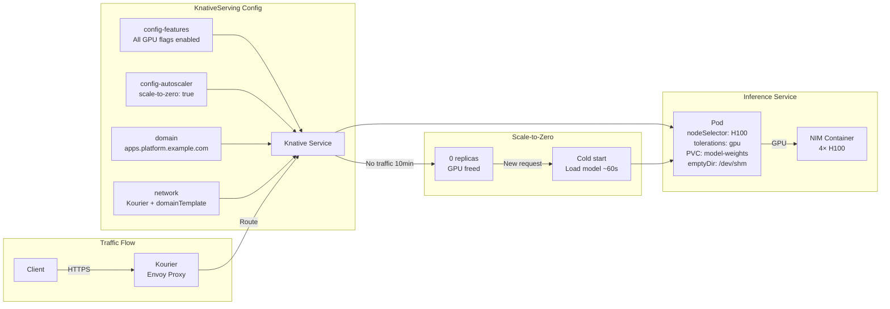

> 💡 **Quick Answer:** Deploy KnativeServing with `enable-scale-to-zero: "true"`, enable all GPU-relevant pod spec features (affinity, tolerations, nodeSelector, securityContext, PVCs), configure Kourier as the ingress class, and set a `domainTemplate` for predictable inference endpoint URLs.

## The Problem

AI inference workloads on Kubernetes have unique requirements that default KnativeServing doesn't support:
- **Scale-to-zero** saves GPU costs when models aren't actively serving requests
- **GPU scheduling** needs node affinity, tolerations, and nodeSelector to target GPU nodes
- **Model storage** requires PVC mounts for large model weights (100GB+)
- **Security contexts** for RDMA, IPC_LOCK, and GPU device access
- **Multi-container pods** for sidecars (metrics exporters, model downloaders)
- **Init containers** for model warmup or cache preparation
- **Internal registries** that use non-standard tags need tag resolution skipping
- **Custom domains** for predictable, human-readable inference endpoint URLs

## The Solution

### KnativeServing Custom Resource

```yaml
apiVersion: operator.knative.dev/v1beta1
kind: KnativeServing
metadata:
  name: knative-serving
  namespace: knative-serving
spec:
  config:
    # Skip tag resolution for internal registries
    deployment:
      registriesSkippingTagResolving: registry.example.com

    # Scale-to-zero configuration
    config-autoscaler:
      enable-scale-to-zero: "true"

    # Enable GPU/AI-relevant pod spec features
    config-features:
      kubernetes.podspec-affinity: enabled
      kubernetes.podspec-init-containers: enabled
      kubernetes.podspec-persistent-volume-claim: enabled
      kubernetes.podspec-persistent-volume-write: enabled
      kubernetes.podspec-schedulername: enabled
      kubernetes.podspec-securitycontext: enabled
      kubernetes.podspec-tolerations: enabled
      kubernetes.podspec-volumes-emptydir: enabled
      kubernetes.podspec-fieldref: enabled
      kubernetes.containerspec-addcapabilities: enabled
      kubernetes.podspec-nodeselector: enabled
      multi-container: enabled

    # Custom domain for inference endpoints
    domain:
      apps.platform.example.com: ""

    # Networking configuration
    network:
      domainTemplate: '{{.Name}}-{{.Namespace}}.{{.Domain}}'
      ingress-class: kourier.ingress.networking.knative.dev
      default-external-scheme: https

  # High availability for serving components
  high-availability:
    replicas: 2

  # Ingress controller selection
  ingress:
    contour:
      enabled: false
    istio:
      enabled: false
    kourier:
      enabled: false
```

### Feature Flags Explained

Each `config-features` flag unlocks a Kubernetes capability in Knative Services:

| Feature Flag | Purpose for AI/GPU Workloads |
|---|---|
| `podspec-affinity` | Target GPU nodes via node/pod affinity rules |
| `podspec-tolerations` | Tolerate GPU node taints (`nvidia.com/gpu=present:NoSchedule`) |
| `podspec-nodeselector` | Select specific GPU types (`nvidia.com/gpu.product: A100`) |
| `podspec-securitycontext` | Enable `IPC_LOCK`, `SYS_RESOURCE` for RDMA and shared memory |
| `podspec-persistent-volume-claim` | Mount PVCs with model weights (NFS, Ceph, local NVMe) |
| `podspec-persistent-volume-write` | Write model cache to persistent storage |
| `podspec-volumes-emptydir` | `/dev/shm` as emptyDir for NCCL shared memory |
| `podspec-init-containers` | Download or warm up model before serving |
| `podspec-schedulername` | Use custom schedulers (Run:ai, Volcano, Kueue) |
| `podspec-fieldref` | Inject node name, pod IP via downward API |
| `containerspec-addcapabilities` | Add `IPC_LOCK` capability for RDMA memory pinning |
| `multi-container` | Sidecars for metrics, logging, model management |

> ⚠️ By default, Knative strips most pod spec fields for portability. For AI workloads, you need **all** of these enabled.

### Registry Tag Resolution Skip

```yaml
deployment:
  registriesSkippingTagResolving: registry.example.com
```

Knative normally resolves image tags to digests at deploy time. For internal registries (air-gapped environments, private Quay/Harbor), this resolution can fail if:
- The registry uses self-signed certificates
- Network policies block the Knative controller from reaching the registry
- Images are mirrored with non-standard tag conventions

Adding your registry here tells Knative to use the tag as-is without resolving to a digest.

### Domain Template

```yaml
domainTemplate: '{{.Name}}-{{.Namespace}}.{{.Domain}}'
```

This generates predictable URLs:

```
# Service "llama-3" in namespace "ai-inference" with domain "apps.platform.example.com"
# → llama-3-ai-inference.apps.platform.example.com

# Service "mistral-small" in namespace "production"
# → mistral-small-production.apps.platform.example.com
```

### Kourier Ingress

Kourier is a lightweight Knative ingress based on Envoy — simpler than Istio for pure inference serving:

```yaml
network:
  ingress-class: kourier.ingress.networking.knative.dev
```

> Note: The `ingress.kourier.enabled: false` in the CR means Kourier is **not** managed by the Knative operator — it's deployed separately (common on OpenShift with OpenShift Serverless operator managing Kourier independently).

### Example: NIM Inference with Knative

```yaml
apiVersion: serving.knative.dev/v1
kind: Service
metadata:
  name: nim-llama
  namespace: ai-inference
spec:
  template:
    metadata:
      annotations:
        autoscaling.knative.dev/target: "10"
        autoscaling.knative.dev/metric: concurrency
        autoscaling.knative.dev/scale-down-delay: "300s"
    spec:
      nodeSelector:
        nvidia.com/gpu.product: H100-SXM
      tolerations:
        - key: nvidia.com/gpu
          operator: Exists
          effect: NoSchedule
      containers:
        - image: registry.example.com/nim/nim-llm:2.0.2
          ports:
            - containerPort: 8000
          env:
            - name: NIM_MODEL_PATH
              value: /models/llama-3.3-70b
          resources:
            limits:
              nvidia.com/gpu: "4"
          volumeMounts:
            - name: model-store
              mountPath: /models
            - name: dshm
              mountPath: /dev/shm
          securityContext:
            capabilities:
              add: ["IPC_LOCK"]
      volumes:
        - name: model-store
          persistentVolumeClaim:
            claimName: model-weights-pvc
        - name: dshm
          emptyDir:
            medium: Memory
            sizeLimit: 16Gi
```

This uses almost every feature flag from the KnativeServing config:
- `nodeSelector` → targets H100 nodes
- `tolerations` → tolerates GPU taints
- `securityContext` + `addcapabilities` → IPC_LOCK for RDMA
- `persistent-volume-claim` → model weights PVC
- `volumes-emptydir` → shared memory for NCCL

### Scale-to-Zero Tuning

```yaml
config-autoscaler:
  enable-scale-to-zero: "true"
  scale-to-zero-grace-period: "300s"        # 5 min grace before terminating
  scale-to-zero-pod-retention-period: "60s"  # Keep pod 60s after last request
  stable-window: "120s"                      # 2 min averaging window
  panic-window-percentage: "10"              # 10% of stable window for panic mode
  target-burst-capacity: "100"               # Buffer for cold-start spikes
```

For GPU inference, increase the grace period — model loading takes 30-120 seconds:
```yaml
scale-to-zero-grace-period: "600s"   # 10 min — keeps GPU allocated longer
scale-to-zero-pod-retention-period: "300s"  # 5 min retention
```



## Common Issues

**Knative strips GPU resources from pod spec**

Missing `config-features` flags. All flags listed above must be `enabled` (not `allowed` — `allowed` requires per-service annotation).

**Scale-to-zero terminates pod during long inference**

The autoscaler counts active requests. If a request takes >60s (e.g., large batch), increase:
```yaml
scale-to-zero-grace-period: "600s"
```

**Cold start too slow for GPU models**

Model loading dominates cold start time. Strategies:
- Use `scale-to-zero-pod-retention-period: "300s"` to keep pods warm longer
- Set `minScale: 1` annotation on critical services to disable scale-to-zero
- Use init containers to pre-download models to a shared PVC

**Internal registry image pull fails with "tag not found"**

Add your registry to `registriesSkippingTagResolving`. Knative's tag-to-digest resolution fails when it can't reach the registry or the registry uses non-standard APIs.

**Domain template produces wrong URLs**

Verify `domain` config has the correct base domain with an empty string value (`""`). Multiple domains can be configured with label selectors.

## Best Practices

- **Enable all pod spec features upfront** — AI workloads will eventually need every one of them
- **Use Kourier over Istio** for inference-only clusters — lower resource overhead, simpler debugging
- **Set `scale-to-zero-grace-period` to 5-10 minutes** for GPU workloads — saves GPU cost without excessive cold starts
- **Pin `minScale: 1` on production-critical models** — cold start is unacceptable for user-facing inference
- **Use `registriesSkippingTagResolving`** for all internal/air-gapped registries
- **High availability `replicas: 2`** for serving control plane — prevents single-point-of-failure during node maintenance
- **Custom `domainTemplate`** with `{{.Name}}-{{.Namespace}}.{{.Domain}}` gives predictable, debuggable URLs
- **Monitor `scale-to-zero` behavior** — track GPU utilization to find the optimal grace period

## Key Takeaways

- KnativeServing needs **12 feature flags enabled** for GPU/AI inference workloads
- Scale-to-zero saves significant GPU cost but requires tuning grace periods for model loading time
- `registriesSkippingTagResolving` is essential for internal/air-gapped registries
- Kourier is the lightweight ingress choice — Istio is overkill for pure inference serving
- `domainTemplate` controls the URL pattern: `{{.Name}}-{{.Namespace}}.{{.Domain}}`
- All ingress controllers set to `false` means they're managed externally (common with OpenShift Serverless)
- High availability `replicas: 2` protects the control plane, not the inference pods (those scale independently)
- Combine with NIM, vLLM, or Triton containers for a complete serverless AI inference platform
