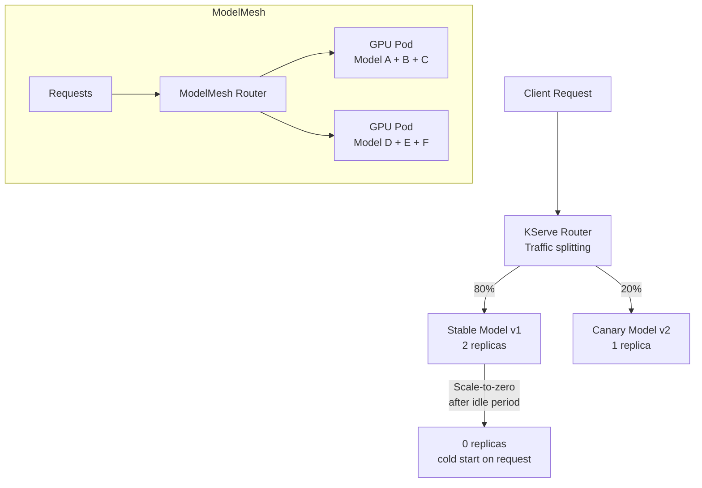

> 💡 **Quick Answer:** Create a `KServe InferenceService` with your model storage URI. KServe handles model loading, autoscaling (including scale-to-zero), request batching, and canary rollouts. Use ModelMesh for high-density multi-model serving on shared GPU infrastructure.

## The Problem

Serving ML models in production requires autoscaling, traffic splitting for A/B testing, request batching, model versioning, and monitoring — none of which a simple Deployment provides. KServe is the standard Kubernetes-native model serving platform that handles all of this declaratively.

## The Solution

### Basic InferenceService

```yaml
apiVersion: serving.kserve.io/v1beta1
kind: InferenceService
metadata:
  name: sklearn-iris
  namespace: production
spec:
  predictor:
    model:
      modelFormat:
        name: sklearn
      storageUri: "s3://models/sklearn/iris/v1"
      resources:
        requests:
          cpu: 100m
          memory: 256Mi
        limits:
          memory: 512Mi
```

### GPU Model Serving

```yaml
apiVersion: serving.kserve.io/v1beta1
kind: InferenceService
metadata:
  name: llm-server
spec:
  predictor:
    model:
      modelFormat:
        name: pytorch
      storageUri: "pvc://model-storage/llama-7b"
      runtime: kserve-torchserve
      resources:
        limits:
          nvidia.com/gpu: 1
          memory: 32Gi
    minReplicas: 1
    maxReplicas: 4
    scaleTarget: 10
    scaleMetric: concurrency
```

### Canary Rollout

```yaml
apiVersion: serving.kserve.io/v1beta1
kind: InferenceService
metadata:
  name: text-classifier
spec:
  predictor:
    canaryTrafficPercent: 20
    model:
      modelFormat:
        name: pytorch
      storageUri: "s3://models/classifier/v2"
```

20% of traffic goes to v2 — monitor accuracy before promoting.

### ModelMesh for Multi-Model Serving

```yaml
apiVersion: serving.kserve.io/v1alpha1
kind: ServingRuntime
metadata:
  name: triton-runtime
spec:
  supportedModelFormats:
    - name: onnx
      version: "1"
      autoSelect: true
  multiModel: true
  containers:
    - name: triton
      image: nvcr.io/nvidia/tritonserver:24.07-py3
      resources:
        requests:
          nvidia.com/gpu: 1
        limits:
          nvidia.com/gpu: 1
---
apiVersion: serving.kserve.io/v1beta1
kind: InferenceService
metadata:
  name: model-a
  annotations:
    serving.kserve.io/deploymentMode: ModelMesh
spec:
  predictor:
    model:
      modelFormat:
        name: onnx
      storageUri: "s3://models/model-a"
```

ModelMesh packs multiple models onto shared GPU pods — 10-100x better GPU utilization.



## Common Issues

**InferenceService stuck in "Not Ready"**

Check model download: `kubectl logs deploy/sklearn-iris-predictor -c storage-initializer`. Common cause: S3 credentials missing or wrong storage URI.

**Scale-to-zero cold start too slow**

Large models take minutes to load from storage. Use `minReplicas: 1` for latency-sensitive services, or pre-warm with periodic health checks.

## Best Practices

- **KServe for standardized serving** — supports sklearn, PyTorch, TensorFlow, ONNX, XGBoost, LightGBM
- **ModelMesh for multi-model** — pack 10-50 models per GPU pod
- **Canary rollouts for model updates** — route 10-20% to new version, monitor metrics
- **Scale-to-zero for dev/staging** — save GPU costs when idle
- **`minReplicas: 1` for production** — avoid cold-start latency

## Key Takeaways

- KServe provides declarative model serving with InferenceService CRD
- Supports scale-to-zero, autoscaling on concurrency, and canary rollouts
- ModelMesh enables multi-model serving on shared GPUs — 10-100x better utilization
- Canary traffic splitting enables safe model updates with gradual promotion
- Storage initializer handles model download from S3, GCS, PVC, or HTTP
