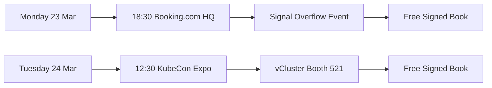

> 💡 **Quick Answer:** Two chances to grab a **free signed copy** of *Kubernetes Recipes* at KubeCon EU 2026 Amsterdam: Monday night at Booking.com HQ and Tuesday lunchtime at vCluster booth #521.

## The Problem

You're at KubeCon Europe 2026 in Amsterdam and you want a free copy of the *Kubernetes Recipes* book — signed by the author. Where do you go and when?

## The Solution

### Event 1: Signal Overflow — Observability in the Age of AI

```yaml
what: "Signal Overflow: Observability in the Age of AI"
when: "Monday, 23 March 2026 — 18:30 to 21:00"
where: "Booking.com HQ, Oosterdokskade 163, Amsterdam"
hosted_by: "SRE NL"
rsvp: "https://luma.com/o93w1hxi"
highlights:
  - Free book giveaway (signed copies)
  - Networking with SRE and platform engineering community
  - Drinks and food at Booking.com headquarters
  - Right next to Amsterdam Centraal station
```

This is the **evening before KubeCon starts** — a perfect warm-up event. The SRE Netherlands community hosts an evening of talks and networking focused on observability and AI operations. Luca will be there with signed copies of *Kubernetes Recipes*.

**How to get there:** Booking.com HQ is a 2-minute walk from Amsterdam Centraal station. Look for the Booking.com building at Oosterdokskade 163.

**RSVP is required** — space is limited. Register at [luma.com/o93w1hxi](https://luma.com/o93w1hxi).

### Event 2: Book Signing at vCluster Booth #521

```yaml
what: "Kubernetes Recipes Book Signing"
when: "Tuesday, 24 March 2026 — 12:30 to 13:30"
where: "KubeCon Europe 2026, vCluster Booth #521"
rsvp: "No RSVP needed — just show up!"
highlights:
  - Free signed copies of Kubernetes Recipes
  - Meet the author Luca Berton
  - Chat about Kubernetes, GPU infrastructure, AI/ML on K8s
  - Learn about vCluster and virtual clusters
```

During the **Tuesday lunch break** at KubeCon, head to **booth #521** (vCluster) on the expo floor. Luca will be signing copies of *Kubernetes Recipes* for one hour. First come, first served — quantities are limited.

**Pro tip:** The expo floor gets busy during lunch. Arrive at 12:30 sharp for the best chance of getting a signed copy.

### Schedule at a Glance

```yaml
monday_23_march:
  - time: "18:30-21:00"
    event: "Signal Overflow at Booking.com HQ"
    action: "RSVP required → luma.com/o93w1hxi"
    book: "Free signed copies available"

tuesday_24_march:
  - time: "12:30-13:30"
    event: "Book signing at vCluster booth #521"
    action: "Just show up at booth #521"
    book: "Free signed copies, first come first served"
```

### About the Book

*Kubernetes Recipes* (Apress, 2026) is a hands-on guide covering 300+ production-ready patterns for Kubernetes and OpenShift, including:

- GPU infrastructure and NVIDIA operator management
- AI/ML workload deployment (Triton, vLLM, TensorRT-LLM)
- SR-IOV, RDMA, and high-performance networking
- ArgoCD GitOps patterns and multi-cluster management
- Security with RHACS, NetworkPolicies, and compliance scanning
- Platform engineering and multi-tenant GPU clusters

Every recipe follows a consistent format: problem → solution → code examples → common issues → best practices.



## Common Issues

- **Can't find the Booking.com HQ** — Oosterdokskade 163 is directly east of Amsterdam Centraal station, across the water; look for the large Booking.com sign
- **Booth #521 location** — check the KubeCon expo floor map in the event app; vCluster is in the main expo hall
- **Books ran out** — quantities are limited at both events; arrive early for the best chance
- **No KubeCon badge for Monday event** — the Booking.com event is separate from KubeCon; you only need the Luma RSVP, no KubeCon ticket required

## Best Practices

- RSVP for the Monday event NOW — space fills up fast for popular side events
- Arrive at booth #521 at 12:30 sharp on Tuesday — the signing is only one hour
- Bring a pen and a question — Luca loves talking about GPU infrastructure and platform engineering
- Share your signed copy on social media with #KubernetesRecipes and #KubeCon

## Key Takeaways

- Two free book signing opportunities at KubeCon EU 2026 Amsterdam
- Monday 23 Mar: Booking.com HQ, 18:30-21:00 (RSVP at luma.com/o93w1hxi)
- Tuesday 24 Mar: vCluster booth #521, 12:30-13:30 (no RSVP needed)
- Free signed copies of *Kubernetes Recipes* at both events
- Come early — quantities are limited!
