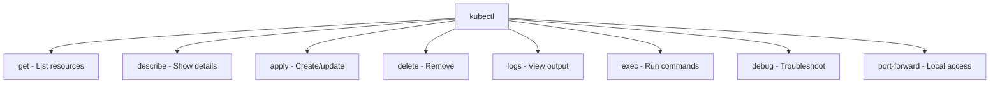

> 💡 **Quick Answer:** Complete kubectl cheat sheet with essential commands for pods, deployments, services, logs, debugging, and cluster management. Copy-paste ready examples.

## The Problem

This is one of the most searched Kubernetes topics. Having a comprehensive, well-structured guide helps both beginners and experienced users quickly find what they need.

## The Solution

### Pod Operations

```bash
# List pods
kubectl get pods
kubectl get pods -A                    # All namespaces
kubectl get pods -o wide               # Show node + IP
kubectl get pods -l app=nginx          # Filter by label
kubectl get pods --field-selector status.phase=Running

# Describe pod (events + config)
kubectl describe pod <name>

# Create pod from YAML
kubectl apply -f pod.yaml

# Delete pod
kubectl delete pod <name>
kubectl delete pod <name> --grace-period=0 --force  # Force delete

# Exec into pod
kubectl exec -it <pod> -- /bin/bash
kubectl exec -it <pod> -c <container> -- sh

# Port forward
kubectl port-forward pod/<name> 8080:80
kubectl port-forward svc/<name> 8080:80

# Copy files
kubectl cp <pod>:/path/file ./local
kubectl cp ./local <pod>:/path/file
```

### Deployment Operations

```bash
# Create/update deployment
kubectl apply -f deployment.yaml
kubectl create deployment nginx --image=nginx --replicas=3

# Scale
kubectl scale deployment <name> --replicas=5

# Rolling update
kubectl set image deployment/<name> container=image:tag
kubectl rollout status deployment/<name>
kubectl rollout history deployment/<name>
kubectl rollout undo deployment/<name>
kubectl rollout undo deployment/<name> --to-revision=2

# Restart deployment (rolling restart)
kubectl rollout restart deployment/<name>
```

### Service & Networking

```bash
# Expose deployment
kubectl expose deployment <name> --port=80 --target-port=8080 --type=ClusterIP
kubectl expose deployment <name> --type=NodePort
kubectl expose deployment <name> --type=LoadBalancer

# Get services
kubectl get svc
kubectl get endpoints <svc>

# DNS test
kubectl run dns-test --rm -it --image=busybox -- nslookup <svc>.<ns>.svc.cluster.local
```

### Logs & Debugging

```bash
# Logs
kubectl logs <pod>
kubectl logs <pod> --previous          # Previous crash
kubectl logs <pod> -c <container>      # Specific container
kubectl logs <pod> -f                  # Follow/stream
kubectl logs <pod> --tail=100          # Last 100 lines
kubectl logs -l app=nginx --all-containers

# Debug
kubectl debug <pod> -it --image=nicolaka/netshoot
kubectl debug node/<node> -it --image=ubuntu

# Events
kubectl get events --sort-by='.lastTimestamp'
kubectl get events --field-selector type=Warning

# Resource usage
kubectl top pods
kubectl top nodes
kubectl top pods --sort-by=memory
```

### Namespace & Context

```bash
# Namespaces
kubectl get ns
kubectl create ns <name>
kubectl config set-context --current --namespace=<name>

# Context
kubectl config get-contexts
kubectl config use-context <name>
kubectl config current-context
```

### Resource Management

```bash
# Get any resource
kubectl get <resource>                 # pods, svc, deploy, pvc, cm, secret...
kubectl get all                        # Common resources
kubectl api-resources                  # All resource types

# Output formats
kubectl get pods -o yaml
kubectl get pods -o json
kubectl get pods -o jsonpath='{.items[*].metadata.name}'
kubectl get pods -o custom-columns=NAME:.metadata.name,STATUS:.status.phase

# Labels & annotations
kubectl label pod <name> env=prod
kubectl annotate pod <name> description="my app"
kubectl get pods --show-labels

# Dry run (preview)
kubectl apply -f file.yaml --dry-run=client
kubectl apply -f file.yaml --dry-run=server

# Diff before applying
kubectl diff -f file.yaml
```

### Quick Reference Table

| Action | Command |
|--------|---------|
| List pods | `kubectl get pods -A` |
| Describe | `kubectl describe pod <name>` |
| Logs | `kubectl logs <pod> -f` |
| Exec | `kubectl exec -it <pod> -- bash` |
| Scale | `kubectl scale deploy <name> --replicas=N` |
| Rollout | `kubectl rollout restart deploy/<name>` |
| Debug | `kubectl debug <pod> -it --image=netshoot` |
| Port forward | `kubectl port-forward svc/<name> 8080:80` |



## Frequently Asked Questions

### What is kubectl?

kubectl is the command-line tool for interacting with Kubernetes clusters. It communicates with the API server to create, inspect, update, and delete resources.

### How do I install kubectl?

```bash
# Linux
curl -LO "https://dl.k8s.io/release/$(curl -L -s https://dl.k8s.io/release/stable.txt)/bin/linux/amd64/kubectl"
chmod +x kubectl && sudo mv kubectl /usr/local/bin/

# macOS
brew install kubectl

# Verify
kubectl version --client
```

### How do I enable kubectl auto-completion?

```bash
# bash
echo 'source <(kubectl completion bash)' >> ~/.bashrc
echo 'alias k=kubectl' >> ~/.bashrc
echo 'complete -o default -F __start_kubectl k' >> ~/.bashrc
source ~/.bashrc
```

## Best Practices

- **Start simple** — use the basic form first, add complexity as needed
- **Be consistent** — follow naming conventions across your cluster
- **Document your choices** — add annotations explaining why, not just what
- **Monitor and iterate** — review configurations regularly

## Key Takeaways

- This is fundamental Kubernetes knowledge every engineer needs
- Start with the simplest approach that solves your problem
- Use `kubectl explain` and `kubectl describe` when unsure
- Practice in a test cluster before applying to production
