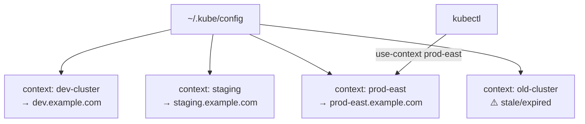

> 💡 **Quick Answer:** `kubectl config get-contexts` lists all contexts. `kubectl config use-context <name>` switches. `kubectl config delete-context <name>` removes a stale context. Merge multiple kubeconfigs with `KUBECONFIG=file1:file2 kubectl config view --flatten > merged.yaml`. Contexts are stored in `~/.kube/config` by default.

## The Problem

DevOps teams work with multiple Kubernetes clusters — dev, staging, production, and various cloud providers. Switching between them, cleaning up stale contexts, and managing credentials across clusters is error-prone. The wrong context can mean deploying to production instead of dev.



## The Solution

### Essential Context Commands

```bash
# List all contexts
kubectl config get-contexts
# CURRENT  NAME         CLUSTER        AUTHINFO       NAMESPACE
# *        dev-cluster  dev-cluster    dev-admin      default
#          staging      staging        staging-admin  default
#          prod-east    prod-east      prod-admin     production

# Show current context
kubectl config current-context
# dev-cluster

# Switch context
kubectl config use-context prod-east
# Switched to context "prod-east".

# Delete a stale context
kubectl config delete-context old-cluster
# deleted context old-cluster

# Delete associated cluster and user entries
kubectl config delete-cluster old-cluster
kubectl config unset users.old-cluster-admin

# Rename a context
kubectl config rename-context gke_project_zone_cluster prod-gke

# Set default namespace for a context
kubectl config set-context --current --namespace=my-app
# Now all kubectl commands use namespace my-app
```

### Merge Multiple Kubeconfigs

```bash
# Merge two kubeconfig files
KUBECONFIG=~/.kube/config:~/new-cluster.yaml \
  kubectl config view --flatten > ~/.kube/config.merged

# Verify and replace
mv ~/.kube/config ~/.kube/config.backup
mv ~/.kube/config.merged ~/.kube/config

# Or use KUBECONFIG env var to load multiple files
export KUBECONFIG=~/.kube/config:~/.kube/eks-config:~/.kube/gke-config
kubectl config get-contexts   # Shows all contexts from all files
```

### Cloud Provider Contexts

```bash
# AWS EKS
aws eks update-kubeconfig --name my-cluster --region us-east-1
# Adds context: arn:aws:eks:us-east-1:123456:cluster/my-cluster

# Rename for readability
kubectl config rename-context \
  arn:aws:eks:us-east-1:123456:cluster/my-cluster \
  eks-production

# GKE
gcloud container clusters get-credentials my-cluster --zone us-central1-a
kubectl config rename-context \
  gke_my-project_us-central1-a_my-cluster \
  gke-production

# AKS
az aks get-credentials --resource-group myRG --name my-cluster
```

### Safe Context Switching

```bash
# Use kubectx for fast switching (install: brew install kubectx)
kubectx              # List contexts
kubectx prod-east    # Switch
kubectx -            # Switch to previous context

# Or use aliases for safety
alias kdev='kubectl config use-context dev-cluster'
alias kstaging='kubectl config use-context staging'
alias kprod='kubectl config use-context prod-east && echo "⚠️  YOU ARE IN PRODUCTION"'

# Prompt showing current context (add to .bashrc/.zshrc)
export PS1='[$(kubectl config current-context 2>/dev/null)] \w$ '
# [prod-east] ~/myapp$
```

### Clean Up Stale Contexts

```bash
# List all contexts and test connectivity
for ctx in $(kubectl config get-contexts -o name); do
  echo -n "$ctx: "
  kubectl --context="$ctx" cluster-info 2>&1 | head -1 || echo "UNREACHABLE"
done

# Remove all unreachable contexts
for ctx in $(kubectl config get-contexts -o name); do
  if ! kubectl --context="$ctx" version --short 2>/dev/null; then
    echo "Removing stale context: $ctx"
    kubectl config delete-context "$ctx"
  fi
done
```

### Kubeconfig Structure

```yaml
# ~/.kube/config structure
apiVersion: v1
kind: Config
current-context: dev-cluster

clusters:
  - name: dev-cluster
    cluster:
      server: https://dev.example.com:6443
      certificate-authority-data: LS0t...

  - name: prod-east
    cluster:
      server: https://prod.example.com:6443
      certificate-authority-data: LS0t...

contexts:
  - name: dev-cluster
    context:
      cluster: dev-cluster
      user: dev-admin
      namespace: default

  - name: prod-east
    context:
      cluster: prod-east
      user: prod-admin
      namespace: production

users:
  - name: dev-admin
    user:
      token: eyJhb...

  - name: prod-admin
    user:
      exec:
        apiVersion: client.authentication.k8s.io/v1beta1
        command: aws
        args: ["eks", "get-token", "--cluster-name", "prod-east"]
```

## Common Issues

| Issue | Cause | Fix |
|-------|-------|-----|
| `The connection was refused` | Stale context, cluster down | `kubectl config delete-context` or update server URL |
| `Unable to connect: x509` | CA cert mismatch | Re-fetch kubeconfig from cloud provider |
| Token expired | Short-lived auth token | Re-run cloud provider `get-credentials` |
| Wrong namespace after switch | Context has default namespace | `kubectl config set-context --current --namespace=X` |
| Accidentally deployed to prod | Wrong active context | Use kubectx + shell prompt + namespace aliases |

## Best Practices

- **Show context in shell prompt** — always know where you are
- **Rename cloud contexts** — `arn:aws:eks:...` → `eks-production` for readability
- **Set default namespace per context** — avoid `-n` flag on every command
- **Clean stale contexts monthly** — old clusters clutter config
- **Use separate kubeconfig files** — one per cluster, merge via `KUBECONFIG` env var
- **Production safety** — add confirmation prompt or color warning when switching to prod

## Key Takeaways

- Kubeconfig stores clusters, users, and contexts in `~/.kube/config`
- `kubectl config use-context` switches between clusters
- `kubectl config delete-context` removes stale entries
- Merge multiple kubeconfigs with `KUBECONFIG=file1:file2 kubectl config view --flatten`
- Use kubectx or shell aliases for fast, safe switching
- Always show current context in your shell prompt to prevent accidents
