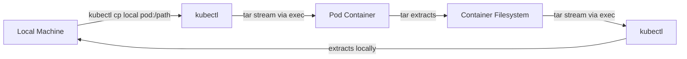

> 💡 **Quick Answer:** `kubectl cp <pod>:/path /local/path` copies files from pod to local. `kubectl cp /local/path <pod>:/path` copies local to pod. Requires `tar` binary in the container.

## The Problem

You need to:
- Extract log files or heap dumps from a running pod
- Upload configuration or debug tools into a container
- Copy database exports or test fixtures
- Collect crash artifacts before pod restart

## The Solution

### Copy from Pod to Local

```bash
# Basic syntax
kubectl cp <namespace>/<pod>:<path> <local-path>

# Copy a file
kubectl cp production/myapp-6f7b9c4d5-abc12:/var/log/app.log ./app.log

# Copy a directory
kubectl cp default/myapp-pod:/app/data ./local-data/

# From specific container (multi-container pod)
kubectl cp myapp-pod:/tmp/dump.hprof ./dump.hprof -c sidecar
```

### Copy from Local to Pod

```bash
# Upload a file
kubectl cp ./config.yaml default/myapp-pod:/etc/app/config.yaml

# Upload a directory
kubectl cp ./fixtures/ default/myapp-pod:/app/test-data/

# To specific namespace and container
kubectl cp ./debug-tools.sh production/myapp-pod:/tmp/ -c main
```

### Specify Namespace

```bash
# Using -n flag
kubectl cp -n production myapp-pod:/data/export.sql ./export.sql

# Using namespace/pod syntax
kubectl cp production/myapp-pod:/data/export.sql ./export.sql
```

### Architecture



### Common Patterns

```bash
# Copy logs before pod is evicted
kubectl cp myapp-pod:/var/log/ ./pod-logs/ --retries=3

# Extract heap dump for analysis
kubectl cp myapp-pod:/tmp/heap-dump-$(date +%s).hprof ./dumps/

# Upload hotfix jar (emergency only!)
kubectl cp ./hotfix.jar myapp-pod:/app/lib/hotfix.jar

# Copy from init container output
kubectl cp myapp-pod:/shared-data/init-output.json ./init-output.json -c init-container

# Compress before copy (faster for large files)
kubectl exec myapp-pod -- tar czf /tmp/logs.tar.gz /var/log/app/
kubectl cp myapp-pod:/tmp/logs.tar.gz ./logs.tar.gz
```

### Alternative: Use exec + cat for Small Files

```bash
# Faster for single small files (no tar overhead)
kubectl exec myapp-pod -- cat /etc/app/config.yaml > config.yaml

# Binary files
kubectl exec myapp-pod -- cat /tmp/dump.bin | base64 -d > dump.bin
```

## Common Issues

| Issue | Cause | Fix |
|-------|-------|-----|
| "tar: not found" | Container has no tar binary | Use `exec + cat` or add tar to image |
| "error: unexpected EOF" | Pod restarted during copy | Retry; use compression for large files |
| Permission denied | Running as non-root, target path restricted | Copy to /tmp first |
| Symlinks not followed | tar default behavior | Use `exec + tar -h` to follow links |
| Slow transfer | Large files uncompressed | Compress first with `exec tar czf` |
| Wrong container | Multi-container pod | Specify `-c container-name` |

## Best Practices

1. **Prefer ephemeral debug containers** for investigation — don't add tools to production images
2. **Compress large transfers** — `exec tar czf` then `cp` the archive
3. **Never cp secrets to local disk** — use `kubectl get secret` with proper RBAC
4. **Use `/tmp` as staging** — guaranteed writable in most containers
5. **Consider rsync alternatives** — `kubectl exec rsync` for large directory syncs

## Key Takeaways

- `kubectl cp` uses `tar` internally via `kubectl exec` — container needs `tar` binary
- Direction: `kubectl cp <source> <destination>` — pod paths use `pod:/path` syntax
- Use `-c` flag for multi-container pods to target the right container
- For large files, compress first then copy — much faster over the network
- Not a replacement for proper logging/monitoring — use for ad-hoc debugging only
