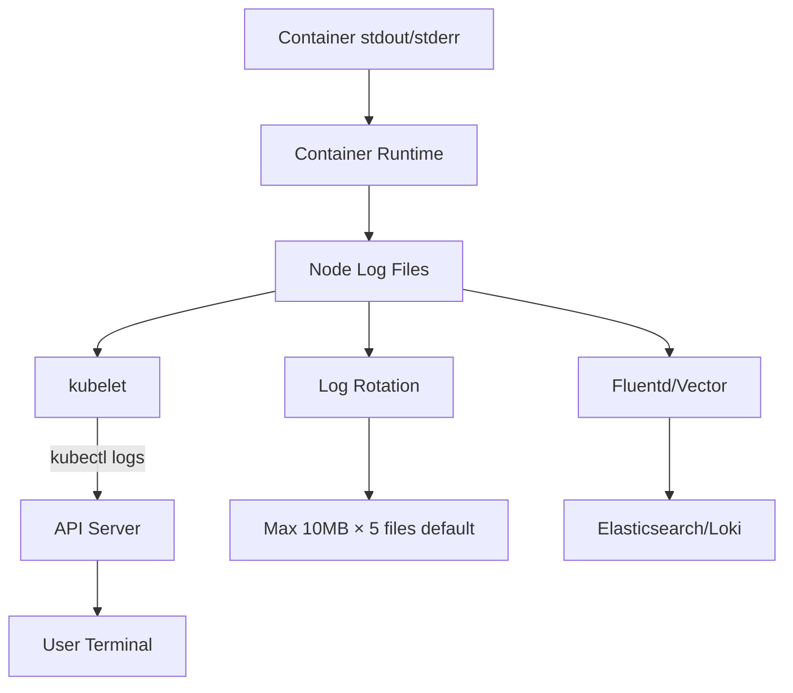

> 💡 **Quick Answer:** `kubectl logs <pod>` shows container stdout/stderr. Use `-f` to stream, `--previous` for crashed container logs, `-c` for multi-container pods, and `-l app=myapp` for all pods matching a label.

## The Problem

You need to debug application issues but:
- Pod crashed and restarted — previous logs are gone without `--previous`
- Multi-container pods show the wrong container's logs by default
- You need logs from multiple pod replicas simultaneously
- Large log output makes it hard to find recent errors

## The Solution

### Basic Usage

```bash
# View logs for a pod
kubectl logs myapp-6f7b9c4d5-abc12

# Stream logs (follow)
kubectl logs -f myapp-6f7b9c4d5-abc12

# Last N lines
kubectl logs --tail=100 myapp-6f7b9c4d5-abc12

# Logs since a time duration
kubectl logs --since=1h myapp-6f7b9c4d5-abc12

# Logs since a specific time
kubectl logs --since-time="2026-04-20T10:00:00Z" myapp-6f7b9c4d5-abc12

# With timestamps
kubectl logs --timestamps myapp-6f7b9c4d5-abc12
```

### Crashed / Restarted Pods

```bash
# View logs from previous container instance (before crash)
kubectl logs myapp-pod --previous

# Essential for CrashLoopBackOff debugging
kubectl logs myapp-pod --previous --tail=50
```

### Multi-Container Pods

```bash
# List containers in a pod
kubectl get pod myapp-pod -o jsonpath='{.spec.containers[*].name}'
# app  sidecar  istio-proxy

# View specific container logs
kubectl logs myapp-pod -c sidecar

# View init container logs
kubectl logs myapp-pod -c init-migration

# All containers
kubectl logs myapp-pod --all-containers=true
```

### Multiple Pods (Label Selector)

```bash
# All pods with a label
kubectl logs -l app=myapp

# Stream from all replicas
kubectl logs -f -l app=myapp --max-log-requests=10

# With prefix showing which pod
kubectl logs -l app=myapp --prefix=true
# [pod/myapp-abc12/app] Connected to database
# [pod/myapp-def34/app] Connected to database

# Combine with tail
kubectl logs -l app=myapp --tail=20 --timestamps
```

### Deployment / Job Logs

```bash
# Logs from a deployment (picks one pod)
kubectl logs deployment/myapp

# Logs from a job
kubectl logs job/data-migration

# Logs from a specific container in a deployment
kubectl logs deployment/myapp -c nginx
```

### Filter and Search

```bash
# Grep for errors
kubectl logs myapp-pod | grep -i error

# Grep with context
kubectl logs myapp-pod | grep -B5 -A5 "Exception"

# JSON logs — extract with jq
kubectl logs myapp-pod | jq 'select(.level == "ERROR")'

# Count errors per minute
kubectl logs myapp-pod --since=1h | grep ERROR | cut -d'T' -f1-2 | sort | uniq -c
```

### Architecture



## Common Issues

| Issue | Cause | Fix |
|-------|-------|-----|
| "error: the server doesn't have a resource type logs" | Missing RBAC | Grant `pods/log` permission |
| Empty logs | App writes to file, not stdout | Configure app to log to stdout |
| "previous terminated container not found" | Only 1 restart kept | Check node log files directly |
| Logs truncated | Container runtime log rotation | Use centralized logging (EFK/Loki) |
| Too many log requests | `-l` selector matches too many pods | Add `--max-log-requests=N` |
| No --previous for init containers | Init container succeeded (no restart) | Logs are available without --previous |

## Best Practices

1. **Always check `--previous` for CrashLoopBackOff** — current container may have empty logs
2. **Use `--prefix` with label selectors** — know which pod generated each line
3. **Set `--tail=100` for initial investigation** — avoid overwhelming output
4. **Pipe to `jq` for structured JSON logs** — filter by level, service, trace ID
5. **Deploy centralized logging for production** — kubectl logs doesn't survive pod deletion

## Key Takeaways

- `kubectl logs` reads container stdout/stderr from node log files via kubelet
- `--previous` is critical for debugging crashed containers
- Label selectors (`-l`) let you aggregate logs across all replicas
- Logs are ephemeral — they're lost when pods are deleted (use EFK/Loki for persistence)
- `--since`, `--tail`, and `--timestamps` are your essential filters
