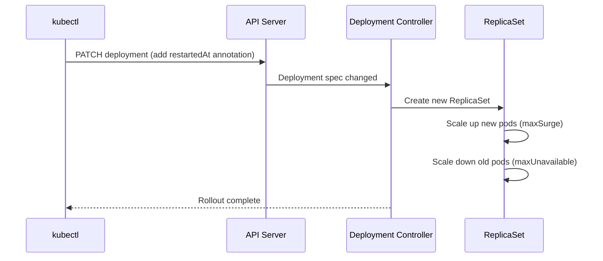

> 💡 **Quick Answer:** `kubectl rollout restart deployment/myapp` triggers a zero-downtime rolling restart by adding a `restartedAt` annotation. Pods are replaced one by one using the deployment's `maxSurge`/`maxUnavailable` strategy.

## The Problem

You need to restart all pods in a Deployment without:
- Changing the pod spec or image tag
- Causing downtime
- Manually deleting pods one by one
- Losing track of rollout history

Common reasons: pick up ConfigMap/Secret changes (without Reloader), clear in-memory caches, restart after a dependency recovery.

## The Solution

```bash
# Restart a Deployment
kubectl rollout restart deployment/myapp

# Restart a StatefulSet
kubectl rollout restart statefulset/redis

# Restart a DaemonSet
kubectl rollout restart daemonset/fluentd

# Restart in a specific namespace
kubectl rollout restart deployment/myapp -n production
```

### What Happens Under the Hood



### Watch the Rollout

```bash
# Watch rollout progress
kubectl rollout status deployment/myapp
# Waiting for deployment "myapp" rollout to finish: 1 out of 3 new replicas have been updated...
# Waiting for deployment "myapp" rollout to finish: 2 out of 3 new replicas have been updated...
# deployment "myapp" successfully rolled out

# Check rollout history
kubectl rollout history deployment/myapp
# REVISION  CHANGE-CAUSE
# 1         <none>
# 2         <none>  (restart)

# Verify the annotation
kubectl get deployment myapp -o jsonpath='{.spec.template.metadata.annotations.kubectl\.kubernetes\.io/restartedAt}'
# 2026-04-20T15:30:00Z
```

### Restart All Deployments in a Namespace

```bash
# Restart all deployments
kubectl rollout restart deployment -n production

# Restart matching a label
kubectl get deployments -l app.kubernetes.io/part-of=mystack -o name | \
  xargs -I{} kubectl rollout restart {}
```

### Rollback If Something Goes Wrong

```bash
# Undo the restart (rollback to previous revision)
kubectl rollout undo deployment/myapp

# Rollback to specific revision
kubectl rollout undo deployment/myapp --to-revision=1

# Pause a bad rollout
kubectl rollout pause deployment/myapp

# Resume after fixing
kubectl rollout resume deployment/myapp
```

### Control Restart Speed

```yaml
# deployment.yaml
apiVersion: apps/v1
kind: Deployment
metadata:
  name: myapp
spec:
  replicas: 10
  strategy:
    type: RollingUpdate
    rollingUpdate:
      maxSurge: 2        # Create 2 extra pods during restart
      maxUnavailable: 1  # Only 1 pod down at a time
  template:
    spec:
      terminationGracePeriodSeconds: 30
      containers:
        - name: app
          image: myapp:1.0.0
          readinessProbe:
            httpGet:
              path: /healthz
              port: 8080
            initialDelaySeconds: 5
```

## Common Issues

| Issue | Cause | Fix |
|-------|-------|-----|
| Rollout stuck | New pods failing readiness | Check pod logs, fix probe |
| All pods restarted at once | `maxUnavailable: 100%` | Set conservative strategy |
| ConfigMap not picked up | Mounted as subPath | Restart won't help for subPath mounts |
| Restart too slow | Low maxSurge | Increase maxSurge for faster rollout |
| "error: rollout restart is not supported" | Wrong resource type | Only Deployment, StatefulSet, DaemonSet supported |

## Best Practices

1. **Always have readiness probes** — rollout waits for probe success before continuing
2. **Use `terminationGracePeriodSeconds`** — gives pods time to drain connections
3. **Watch with `rollout status`** — catch failures early
4. **Consider Reloader instead** — auto-restarts on ConfigMap/Secret change
5. **Don't restart StatefulSets carelessly** — ordered restart may cause quorum loss

## Key Takeaways

- `kubectl rollout restart` is zero-downtime — uses the deployment's rolling update strategy
- Works on Deployments, StatefulSets, and DaemonSets
- Adds `restartedAt` annotation — doesn't change your image or config
- Use `rollout undo` to immediately rollback if something breaks
- Available since Kubernetes 1.15 — no additional tools needed
