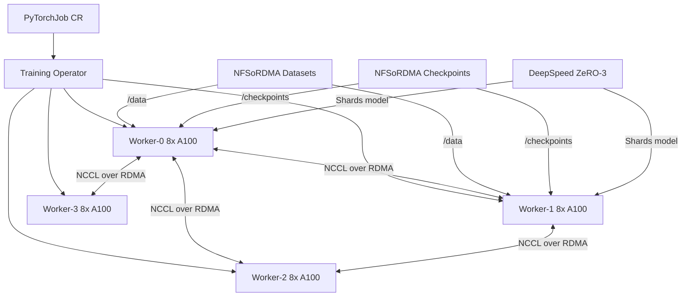

> 💡 **Quick Answer:** Create a PyTorchJob with `elasticPolicy` for fault-tolerant distributed training, mount shared storage for checkpoints, configure NCCL environment variables for RDMA, and use `torch.distributed.run` (torchrun) for elastic launching.

## The Problem

Training large language models (10B+ parameters) requires distributing work across 8-64+ GPUs on multiple nodes. You need data parallelism, model parallelism, proper gradient synchronization, checkpoint management, and fault tolerance — all orchestrated on Kubernetes.

## The Solution

Kubeflow Training Operator with PyTorchJob handles multi-node coordination. Combined with NCCL over RDMA for fast gradient sync and shared NFSoRDMA storage for checkpoints, you get a production training platform.

### Multi-Node PyTorchJob with NCCL over RDMA

```yaml
apiVersion: kubeflow.org/v1
kind: PyTorchJob
metadata:
  name: llm-finetune
  namespace: ai-training
spec:
  elasticPolicy:
    rdzvBackend: c10d
    minReplicas: 2
    maxReplicas: 8
    metrics:
      - type: Resource
        resource:
          name: cpu
          target:
            type: Utilization
            averageUtilization: 80
  pytorchReplicaSpecs:
    Worker:
      replicas: 4
      restartPolicy: OnFailure
      template:
        metadata:
          annotations:
            k8s.v1.cni.cncf.io/networks: rdma-net
        spec:
          nodeSelector:
            nvidia.com/gpu.product: "NVIDIA-A100-SXM4-80GB"
          tolerations:
            - key: nvidia.com/gpu
              operator: Exists
              effect: NoSchedule
          containers:
            - name: pytorch
              image: nvcr.io/nvidia/pytorch:24.03-py3
              command:
                - torchrun
                - --nnodes=4
                - --nproc_per_node=8
                - --rdzv_backend=c10d
                - --rdzv_endpoint=$(MASTER_ADDR):29500
                - /workspace/train.py
                - --model=meta-llama/Llama-2-13b-hf
                - --dataset=/data/train
                - --output-dir=/checkpoints/llm-finetune
                - --per-device-train-batch-size=2
                - --gradient-accumulation-steps=8
                - --num-train-epochs=3
                - --learning-rate=2e-5
                - --bf16
                - --deepspeed=/workspace/ds_config.json
              env:
                # NCCL over RDMA for fast gradient sync
                - name: NCCL_IB_DISABLE
                  value: "0"
                - name: NCCL_IB_HCA
                  value: "mlx5"
                - name: NCCL_IB_GID_INDEX
                  value: "3"
                - name: NCCL_NET_GDR_LEVEL
                  value: "5"        # GPU Direct RDMA
                - name: NCCL_SOCKET_IFNAME
                  value: "net1"     # RDMA interface
                - name: NCCL_DEBUG
                  value: "INFO"
                # Distributed settings
                - name: OMP_NUM_THREADS
                  value: "8"
                - name: TOKENIZERS_PARALLELISM
                  value: "false"
                # HuggingFace cache
                - name: HF_HOME
                  value: "/data/hf-cache"
                - name: HF_TOKEN
                  valueFrom:
                    secretKeyRef:
                      name: hf-token
                      key: token
              resources:
                limits:
                  nvidia.com/gpu: 8
                  rdma/rdma_shared_device_a: 1
                requests:
                  cpu: "32"
                  memory: 256Gi
              volumeMounts:
                - name: datasets
                  mountPath: /data
                  readOnly: true
                - name: checkpoints
                  mountPath: /checkpoints
                - name: dshm
                  mountPath: /dev/shm
          volumes:
            - name: datasets
              persistentVolumeClaim:
                claimName: nfsordma-datasets
            - name: checkpoints
              persistentVolumeClaim:
                claimName: nfsordma-checkpoints
            - name: dshm
              emptyDir:
                medium: Memory
                sizeLimit: 64Gi    # Shared memory for NCCL
```

### DeepSpeed Configuration

```json
{
  "bf16": {"enabled": true},
  "zero_optimization": {
    "stage": 3,
    "offload_optimizer": {"device": "none"},
    "offload_param": {"device": "none"},
    "overlap_comm": true,
    "contiguous_gradients": true,
    "reduce_scatter": true,
    "reduce_bucket_size": 5e8,
    "allgather_bucket_size": 5e8
  },
  "gradient_accumulation_steps": 8,
  "gradient_clipping": 1.0,
  "train_batch_size": 64,
  "train_micro_batch_size_per_gpu": 2,
  "wall_clock_breakdown": false,
  "communication_data_type": "bf16"
}
```

### TensorFlow Distributed Training

```yaml
apiVersion: kubeflow.org/v1
kind: TFJob
metadata:
  name: tf-distributed
  namespace: ai-training
spec:
  tfReplicaSpecs:
    Chief:
      replicas: 1
      restartPolicy: OnFailure
      template:
        spec:
          containers:
            - name: tensorflow
              image: tensorflow/tensorflow:2.16.1-gpu
              command:
                - python
                - /workspace/train_multi_worker.py
              resources:
                limits:
                  nvidia.com/gpu: 8
              volumeMounts:
                - name: data
                  mountPath: /data
          volumes:
            - name: data
              persistentVolumeClaim:
                claimName: training-data
    Worker:
      replicas: 3
      restartPolicy: OnFailure
      template:
        spec:
          containers:
            - name: tensorflow
              image: tensorflow/tensorflow:2.16.1-gpu
              command:
                - python
                - /workspace/train_multi_worker.py
              resources:
                limits:
                  nvidia.com/gpu: 8
              volumeMounts:
                - name: data
                  mountPath: /data
          volumes:
            - name: data
              persistentVolumeClaim:
                claimName: training-data
```

### MPIJob for Horovod

```yaml
apiVersion: kubeflow.org/v1
kind: MPIJob
metadata:
  name: horovod-training
  namespace: ai-training
spec:
  slotsPerWorker: 8
  runPolicy:
    cleanPodPolicy: Running
    ttlSecondsAfterFinished: 3600
  mpiReplicaSpecs:
    Launcher:
      replicas: 1
      template:
        spec:
          containers:
            - name: mpi-launcher
              image: horovod/horovod:latest-gpu
              command:
                - mpirun
                - --allow-run-as-root
                - -np
                - "32"
                - -bind-to
                - none
                - -map-by
                - slot
                - -x NCCL_DEBUG=INFO
                - -x NCCL_IB_DISABLE=0
                - -x NCCL_IB_HCA=mlx5
                - python
                - /workspace/train_horovod.py
              resources:
                limits:
                  cpu: "2"
                  memory: 4Gi
    Worker:
      replicas: 4
      template:
        spec:
          containers:
            - name: mpi-worker
              image: horovod/horovod:latest-gpu
              resources:
                limits:
                  nvidia.com/gpu: 8
              volumeMounts:
                - name: dshm
                  mountPath: /dev/shm
          volumes:
            - name: dshm
              emptyDir:
                medium: Memory
                sizeLimit: 64Gi
```

### Monitor Distributed Training

```bash
# Watch job status
kubectl get pytorchjobs -n ai-training -w

# Check all worker pods
kubectl get pods -n ai-training -l training.kubeflow.org/job-name=llm-finetune

# Stream master logs (training progress)
kubectl logs -f llm-finetune-worker-0 -n ai-training

# Check NCCL initialization
kubectl logs llm-finetune-worker-0 -n ai-training | grep -i nccl

# Monitor GPU utilization across workers
for i in 0 1 2 3; do
  echo "=== Worker $i ==="
  kubectl exec llm-finetune-worker-$i -n ai-training -- nvidia-smi --query-gpu=utilization.gpu,memory.used --format=csv
done

# Check training throughput
kubectl logs llm-finetune-worker-0 -n ai-training | grep "samples/sec\|throughput\|loss"
```



## Common Issues

- **NCCL timeout during init** — increase `NCCL_SOCKET_TIMEOUT`; verify all workers can reach each other on RDMA interface
- **OOM on GPU** — reduce `per-device-train-batch-size`; enable DeepSpeed ZeRO-3 offloading; use gradient checkpointing
- **Worker crash: shared memory** — increase `/dev/shm` via `emptyDir.medium: Memory`; NCCL needs large shared memory
- **Elastic scaling not working** — ensure `elasticPolicy` with `rdzvBackend: c10d`; `torchrun` must be used (not `python -m torch.distributed.launch`)
- **Slow training throughput** — check NCCL is using RDMA (not TCP); verify `NCCL_IB_DISABLE=0`; check `nvidia-smi` for GPU utilization < 80% indicating communication bottleneck

## Best Practices

- Use `emptyDir` with `medium: Memory` for `/dev/shm` (64Gi+) — NCCL requires large shared memory
- Enable NCCL over RDMA with `NCCL_IB_DISABLE=0` and `NCCL_IB_HCA=mlx5` for ConnectX NICs
- Use DeepSpeed ZeRO-3 for models > 7B parameters
- Store checkpoints to NFSoRDMA shared storage for automatic resume after failures
- Set `restartPolicy: OnFailure` for automatic worker recovery
- Use `elasticPolicy` for fault-tolerant training that survives worker preemption
- Monitor NCCL debug logs during first run to verify RDMA transport is active
- Set `ttlSecondsAfterFinished` to auto-cleanup completed job resources

## Key Takeaways

- PyTorchJob/TFJob/MPIJob handle multi-node coordination automatically
- NCCL over RDMA delivers 2-5x faster gradient synchronization than TCP
- ElasticPolicy enables fault-tolerant training with dynamic worker count
- DeepSpeed ZeRO-3 shards model across workers for large model training
- Shared NFSoRDMA storage enables checkpoint sharing across all workers
- `/dev/shm` must be large enough (64Gi+) for NCCL shared memory communication
