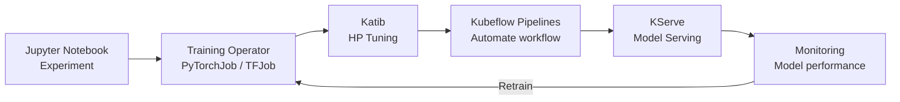

> 💡 **Quick Answer:** Deploy Kubeflow with `kustomize build` or the Kubeflow Operator for a complete ML platform: Jupyter notebooks for experimentation, Training Operators for distributed training, Katib for hyperparameter tuning, Pipelines for workflow automation, and KServe for model serving.

## The Problem

Data scientists need an end-to-end ML platform — from experimentation in notebooks to distributed training to production serving. Building this from scratch on Kubernetes requires integrating dozens of components. Kubeflow provides an opinionated, production-ready ML platform that runs natively on Kubernetes.

## The Solution

### Install Kubeflow

```bash
# Clone Kubeflow manifests
git clone https://github.com/kubeflow/manifests.git
cd manifests

# Deploy all components
while ! kustomize build example | kubectl apply -f -; do
  echo "Retrying..."; sleep 10
done
```

### Kubeflow Components

| Component | Purpose | CRD |
|-----------|---------|-----|
| **Notebooks** | Jupyter on K8s | Notebook |
| **Training Operator** | Distributed training | TFJob, PyTorchJob, MPIJob |
| **Katib** | Hyperparameter tuning | Experiment, Trial |
| **Pipelines** | ML workflow DAGs | PipelineRun |
| **KServe** | Model serving | InferenceService |

### Jupyter Notebook Server

```yaml
apiVersion: kubeflow.org/v1
kind: Notebook
metadata:
  name: ml-workspace
  namespace: kubeflow-user
spec:
  template:
    spec:
      containers:
        - name: notebook
          image: registry.example.com/jupyter-pytorch:2.5
          resources:
            requests:
              cpu: "2"
              memory: 8Gi
              nvidia.com/gpu: 1
            limits:
              memory: 16Gi
              nvidia.com/gpu: 1
          volumeMounts:
            - name: workspace
              mountPath: /home/jovyan
      volumes:
        - name: workspace
          persistentVolumeClaim:
            claimName: ml-workspace-pvc
```

### Distributed Training with PyTorchJob

```yaml
apiVersion: kubeflow.org/v1
kind: PyTorchJob
metadata:
  name: resnet-training
  namespace: kubeflow-user
spec:
  pytorchReplicaSpecs:
    Master:
      replicas: 1
      template:
        spec:
          containers:
            - name: pytorch
              image: registry.example.com/training:1.0
              command: ["torchrun"]
              args:
                - --nproc_per_node=8
                - --nnodes=4
                - --node_rank=$(RANK)
                - --master_addr=$(MASTER_ADDR)
                - --master_port=$(MASTER_PORT)
                - train.py
              resources:
                limits:
                  nvidia.com/gpu: 8
    Worker:
      replicas: 3
      template:
        spec:
          containers:
            - name: pytorch
              image: registry.example.com/training:1.0
              command: ["torchrun"]
              args:
                - --nproc_per_node=8
                - --nnodes=4
                - --node_rank=$(RANK)
                - --master_addr=$(MASTER_ADDR)
                - --master_port=$(MASTER_PORT)
                - train.py
              resources:
                limits:
                  nvidia.com/gpu: 8
```

### ML Pipeline

```yaml
apiVersion: tekton.dev/v1beta1
kind: Pipeline
metadata:
  name: ml-pipeline
spec:
  tasks:
    - name: preprocess
      taskRef:
        name: data-preprocessing
    - name: train
      taskRef:
        name: distributed-training
      runAfter: ["preprocess"]
    - name: evaluate
      taskRef:
        name: model-evaluation
      runAfter: ["train"]
    - name: deploy
      taskRef:
        name: model-deployment
      runAfter: ["evaluate"]
```



## Common Issues

**Kubeflow installation fails with resource conflicts**

Run the install command in a loop — components have ordering dependencies. Use `while ! kustomize build | kubectl apply -f -; do sleep 10; done`.

**Notebook server stuck in Pending**

Check GPU resource availability: `kubectl describe node | grep nvidia.com/gpu`. Ensure GPU operator is installed and nodes have available GPUs.

## Best Practices

- **Dedicated namespace per user** — Kubeflow profiles provide multi-tenancy
- **PVCs for notebook workspaces** — persistent storage survives pod restarts
- **GPU quotas per namespace** — prevent one team from monopolizing GPUs
- **Istio or Dex for authentication** — Kubeflow requires identity management
- **Regular model retraining pipelines** — models degrade over time (data drift)

## Key Takeaways

- Kubeflow provides a complete ML platform: notebooks, training, tuning, pipelines, serving
- Training Operator supports distributed PyTorch, TensorFlow, MPI, and XGBoost jobs
- Katib automates hyperparameter search — no manual tuning loops
- KServe provides serverless model serving with autoscaling and canary rollouts
- ML Pipelines automate the full workflow from data processing to model deployment
