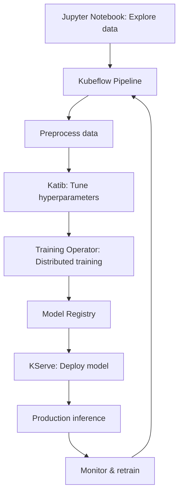

> 💡 **Quick Answer:** Deploy the complete Kubeflow platform on Kubernetes with the Kubeflow Operator. Covers Pipelines, Notebooks, KServe, Katib, and multi-tenant ML workflows.

## The Problem

Building an end-to-end ML platform requires stitching together dozens of tools: notebooks, experiment tracking, distributed training, hyperparameter tuning, model serving, and pipeline orchestration. Installing each component separately leads to version conflicts, broken integrations, and maintenance nightmares. The Kubeflow Operator deploys and manages the entire stack as a single, cohesive platform.

## The Solution

### Kubeflow Components Overview

| Component | Purpose | CRD |
|-----------|---------|-----|
| **Pipelines** | ML workflow orchestration | `PipelineRun` |
| **Notebooks** | Jupyter notebook servers | `Notebook` |
| **Training Operator** | Distributed training | `PyTorchJob`, `TFJob`, `MPIJob` |
| **Katib** | Hyperparameter tuning | `Experiment` |
| **KServe** | Model serving & inference | `InferenceService` |
| **Volumes** | Data/model management | PVCs |
| **Profiles** | Multi-tenant namespaces | `Profile` |

### Prerequisites

```bash
# Kubernetes 1.27+ with:
# - Default StorageClass (dynamic provisioning)
# - GPU support (NVIDIA GPU Operator) for training/inference
# - At least 16GB RAM, 8 CPUs for control plane components

# Required: cert-manager and Istio
kubectl apply -f https://github.com/cert-manager/cert-manager/releases/download/v1.14.0/cert-manager.yaml

# Wait for cert-manager
kubectl wait --for=condition=Available deployment -n cert-manager --all --timeout=300s
```

### Install Kubeflow with Manifests (Recommended)

```bash
# Clone Kubeflow manifests
git clone https://github.com/kubeflow/manifests.git
cd manifests

# Install everything (takes 10-15 minutes)
while ! kustomize build example | kubectl apply -f -; do
  echo "Retrying..."
  sleep 10
done

# Verify all pods are running
kubectl get pods -n kubeflow --watch

# Access the dashboard
kubectl port-forward svc/istio-ingressgateway -n istio-system 8080:80
# Open http://localhost:8080
# Default credentials: user@example.com / 12341234
```

### Install with Kubeflow Operator (Declarative)

```yaml
# The Kubeflow Operator manages the platform lifecycle
apiVersion: kfdef.apps.kubeflow.org/v1
kind: KfDef
metadata:
  name: kubeflow
  namespace: kubeflow
spec:
  applications:
    - kustomizeConfig:
        repoRef:
          name: manifests
          path: common/cert-manager/cert-manager/base
      name: cert-manager
    - kustomizeConfig:
        repoRef:
          name: manifests
          path: common/istio-1-17/istio-install/base
      name: istio
    - kustomizeConfig:
        repoRef:
          name: manifests
          path: apps/pipeline/upstream/env/cert-manager/platform-agnostic-multi-user
      name: pipelines
    - kustomizeConfig:
        repoRef:
          name: manifests
          path: apps/jupyter/notebook-controller/upstream/overlays/kubeflow
      name: notebooks
    - kustomizeConfig:
        repoRef:
          name: manifests
          path: apps/training-operator/upstream/overlays/kubeflow
      name: training-operator
    - kustomizeConfig:
        repoRef:
          name: manifests
          path: apps/katib/upstream/installs/katib-with-kubeflow
      name: katib
    - kustomizeConfig:
        repoRef:
          name: manifests
          path: contrib/kserve/kserve
      name: kserve
  repos:
    - name: manifests
      uri: https://github.com/kubeflow/manifests/archive/v1.9.tar.gz
```

### Multi-Tenant Setup with Profiles

```yaml
# Create a team workspace (namespace + RBAC + quotas)
apiVersion: kubeflow.org/v1
kind: Profile
metadata:
  name: ml-team-alpha
spec:
  owner:
    kind: User
    name: alice@example.com
  resourceQuotaSpec:
    hard:
      requests.cpu: "32"
      requests.memory: 128Gi
      requests.nvidia.com/gpu: "4"
      limits.cpu: "64"
      limits.memory: 256Gi
      persistentvolumeclaims: "20"
```

```bash
# Kubeflow creates namespace "ml-team-alpha" with:
# - Istio sidecar injection
# - RBAC for the owner
# - ResourceQuota
# - Network isolation

kubectl get profile
kubectl get ns ml-team-alpha
```

### Kubeflow Pipelines

```python
# Define a pipeline with the KFP SDK
from kfp import dsl, compiler

@dsl.component(base_image="python:3.11")
def preprocess(data_path: str) -> str:
    import pandas as pd
    df = pd.read_csv(data_path)
    # Clean, transform, feature engineer...
    output_path = "/tmp/processed.csv"
    df.to_csv(output_path)
    return output_path

@dsl.component(base_image="pytorch/pytorch:2.2.0-cuda12.1-cudnn8-runtime")
def train(data_path: str, epochs: int = 10) -> str:
    import torch
    # Training logic...
    model_path = "/tmp/model.pt"
    torch.save(model.state_dict(), model_path)
    return model_path

@dsl.component(base_image="python:3.11")
def deploy(model_path: str, endpoint: str):
    # Deploy to KServe
    pass

@dsl.pipeline(name="ML Training Pipeline")
def ml_pipeline(data_path: str = "gs://bucket/data.csv"):
    preprocess_task = preprocess(data_path=data_path)
    train_task = train(
        data_path=preprocess_task.output,
        epochs=20
    ).set_gpu_limit(1)
    deploy(
        model_path=train_task.output,
        endpoint="my-model"
    )

# Compile and upload
compiler.Compiler().compile(ml_pipeline, "pipeline.yaml")

# Submit via CLI
# kfp run submit -e my-experiment -r run-001 -f pipeline.yaml
```

### Jupyter Notebooks

```yaml
apiVersion: kubeflow.org/v1
kind: Notebook
metadata:
  name: gpu-notebook
  namespace: ml-team-alpha
spec:
  template:
    spec:
      containers:
        - name: notebook
          image: kubeflownotebookswg/jupyter-pytorch-cuda-full:v1.9.0
          resources:
            requests:
              cpu: "2"
              memory: 8Gi
              nvidia.com/gpu: "1"
            limits:
              cpu: "4"
              memory: 16Gi
              nvidia.com/gpu: "1"
          volumeMounts:
            - name: workspace
              mountPath: /home/jovyan
      volumes:
        - name: workspace
          persistentVolumeClaim:
            claimName: gpu-notebook-workspace
```

### Katib Hyperparameter Tuning

```yaml
apiVersion: kubeflow.org/v1beta1
kind: Experiment
metadata:
  name: tune-learning-rate
  namespace: ml-team-alpha
spec:
  objective:
    type: maximize
    goal: 0.95
    objectiveMetricName: accuracy
  algorithm:
    algorithmName: bayesianoptimization
  maxTrialCount: 30
  maxFailedTrialCount: 3
  parallelTrialCount: 5
  parameters:
    - name: learning-rate
      parameterType: double
      feasibleSpace:
        min: "0.0001"
        max: "0.1"
    - name: batch-size
      parameterType: int
      feasibleSpace:
        min: "16"
        max: "256"
    - name: optimizer
      parameterType: categorical
      feasibleSpace:
        list: ["adam", "sgd", "adamw"]
  trialTemplate:
    primaryContainerName: training
    trialParameters:
      - name: learningRate
        reference: learning-rate
      - name: batchSize
        reference: batch-size
      - name: optimizer
        reference: optimizer
    trialSpec:
      apiVersion: batch/v1
      kind: Job
      spec:
        template:
          spec:
            containers:
              - name: training
                image: my-training:v1
                command:
                  - python
                  - train.py
                  - --lr=${trialParameters.learningRate}
                  - --batch-size=${trialParameters.batchSize}
                  - --optimizer=${trialParameters.optimizer}
                resources:
                  limits:
                    nvidia.com/gpu: 1
            restartPolicy: Never
```

### KServe Model Serving

```yaml
apiVersion: serving.kserve.io/v1beta1
kind: InferenceService
metadata:
  name: my-model
  namespace: ml-team-alpha
spec:
  predictor:
    model:
      modelFormat:
        name: pytorch
      storageUri: "gs://models/my-model/v1"
      resources:
        requests:
          cpu: "2"
          memory: 4Gi
          nvidia.com/gpu: "1"
    minReplicas: 1
    maxReplicas: 5
    scaleTarget: 10        # Scale at 10 concurrent requests
  transformer:
    containers:
      - name: preprocessor
        image: my-preprocessor:v1
```

```bash
# Test inference
curl -X POST http://my-model.ml-team-alpha.example.com/v1/models/my-model:predict \
  -H "Content-Type: application/json" \
  -d '{"instances": [[1.0, 2.0, 3.0, 4.0]]}'
```

### Full ML Workflow



### Resource Requirements

| Component | Min CPU | Min Memory | Notes |
|-----------|---------|------------|-------|
| Istio | 2 cores | 4Gi | Service mesh |
| Pipelines | 2 cores | 4Gi | Argo + MySQL + MinIO |
| Notebooks | 1 core | 2Gi | Per notebook server |
| Training Operator | 500m | 512Mi | Controller only |
| Katib | 500m | 512Mi | Controller + DB |
| KServe | 1 core | 2Gi | Controller + Istio |
| **Total platform** | **~8 cores** | **~16Gi** | **Without workloads** |

### Production Hardening

```bash
# 1. Change default credentials
kubectl edit configmap dex -n auth
# Update staticPasswords

# 2. Configure external auth (OIDC)
# Point Dex to your identity provider (Okta, Azure AD, Google)

# 3. Enable HTTPS
# Configure Istio gateway with TLS certificates

# 4. External database for Pipelines
# Replace built-in MySQL with managed RDS/CloudSQL

# 5. External object storage
# Replace MinIO with S3/GCS for pipeline artifacts

# 6. GPU node pools
# Dedicate GPU nodes with taints for training workloads
kubectl taint nodes gpu-pool nvidia.com/gpu=present:NoSchedule
```

## Common Issues

| Issue | Cause | Fix |
|-------|-------|-----|
| Pods stuck in Init | Istio sidecar injection delay | Wait, check istio-proxy logs |
| Pipeline step OOM | Insufficient memory limit | Increase resource requests |
| Notebook won't start | PVC not bound | Check StorageClass |
| Katib trials fail | Training image error | Test image standalone first |
| KServe 503 | Model loading timeout | Increase timeout, check storage access |
| Auth redirect loop | Dex misconfiguration | Check OIDC settings, cookie domain |

## Best Practices

- **Start small**: Install only the components you need (Pipelines + Notebooks is a good start)
- **Use Profiles** for team isolation — each team gets their own namespace with quotas
- **External databases** for production — built-in MySQL/MinIO are for development only
- **GPU quotas**: Set `requests.nvidia.com/gpu` in Profile ResourceQuotas
- **Version pin** your Kubeflow manifests — don't track `main` in production
- **Backup Pipelines DB** — contains all experiment history and metadata

## Key Takeaways

- Kubeflow provides a complete MLOps platform on Kubernetes
- The operator approach manages the entire lifecycle declaratively
- Multi-tenancy via Profiles provides team isolation with RBAC and quotas
- Katib automates hyperparameter tuning with Bayesian optimization
- KServe handles model serving with autoscaling and canary rollouts
- Production deployments need external databases, OIDC auth, and TLS
