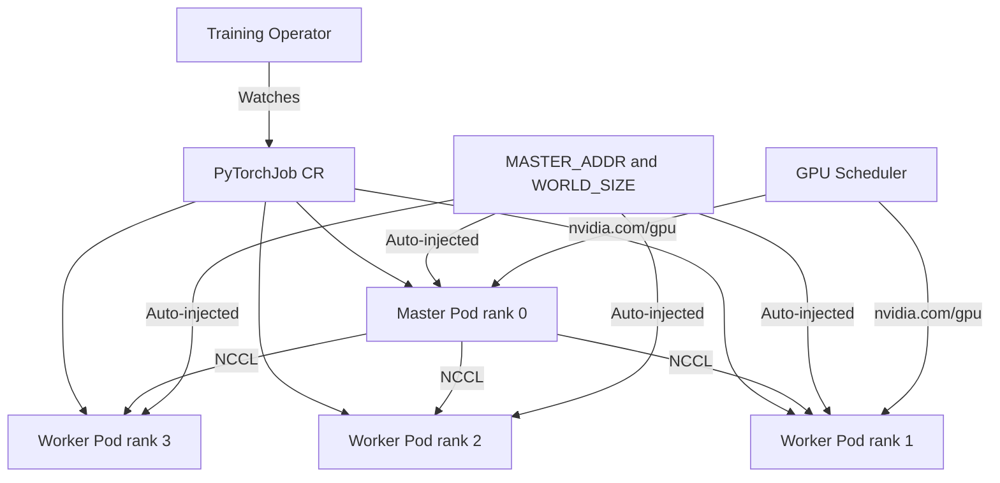

> 💡 **Quick Answer:** Install the standalone Kubeflow Training Operator via `kubectl apply` manifest or Helm, then create PyTorchJob/TFJob CRs to run distributed training across GPU nodes with automatic worker coordination.

## The Problem

Distributed ML training requires coordinating multiple workers across nodes — setting up rendezvous endpoints, managing rank assignments, handling worker failures, and cleaning up resources. Manually managing this with bare Deployments or StatefulSets is error-prone and doesn't handle gang scheduling or elastic scaling.

## The Solution

The Kubeflow Training Operator provides CRDs (PyTorchJob, TFJob, MPIJob, XGBoostJob, PaddleJob) that abstract distributed training orchestration. It handles worker startup ordering, environment variable injection, failure recovery, and cleanup.

> **Note:** Kubeflow Training Operator is a standalone component. It was removed from OpenShift AI (RHOAI) in 2025 — on OpenShift, install it directly from upstream.

### Install Training Operator (Standalone)

```bash
# Install latest stable release
kubectl apply -k "github.com/kubeflow/training-operator.git/manifests/overlays/standalone?ref=v1.8.1"

# Or via Helm
helm repo add kubeflow https://kubeflow.github.io/training-operator
helm install training-operator kubeflow/training-operator \
  --namespace kubeflow \
  --create-namespace

# Verify installation
kubectl get pods -n kubeflow
kubectl get crds | grep kubeflow
# pytorchjobs.kubeflow.org
# tfjobs.kubeflow.org
# mpijobs.kubeflow.org
# xgboostjobs.kubeflow.org
# paddlejobs.kubeflow.org
```

### Install on OpenShift

```bash
# Kubeflow Training Operator was removed from OpenShift AI (RHOAI)
# Install standalone operator directly

# Option 1: Manifest-based
oc apply -k "github.com/kubeflow/training-operator.git/manifests/overlays/standalone?ref=v1.8.1"

# Option 2: Create namespace with proper SCC
oc new-project kubeflow
oc adm policy add-scc-to-user anyuid -z training-operator -n kubeflow

kubectl apply -k "github.com/kubeflow/training-operator.git/manifests/overlays/standalone?ref=v1.8.1"

# Verify CRDs
oc get crds | grep kubeflow
```

### Basic PyTorchJob

```yaml
apiVersion: kubeflow.org/v1
kind: PyTorchJob
metadata:
  name: pytorch-mnist
  namespace: ai-workloads
spec:
  pytorchReplicaSpecs:
    Master:
      replicas: 1
      restartPolicy: OnFailure
      template:
        spec:
          containers:
            - name: pytorch
              image: kubeflowkatib/pytorch-mnist-gpu:latest
              command:
                - python
                - /opt/pytorch-mnist/mnist.py
                - --epochs=5
                - --batch-size=64
              resources:
                limits:
                  nvidia.com/gpu: 1
    Worker:
      replicas: 3
      restartPolicy: OnFailure
      template:
        spec:
          containers:
            - name: pytorch
              image: kubeflowkatib/pytorch-mnist-gpu:latest
              command:
                - python
                - /opt/pytorch-mnist/mnist.py
                - --epochs=5
                - --batch-size=64
              resources:
                limits:
                  nvidia.com/gpu: 1
```

### Monitor Training Jobs

```bash
# List training jobs
kubectl get pytorchjobs -n ai-workloads
kubectl get tfjobs -n ai-workloads
kubectl get mpijobs -n ai-workloads

# Get job status
kubectl describe pytorchjob pytorch-mnist -n ai-workloads

# View master logs
kubectl logs pytorch-mnist-master-0 -n ai-workloads

# View worker logs
kubectl logs pytorch-mnist-worker-0 -n ai-workloads

# Watch job progress
kubectl get pytorchjobs -n ai-workloads -w

# Clean up completed jobs
kubectl delete pytorchjob pytorch-mnist -n ai-workloads
```

### Environment Variables (Auto-Injected)

```bash
# The Training Operator automatically sets these env vars:
# MASTER_ADDR=pytorch-mnist-master-0
# MASTER_PORT=23456
# WORLD_SIZE=4 (1 master + 3 workers)
# RANK=0|1|2|3
# PYTHONUNBUFFERED=1

# Your training script uses them via torch.distributed:
# torch.distributed.init_process_group(backend="nccl")
```



## Common Issues

- **Workers stuck Pending** — insufficient GPU resources; check `kubectl describe node | grep gpu` and reduce worker count
- **NCCL timeout** — workers can't communicate; verify NetworkPolicy allows pod-to-pod traffic; check NCCL_SOCKET_IFNAME
- **Master pod CrashLoopBackOff** — training script error; check `kubectl logs` for Python traceback
- **OpenShift SCC issues** — Training Operator may need `anyuid` SCC; add to service account
- **Job stuck in Running after completion** — some training scripts don't exit cleanly; add proper `sys.exit(0)` after training

## Best Practices

- Use `restartPolicy: OnFailure` for automatic retry on transient failures
- Set appropriate GPU resource limits — one GPU per worker is typical
- Use NCCL backend for multi-GPU communication (`backend="nccl"`)
- Store checkpoints to shared storage (PVC) for crash recovery
- Use `ttlSecondsAfterFinished` or manual cleanup to avoid accumulating completed jobs
- Pin Training Operator version to avoid unexpected behavior changes

## Key Takeaways

- Kubeflow Training Operator is standalone — install independently (removed from OpenShift AI)
- CRDs: PyTorchJob, TFJob, MPIJob, XGBoostJob, PaddleJob
- Auto-injects MASTER_ADDR, WORLD_SIZE, RANK — training scripts use standard distributed APIs
- Master-Worker topology with automatic pod coordination and failure handling
- Works with any GPU-enabled Kubernetes cluster including OpenShift
