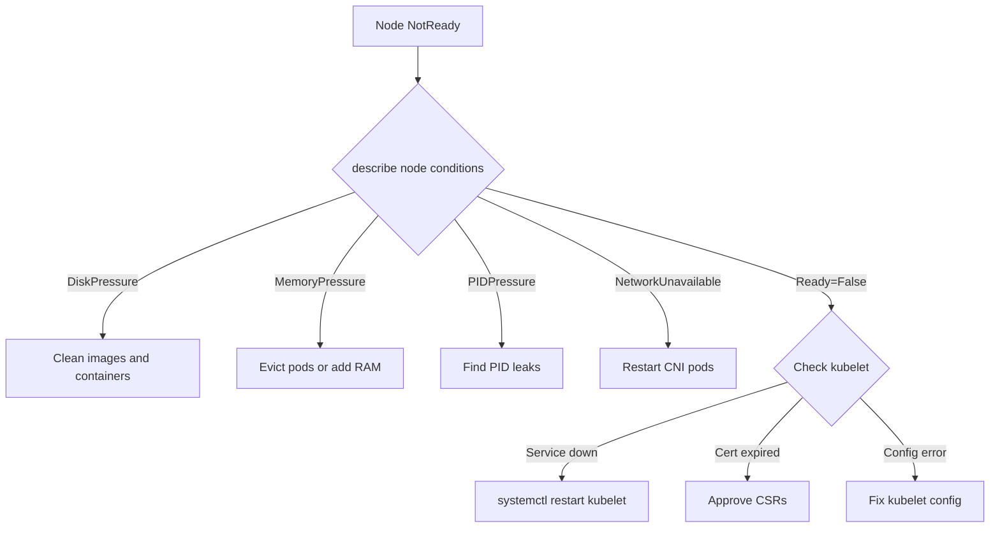

> 💡 **Quick Answer:** Node NotReady means kubelet can't communicate with the API server, or a node condition is failing (disk/memory/PID pressure, network not ready). Run `kubectl describe node <name>` to see conditions, then check kubelet logs on the node with `journalctl -u kubelet`.
>
> **Key insight:** NotReady doesn't always mean the node is down. It could be kubelet crashed, certificate expired, CNI plugin failed, or the node is under resource pressure.

## The Problem

```bash
$ kubectl get nodes
NAME       STATUS     ROLES    AGE   VERSION
worker-1   NotReady   worker   30d   v1.28.4
worker-2   Ready      worker   30d   v1.28.4
```

## The Solution

### Step 1: Check Node Conditions

```bash
kubectl describe node worker-1 | grep -A20 Conditions
```

| Condition | True Means | Fix |
|-----------|-----------|-----|
| MemoryPressure | Node low on RAM | Evict pods, add memory |
| DiskPressure | Node low on disk | Clean images: `crictl rmi --prune` |
| PIDPressure | Too many processes | Find PID leaks, increase max PIDs |
| NetworkUnavailable | CNI not ready | Restart CNI pods |
| Ready=False | Kubelet stopped posting | Check kubelet service |

### Step 2: Check Kubelet Service

```bash
# SSH to the node or use oc debug
oc debug node/worker-1 -- chroot /host bash

# Check kubelet status
systemctl status kubelet
journalctl -u kubelet --no-pager -n 100

# Common kubelet failures:
# "failed to run Kubelet: unable to load bootstrap kubeconfig"
# "certificate has expired"
# "failed to start ContainerManager"
```

### Step 3: Fix by Condition

**Disk Pressure:**
```bash
# Clean unused images
crictl rmi --prune
# Clean old containers
crictl rm $(crictl ps -a -q --state exited)
# Check disk usage
df -h /var/lib/kubelet /var/lib/containers
```

**Memory Pressure:**
```bash
# Find memory hogs
top -b -o %MEM | head -20
# Check eviction thresholds
cat /var/lib/kubelet/config.yaml | grep -A5 eviction
```

**Certificate Expired (OpenShift):**
```bash
# Check certificate expiry
openssl x509 -in /var/lib/kubelet/pki/kubelet-client-current.pem -noout -dates
# Approve pending CSRs
oc get csr | grep Pending | awk '{print $1}' | xargs oc adm certificate approve
```



## Common Issues

### Node flaps between Ready and NotReady
Usually indicates intermittent network between the node and API server. Check: network connectivity, firewall rules, and load balancer health for the API server.

### All nodes NotReady after certificate rotation
Approve all pending CSRs: `oc get csr -o name | xargs oc adm certificate approve`

### Node Ready but pods not scheduling
Check for taints: `kubectl describe node worker-1 | grep Taints`. The node may have been cordoned.

## Best Practices

- **Monitor node conditions** with alerting — don't wait for NotReady
- **Set eviction thresholds** appropriately for your workload: `--eviction-hard=memory.available<500Mi,nodefs.available<10%`
- **Auto-approve CSRs** in clusters with frequent node cycling
- **Pre-pull critical images** to avoid disk pressure from large image pulls
- **Use node problem detector** for early warning on hardware/kernel issues

## Key Takeaways

- NotReady ≠ node down — could be kubelet, certificates, CNI, or resource pressure
- `kubectl describe node` conditions tell you the exact problem
- `journalctl -u kubelet` on the node gives detailed error logs
- Disk pressure is the #1 cause in production — monitor and clean images regularly
- Certificate expiry is the #1 cause in OpenShift — auto-approve CSRs
