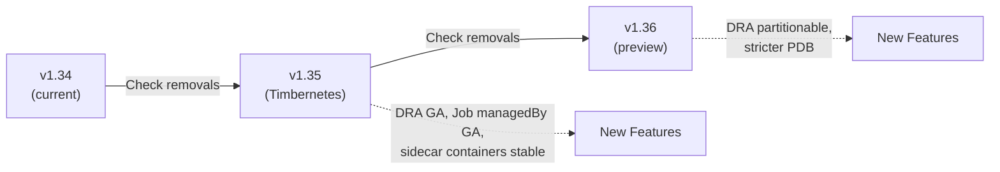

> 💡 **Quick Answer:** Kubernetes v1.35 (Timbernetes) and v1.36 bring DRA partitionable devices, Job `managedBy` GA, stricter PodDisruptionBudget behavior, and several API removals. Before upgrading: audit deprecated APIs with `kubectl deprecations`, backup etcd, test in staging, and update Helm charts and operators.

## The Problem

Every Kubernetes release deprecates or removes APIs, changes default behaviors, and graduates features. Upgrading without checking these changes causes broken deployments, failed CI/CD, and production incidents. This checklist covers both v1.35 and v1.36 to help teams planning multi-version upgrades.



## The Solution

### Pre-Upgrade Checklist

```bash
# Step 1: Check current version
kubectl version --short

# Step 2: Audit deprecated APIs
# Option A: kubectl-deprecations plugin
kubectl deprecations --k8s-version=1.35

# Option B: Pluto (by FairwindsOps)
pluto detect-all-in-cluster --target-versions k8s=v1.35

# Option C: Manual check with API discovery
kubectl get --raw /apis | jq -r '.groups[].preferredVersion.groupVersion'

# Step 3: Backup etcd
ETCDCTL_API=3 etcdctl snapshot save /backup/etcd-pre-upgrade-$(date +%Y%m%d).db \
  --endpoints=https://127.0.0.1:2379 \
  --cacert=/etc/kubernetes/pki/etcd/ca.crt \
  --cert=/etc/kubernetes/pki/etcd/server.crt \
  --key=/etc/kubernetes/pki/etcd/server.key

# Step 4: Check node readiness
kubectl get nodes -o wide
kubectl top nodes

# Step 5: Check PodDisruptionBudgets (stricter in 1.36)
kubectl get pdb -A -o wide
```

### Kubernetes v1.35 Changes (Timbernetes)

#### Graduated to Stable (GA)

| Feature | What Changed |
|---------|-------------|
| **Job `managedBy` field** | External controllers (Kueue, Volcano) manage Jobs natively |
| **Node memory swap** | Swap support stable — configure `memorySwap` in kubelet config |
| **CRD validation ratcheting** | Invalid fields preserved on update if unchanged (migration-friendly) |
| **Recursive read-only mounts** | `readOnlyRootFilesystem` applies recursively to all mounts |

#### API Removals in v1.35

```yaml
# REMOVED: flowcontrol.apiserver.k8s.io/v1beta3
# BEFORE:
apiVersion: flowcontrol.apiserver.k8s.io/v1beta3
kind: FlowSchema
# AFTER:
apiVersion: flowcontrol.apiserver.k8s.io/v1
kind: FlowSchema
---
# REMOVED: autoscaling/v2beta2 (if any lingering manifests)
# Use: autoscaling/v2
```

#### Behavior Changes in v1.35

```yaml
# 1. Default ServiceAccount token no longer auto-mounted in v1.35
# If your pods rely on implicit SA tokens, you'll get 403s
# FIX: Explicitly mount the token
automountServiceAccountToken: true

# 2. Pod scheduling readiness gates
# Pods can now have scheduling gates — check if third-party
# controllers add them
kubectl get pods -A -o json | jq '.items[] | select(.spec.schedulingGates != null) | .metadata.name'
```

### Kubernetes v1.36 Changes

#### Graduated to Stable (GA)

| Feature | What Changed |
|---------|-------------|
| **DRA partitionable devices** | GPU/accelerator partitioning without pre-configured MIG |
| **CEL admission control** | ValidatingAdmissionPolicy GA — native policy without webhooks |
| **AppArmor GA** | Container-level AppArmor profiles via `securityContext` |

#### Behavior Changes in v1.36

```yaml
# 1. Stricter PDB enforcement
# PDBs now block voluntary disruption MORE strictly
# If your PDB allows 0 disruptions, node drain WILL fail
# FIX: Ensure PDBs allow at least 1 disruption
apiVersion: policy/v1
kind: PodDisruptionBudget
metadata:
  name: my-app-pdb
spec:
  # BAD: maxUnavailable 0 blocks all drains
  # maxUnavailable: 0
  # GOOD: allow at least 1
  maxUnavailable: 1
  selector:
    matchLabels:
      app: my-app

# 2. Default container runtime changes
# containerd 2.0 is the expected runtime in v1.36+
# Verify: crictl version
```

### Upgrade Procedure

```bash
# 1. Upgrade control plane (one node at a time)
sudo kubeadm upgrade plan
sudo kubeadm upgrade apply v1.35.0

# 2. Upgrade kubelet and kubectl on each node
sudo apt-get update
sudo apt-get install -y kubelet=1.35.0-1.1 kubectl=1.35.0-1.1
sudo systemctl daemon-reload
sudo systemctl restart kubelet

# 3. For managed Kubernetes (EKS/GKE/AKS)
# EKS:
aws eks update-cluster-version --name my-cluster --kubernetes-version 1.35

# GKE:
gcloud container clusters upgrade my-cluster --master --cluster-version 1.35

# AKS:
az aks upgrade --resource-group myRG --name myCluster --kubernetes-version 1.35
```

### Post-Upgrade Validation

```bash
# Verify all nodes are Ready and running new version
kubectl get nodes -o wide

# Check for pod restarts or failures
kubectl get pods -A --field-selector=status.phase!=Running,status.phase!=Succeeded

# Verify CoreDNS, kube-proxy, CNI are healthy
kubectl get pods -n kube-system

# Run conformance tests (optional but recommended)
sonobuoy run --mode=quick
sonobuoy status
sonobuoy results $(sonobuoy retrieve)

# Check deprecated API usage in audit logs
grep -E "v1beta|deprecated" /var/log/kubernetes/audit.log | head -20
```

### Helm Chart Compatibility Check

```bash
# Check if Helm charts use deprecated APIs
for release in $(helm list -A -q); do
  echo "=== $release ==="
  helm get manifest $release | grep "apiVersion:" | sort -u
done

# Update charts to latest versions
helm repo update
helm upgrade my-release my-chart --version <latest>
```

## Common Issues

| Issue | Cause | Fix |
|-------|-------|-----|
| `kubectl apply` fails after upgrade | Deprecated API in YAML | Update `apiVersion` to GA version |
| Pods stuck in Pending | New scheduling gates | Check `spec.schedulingGates` |
| Node drain fails | PDB too restrictive (v1.36) | Set `maxUnavailable: 1` minimum |
| SA token 403 errors | Auto-mount disabled by default | Set `automountServiceAccountToken: true` |
| Operator CrDs fail validation | CRD schema stricter | Update operator to latest version |

## Best Practices

- **Upgrade one minor version at a time** — never skip (1.34 → 1.35 → 1.36)
- **Always backup etcd first** — rollback without it is nearly impossible
- **Test in staging** — reproduce your workloads before touching production
- **Audit deprecated APIs before upgrade** — Pluto or kubectl-deprecations
- **Update operators first** — cert-manager, Prometheus, Istio must support the new K8s version
- **Read the changelog** — `kubernetes.io/blog` for each release has breaking changes

## Key Takeaways

- Kubernetes v1.35: Job `managedBy` GA, swap support, CRD validation ratcheting
- Kubernetes v1.36: DRA partitionable devices, CEL admission GA, stricter PDB
- Always audit deprecated APIs before upgrading: `pluto detect-all-in-cluster`
- Backup etcd before every upgrade — it's your rollback safety net
- Upgrade one version at a time: 1.34 → 1.35 → 1.36
- Check Helm charts, operators, and CRDs for compatibility before upgrading
