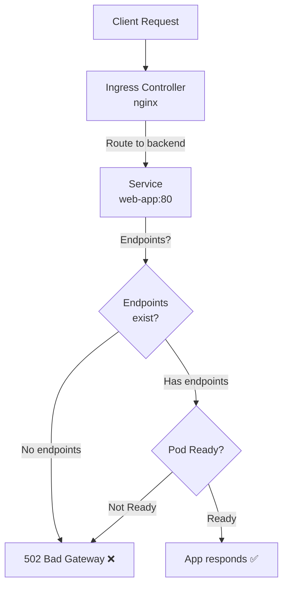

> 💡 **Quick Answer:** Check three things: (1) backend pods are Running and Ready (`kubectl get pods`), (2) Service selector matches pod labels (`kubectl get endpoints`), (3) Ingress backend service name and port are correct. 90% of 502s are caused by empty endpoints — the Service has no matching pods.

## The Problem

You deploy an Ingress and get `502 Bad Gateway` from nginx. The pod is running, the Service exists, but the Ingress controller returns 502. This is the most common Ingress error and it's almost always a selector or port mismatch.

## The Solution

### Systematic Debugging

```bash
# Step 1: Check if pods are Ready
kubectl get pods -l app=web-app -n production
# NAME       READY   STATUS    RESTARTS   AGE
# web-app-1  1/1     Running   0          5m    ← All good
# web-app-2  0/1     Running   0          5m    ← NOT READY → 502!

# Step 2: Check endpoints (most common cause)
kubectl get endpoints web-app -n production
# NAME      ENDPOINTS         AGE
# web-app   10.0.1.5:8080     5m     ← Has endpoints → OK
# web-app   <none>            5m     ← NO ENDPOINTS → 502!

# Step 3: Verify Service selector matches pod labels
kubectl get svc web-app -o jsonpath='{.spec.selector}' -n production
kubectl get pods -l app=web-app -n production

# Step 4: Check Ingress controller logs
kubectl logs -n ingress-nginx deploy/ingress-nginx-controller --tail=50 | grep 502

# Step 5: Test backend directly (bypass Ingress)
kubectl port-forward svc/web-app 8080:80 -n production
curl http://localhost:8080
```

### Common Causes and Fixes

**1. Empty endpoints (selector mismatch)**
```yaml
# Service selector
spec:
  selector:
    app: web-app    # Must match pod labels EXACTLY
    
# Pod labels
metadata:
  labels:
    app: web-app    # ← This must match
```

**2. Port mismatch**
```yaml
# Service
spec:
  ports:
    - port: 80
      targetPort: 8080   # Must match the port your app listens on

# Ingress
spec:
  rules:
    - http:
        paths:
          - backend:
              service:
                name: web-app
                port:
                  number: 80    # Must match Service port, NOT targetPort
```

**3. Readiness probe failing**
```yaml
# Pod not Ready because readiness probe fails
readinessProbe:
  httpGet:
    path: /healthz       # Does this path exist?
    port: 8080           # Is this the right port?
  initialDelaySeconds: 5  # Enough time for app to start?
```

**4. Upstream timeout**
```yaml
# Ingress annotation to increase timeout
metadata:
  annotations:
    nginx.ingress.kubernetes.io/proxy-read-timeout: "300"
    nginx.ingress.kubernetes.io/proxy-send-timeout: "300"
    nginx.ingress.kubernetes.io/proxy-connect-timeout: "60"
```



## Common Issues

**502 only during deployments**: Pods are terminated before Ingress removes them from upstream. Add `preStop` lifecycle hook: `sleep 5` to delay shutdown.

**Intermittent 502s**: Some pods are failing readiness probes. Check: `kubectl get pods -o wide` — look for pods flapping between Ready and NotReady.

## Best Practices

- **Check endpoints first** — `kubectl get endpoints svc-name` is the fastest diagnosis
- **Selector must match exactly** — one typo in labels causes empty endpoints
- **Service port vs targetPort** — Ingress references Service port, not container port
- **Readiness probes must pass** — unready pods are removed from endpoints
- **preStop hook during rollouts** — prevents 502s during deployment updates

## Key Takeaways

- 502 Bad Gateway means the Ingress controller can't reach the backend
- 90% of 502s are caused by empty endpoints (selector/port mismatch)
- Debug flow: pods Ready → endpoints exist → Service port correct → Ingress config valid
- Readiness probe failures remove pods from endpoints, causing 502s
- Add preStop lifecycle hooks to prevent 502s during rolling updates
