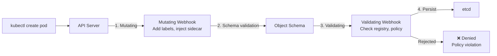

> 💡 **Quick Answer:** Create a `ValidatingWebhookConfiguration` that points to your webhook service, set `failurePolicy: Fail` for security-critical webhooks and `Ignore` for optional mutations, and use cert-manager to manage webhook TLS certificates automatically.

## The Problem

Kubernetes admission webhooks intercept API requests before persistence — they can reject (validating) or modify (mutating) resources. Use cases: enforce naming conventions, inject sidecars, add default labels, block privileged containers, and enforce image registries.

## The Solution

### ValidatingWebhookConfiguration

```yaml
apiVersion: admissionregistration.k8s.io/v1
kind: ValidatingWebhookConfiguration
metadata:
  name: image-registry-validator
  annotations:
    cert-manager.io/inject-ca-from: webhooks/webhook-cert
webhooks:
  - name: registry.example.com
    admissionReviewVersions: ["v1"]
    sideEffects: None
    failurePolicy: Fail
    timeoutSeconds: 5
    clientConfig:
      service:
        name: webhook-service
        namespace: webhooks
        path: /validate
    rules:
      - apiGroups: [""]
        apiVersions: ["v1"]
        operations: ["CREATE", "UPDATE"]
        resources: ["pods"]
        scope: Namespaced
    namespaceSelector:
      matchExpressions:
        - key: webhooks.example.com/skip
          operator: DoesNotExist
```

### MutatingWebhookConfiguration

```yaml
apiVersion: admissionregistration.k8s.io/v1
kind: MutatingWebhookConfiguration
metadata:
  name: default-labels-mutator
webhooks:
  - name: labels.example.com
    admissionReviewVersions: ["v1"]
    sideEffects: None
    failurePolicy: Ignore
    reinvocationPolicy: IfNeeded
    clientConfig:
      service:
        name: webhook-service
        namespace: webhooks
        path: /mutate
    rules:
      - apiGroups: ["apps"]
        apiVersions: ["v1"]
        operations: ["CREATE"]
        resources: ["deployments"]
```

### Failure Policies

| Policy | Behavior | Use Case |
|--------|----------|----------|
| `Fail` | Reject request if webhook unreachable | Security-critical validation |
| `Ignore` | Allow request if webhook unreachable | Optional mutations, labels |

> ⚠️ `failurePolicy: Fail` can block ALL pod creation if your webhook service is down. Always use `namespaceSelector` to exclude `kube-system` and the webhook's own namespace.

### Certificate Management with cert-manager

```yaml
apiVersion: cert-manager.io/v1
kind: Certificate
metadata:
  name: webhook-cert
  namespace: webhooks
spec:
  secretName: webhook-tls
  dnsNames:
    - webhook-service.webhooks.svc
    - webhook-service.webhooks.svc.cluster.local
  issuerRef:
    name: self-signed-issuer
    kind: ClusterIssuer
```



## Common Issues

**Webhook blocks ALL pod creation — cluster stuck**

Your webhook service is down and `failurePolicy: Fail` is set. Emergency fix:
```bash
kubectl delete validatingwebhookconfiguration image-registry-validator
```
Prevent this by excluding `kube-system` with `namespaceSelector`.

**Webhook timeout causes slow deployments**

Set `timeoutSeconds: 5` (max 30). Optimize webhook response time — it's in the critical path for every matching API call.

## Best Practices

- **Always exclude `kube-system`** from webhook rules — prevents cluster lockout
- **Set `timeoutSeconds: 5`** — fail fast, don't slow the API server
- **`failurePolicy: Fail` for security**, `Ignore` for convenience mutations
- **Use cert-manager** for webhook certificates — auto-renewal, CA injection
- **`sideEffects: None`** unless your webhook truly has side effects (most don't)
- **Consider `ValidatingAdmissionPolicy`** (K8s 1.30+) for simple validations — no webhook needed

## Key Takeaways

- Mutating webhooks modify resources (add labels, inject sidecars); validating webhooks reject non-compliant resources
- Mutating runs before validating — order matters
- `failurePolicy: Fail` can lock out your cluster if the webhook service is down
- cert-manager handles webhook TLS certificates automatically
- `namespaceSelector` to exclude kube-system is mandatory for `Fail` policy webhooks
- K8s 1.30+ `ValidatingAdmissionPolicy` replaces simple validating webhooks with in-process CEL expressions
