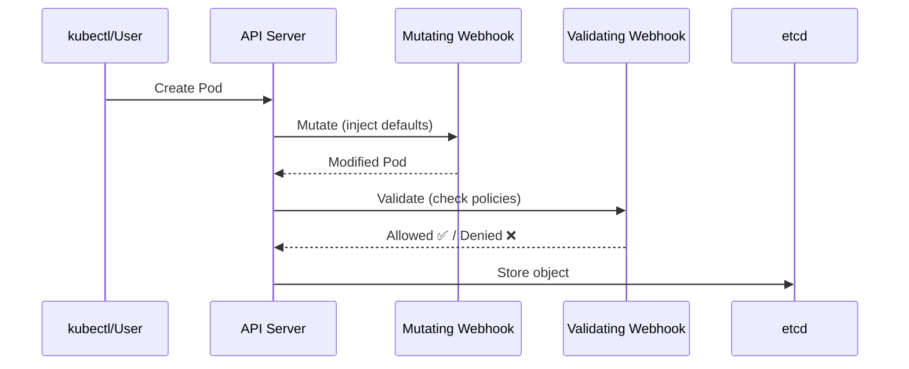

> 💡 **Quick Answer:** Create a `ValidatingWebhookConfiguration` that intercepts pod creation and rejects pods without resource limits. Deploy the webhook server as a Deployment with TLS certs from cert-manager. Set `failurePolicy: Fail` for security-critical policies and `Ignore` for non-critical.

## The Problem

RBAC controls WHO can do things, but not WHAT they create. A developer with pod-create permissions can deploy a container with no resource limits, running as root, pulling from an untrusted registry. Admission webhooks enforce policies on the objects themselves.

## The Solution

### ValidatingWebhookConfiguration

```yaml
apiVersion: admissionregistration.k8s.io/v1
kind: ValidatingWebhookConfiguration
metadata:
  name: require-resource-limits
  annotations:
    cert-manager.io/inject-ca-from: webhooks/webhook-cert
spec:
  webhooks:
    - name: require-limits.kubernetes.recipes
      admissionReviewVersions: ["v1"]
      sideEffects: None
      failurePolicy: Fail
      clientConfig:
        service:
          name: webhook-server
          namespace: webhooks
          path: /validate
          port: 443
      rules:
        - apiGroups: [""]
          apiVersions: ["v1"]
          operations: ["CREATE", "UPDATE"]
          resources: ["pods"]
      namespaceSelector:
        matchExpressions:
          - key: kubernetes.io/metadata.name
            operator: NotIn
            values: ["kube-system", "webhooks"]
```

### MutatingWebhookConfiguration (Auto-inject defaults)

```yaml
apiVersion: admissionregistration.k8s.io/v1
kind: MutatingWebhookConfiguration
metadata:
  name: inject-defaults
spec:
  webhooks:
    - name: defaults.kubernetes.recipes
      admissionReviewVersions: ["v1"]
      sideEffects: None
      failurePolicy: Ignore
      clientConfig:
        service:
          name: webhook-server
          namespace: webhooks
          path: /mutate
      rules:
        - apiGroups: ["apps"]
          apiVersions: ["v1"]
          operations: ["CREATE"]
          resources: ["deployments"]
```

### Webhook Server (Go)

```go
func validatePod(w http.ResponseWriter, r *http.Request) {
    var review admissionv1.AdmissionReview
    json.NewDecoder(r.Body).Decode(&review)
    
    var pod corev1.Pod
    json.Unmarshal(review.Request.Object.Raw, &pod)
    
    // Check all containers have resource limits
    for _, c := range pod.Spec.Containers {
        if c.Resources.Limits.Memory().IsZero() {
            review.Response = &admissionv1.AdmissionResponse{
                Allowed: false,
                Result: &metav1.Status{
                    Message: fmt.Sprintf("container %s must have memory limits", c.Name),
                },
            }
            json.NewEncoder(w).Encode(review)
            return
        }
    }
    
    review.Response = &admissionv1.AdmissionResponse{Allowed: true}
    json.NewEncoder(w).Encode(review)
}
```

### TLS with cert-manager

```yaml
apiVersion: cert-manager.io/v1
kind: Certificate
metadata:
  name: webhook-cert
  namespace: webhooks
spec:
  secretName: webhook-tls
  dnsNames:
    - webhook-server.webhooks.svc
    - webhook-server.webhooks.svc.cluster.local
  issuerRef:
    name: cluster-issuer
    kind: ClusterIssuer
```



## Common Issues

**Webhook blocks all pods including system pods**

Add `namespaceSelector` to exclude `kube-system`. Without it, the webhook can block critical system components.

**Webhook server down — all pod creation fails**

Set `failurePolicy: Ignore` for non-critical webhooks. `Fail` means if the webhook is unreachable, ALL matching requests are rejected.

## Best Practices

- **`failurePolicy: Fail` for security** — reject if webhook is down
- **`failurePolicy: Ignore` for convenience** — allow if webhook is down
- **Always exclude kube-system** — never risk blocking system pods
- **cert-manager for TLS** — automatic certificate rotation
- **Timeout: 10s max** — slow webhooks slow down all API operations

## Key Takeaways

- Admission webhooks enforce policies on Kubernetes objects at creation/update time
- Validating webhooks reject non-compliant resources; mutating webhooks auto-fix them
- Webhooks need TLS — use cert-manager for automatic certificate management
- Always exclude kube-system namespace to prevent breaking the cluster
- failurePolicy controls behavior when webhook is unreachable: Fail (safe) vs Ignore (available)
