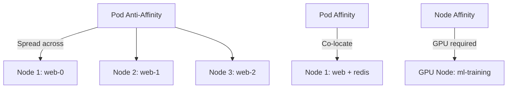

> 💡 **Quick Answer:** configuration

## The Problem

This is one of the most searched Kubernetes topics with thousands of monthly searches. A comprehensive, production-ready guide prevents hours of trial and error.

## The Solution

### Node Affinity

```yaml
spec:
  affinity:
    nodeAffinity:
      # MUST match (hard requirement)
      requiredDuringSchedulingIgnoredDuringExecution:
        nodeSelectorTerms:
          - matchExpressions:
              - key: topology.kubernetes.io/zone
                operator: In
                values: [eu-west-1a, eu-west-1b]
              - key: node.kubernetes.io/instance-type
                operator: In
                values: [m5.xlarge, m5.2xlarge]
      # PREFER (soft requirement)
      preferredDuringSchedulingIgnoredDuringExecution:
        - weight: 80
          preference:
            matchExpressions:
              - key: disktype
                operator: In
                values: [ssd]
```

### Pod Affinity (Co-locate)

```yaml
spec:
  affinity:
    # Put web pods on SAME node as cache pods
    podAffinity:
      requiredDuringSchedulingIgnoredDuringExecution:
        - labelSelector:
            matchLabels:
              app: redis-cache
          topologyKey: kubernetes.io/hostname
```

### Pod Anti-Affinity (Spread)

```yaml
spec:
  affinity:
    # NEVER put 2 web pods on same node
    podAntiAffinity:
      requiredDuringSchedulingIgnoredDuringExecution:
        - labelSelector:
            matchLabels:
              app: web
          topologyKey: kubernetes.io/hostname

    # Or soft: PREFER different zones
    podAntiAffinity:
      preferredDuringSchedulingIgnoredDuringExecution:
        - weight: 100
          podAffinityTerm:
            labelSelector:
              matchLabels:
                app: web
            topologyKey: topology.kubernetes.io/zone
```

### Topology Spread Constraints (K8s 1.19+)

```yaml
# Better than anti-affinity for even distribution
spec:
  topologySpreadConstraints:
    - maxSkew: 1
      topologyKey: topology.kubernetes.io/zone
      whenUnsatisfiable: DoNotSchedule
      labelSelector:
        matchLabels:
          app: web
    - maxSkew: 1
      topologyKey: kubernetes.io/hostname
      whenUnsatisfiable: ScheduleAnyway  # Soft
      labelSelector:
        matchLabels:
          app: web
```

| Feature | Use Case |
|---------|----------|
| Node affinity | Run on specific hardware (GPU, SSD, zone) |
| Pod affinity | Co-locate for low latency (app + cache) |
| Pod anti-affinity | Spread for HA (no 2 replicas on same node) |
| Topology spread | Even distribution across zones/nodes |



## Frequently Asked Questions

### required vs preferred?

**Required**: pod won't schedule if rule can't be met (stays Pending). **Preferred**: scheduler tries but will place elsewhere if needed. Use required for hard constraints (zone, hardware), preferred for optimization.

## Best Practices

- Start with the simplest configuration that solves your problem
- Test in staging before production
- Use `kubectl describe` and events for troubleshooting
- Document team conventions for consistency

## Key Takeaways

- This is fundamental Kubernetes operational knowledge
- Follow established conventions and recommended labels
- Monitor and iterate based on real production behavior
- Automate repetitive tasks to reduce human error
