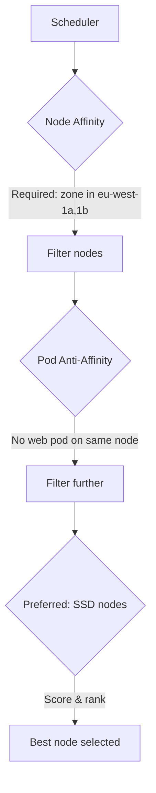

> 💡 **Quick Answer:** Configure node affinity, pod affinity, and anti-affinity rules for advanced Kubernetes scheduling. Control pod placement across zones, nodes, and topologies.

## The Problem

This is one of the most searched Kubernetes topics. Having a comprehensive, well-structured guide helps both beginners and experienced users quickly find what they need.

## The Solution

### Node Affinity

```yaml
apiVersion: apps/v1
kind: Deployment
metadata:
  name: web-app
spec:
  template:
    spec:
      affinity:
        nodeAffinity:
          # Required — must match
          requiredDuringSchedulingIgnoredDuringExecution:
            nodeSelectorTerms:
              - matchExpressions:
                  - key: topology.kubernetes.io/zone
                    operator: In
                    values: ["eu-west-1a", "eu-west-1b"]
                  - key: node.kubernetes.io/instance-type
                    operator: In
                    values: ["m5.xlarge", "m5.2xlarge"]
          # Preferred — try but don't require
          preferredDuringSchedulingIgnoredDuringExecution:
            - weight: 80
              preference:
                matchExpressions:
                  - key: disktype
                    operator: In
                    values: ["ssd"]
```

### Pod Anti-Affinity (Spread Across Nodes)

```yaml
spec:
  affinity:
    podAntiAffinity:
      requiredDuringSchedulingIgnoredDuringExecution:
        - labelSelector:
            matchExpressions:
              - key: app
                operator: In
                values: ["web"]
          topologyKey: kubernetes.io/hostname
          # One web pod per node
```

### Pod Affinity (Co-locate)

```yaml
spec:
  affinity:
    podAffinity:
      requiredDuringSchedulingIgnoredDuringExecution:
        - labelSelector:
            matchExpressions:
              - key: app
                operator: In
                values: ["cache"]
          topologyKey: kubernetes.io/hostname
          # Schedule on same node as cache pods
```

### Topology Spread Constraints

```yaml
spec:
  topologySpreadConstraints:
    - maxSkew: 1
      topologyKey: topology.kubernetes.io/zone
      whenUnsatisfiable: DoNotSchedule
      labelSelector:
        matchLabels:
          app: web
    # Spread evenly across zones
```



## Frequently Asked Questions

### Node affinity vs nodeSelector?

`nodeSelector` is simpler (exact label match only). Node affinity supports `In`, `NotIn`, `Exists`, `DoesNotExist`, `Gt`, `Lt` operators and preferred (soft) rules.

### When should I use pod anti-affinity?

Use it for high availability — spread replicas across nodes or zones so a single failure doesn't take out all replicas.

## Best Practices

- **Start simple** — use the basic form first, add complexity as needed
- **Be consistent** — follow naming conventions across your cluster
- **Document your choices** — add annotations explaining why, not just what
- **Monitor and iterate** — review configurations regularly

## Key Takeaways

- This is fundamental Kubernetes knowledge every engineer needs
- Start with the simplest approach that solves your problem
- Use `kubectl explain` and `kubectl describe` when unsure
- Practice in a test cluster before applying to production
