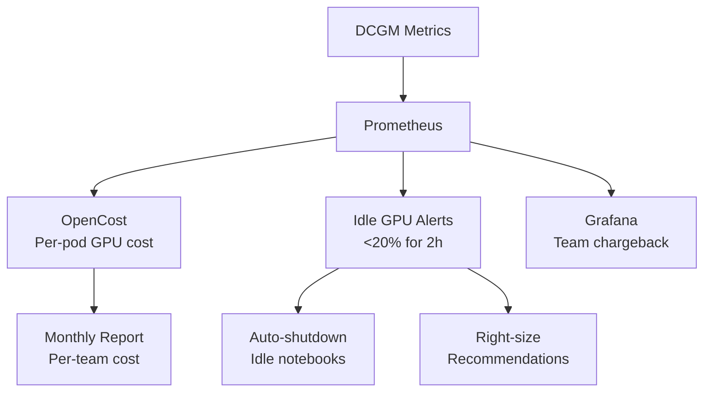

> 💡 **Quick Answer:** Implement GPU cost management with: (1) DCGM + Prometheus for per-pod GPU utilization, (2) Kubecost or OpenCost for team-level chargeback, (3) Kueue quotas for fair sharing, (4) idle GPU alerts at <20% utilization for >2 hours, (5) spot instances for training with checkpointing.

## The Problem

AI infrastructure costs spiral quickly: a single H100 node costs $75,000/year on-demand. Without visibility into who's using what, teams over-provision GPUs, notebooks run 24/7 with idle GPUs, and training jobs use on-demand instances when spot would work. Most organizations waste 40-60% of their GPU budget.

## The Solution

### GPU Cost Tracking with OpenCost

```yaml
# Install OpenCost
helm install opencost opencost/opencost \
  --namespace opencost \
  --set opencost.customPricing.enabled=true \
  --set opencost.customPricing.configPath=/tmp/pricing.json

# Custom GPU pricing
apiVersion: v1
kind: ConfigMap
metadata:
  name: custom-pricing
  namespace: opencost
data:
  pricing.json: |
    {
      "nvidia.com/gpu": {
        "A100-SXM4-80GB": 2.50,
        "H100-SXM5-80GB": 4.00,
        "L4": 0.35,
        "T4": 0.15
      }
    }
```

### Idle GPU Detection

```yaml
apiVersion: monitoring.coreos.com/v1
kind: PrometheusRule
metadata:
  name: gpu-cost-alerts
spec:
  groups:
    - name: gpu-cost
      rules:
        - alert: IdleGPU
          expr: |
            avg_over_time(DCGM_FI_DEV_GPU_UTIL[2h]) < 20
            and on(pod) kube_pod_labels{label_workload_type="notebook"}
          for: 30m
          labels:
            severity: warning
          annotations:
            summary: "GPU idle >2h in notebook {{ $labels.pod }}"
            action: "Consider scaling down or using CPU-only notebook"
            estimated_waste: "{{ $value | humanize }}% utilization = ~${{ mul 2.5 0.8 | humanize }}/hr wasted"
        
        - alert: GPUOverProvisionedJob
          expr: |
            avg_over_time(DCGM_FI_DEV_GPU_UTIL[1h]) < 30
            and on(pod) kube_pod_labels{label_workload_type="training"}
          for: 2h
          annotations:
            summary: "Training job {{ $labels.pod }} using <30% GPU — consider smaller instance"
```

### Team Chargeback Dashboard (PromQL)

```promql
# GPU-hours per team per day
sum by (namespace) (
  count_over_time(DCGM_FI_DEV_GPU_UTIL[24h]) / 240
) * on(namespace) group_left(team)
  kube_namespace_labels{label_team!=""}

# Cost per team (GPU-hours × price)
sum by (namespace) (
  count_over_time(DCGM_FI_DEV_GPU_UTIL[24h]) / 240
  * on(node) group_left(gpu_model)
    label_replace(DCGM_FI_DEV_GPU_UTIL, "gpu_model", "$1", "modelName", "(.*)")
) * 2.50  # $/GPU-hour for A100
```

### Auto-Shutdown for Idle Notebooks

```yaml
apiVersion: batch/v1
kind: CronJob
metadata:
  name: idle-notebook-cleanup
  namespace: kubeflow
spec:
  schedule: "0 */2 * * *"
  jobTemplate:
    spec:
      template:
        spec:
          containers:
            - name: cleanup
              image: bitnami/kubectl:latest
              command:
                - /bin/sh
                - -c
                - |
                  for nb in $(kubectl get notebook -n kubeflow -o name); do
                    LAST_ACTIVITY=$(kubectl get $nb -o jsonpath='{.metadata.annotations.notebooks\.kubeflow\.org/last-activity}')
                    if [ $(date -d "$LAST_ACTIVITY" +%s) -lt $(date -d "4 hours ago" +%s) ]; then
                      kubectl delete $nb
                      echo "Deleted idle notebook: $nb"
                    fi
                  done
```

### Cost Optimization Matrix

| Strategy | Savings | Risk | Workload |
|----------|---------|------|----------|
| Spot instances | 60-80% | Interruption | Training |
| MIG sharing | 3-7x | Reduced per-model GPU | Small inference |
| Time-slicing | 2-4x | Contention | Notebooks |
| Idle shutdown | 30-50% | User friction | Notebooks |
| Right-sizing | 20-40% | None | All |
| Reserved instances | 30-60% | Commitment | Steady-state |



## Common Issues

**OpenCost not tracking GPU costs**

Custom pricing ConfigMap must match your GPU model names exactly. Check: `kubectl get nodes -o json | jq '.items[].metadata.labels["nvidia.com/gpu.product"]'`.

**Teams pushing back on chargeback**

Start with visibility (dashboards) before enforcement (quotas). Show teams their utilization before charging. Most teams self-optimize when they see the numbers.

## Best Practices

- **Visibility first** — dashboards before enforcement, show teams their GPU utilization
- **Alert on idle GPUs** — <20% for 2h is the standard threshold
- **Auto-shutdown idle notebooks** — biggest single source of GPU waste
- **Spot for training** — checkpointing makes interruption tolerable
- **Chargeback per team** — accountability drives optimization behavior

## Key Takeaways

- 40-60% of GPU spending is wasted on idle or underutilized GPUs
- DCGM + Prometheus + OpenCost provides per-pod, per-team GPU cost tracking
- Idle GPU alerts catch notebooks and dev pods wasting expensive GPUs
- Auto-shutdown idle notebooks — the single biggest cost optimization
- Team-level chargeback dashboards drive self-optimization behavior
- Spot instances for training + MIG/time-slicing for inference = 3-5x cost reduction
