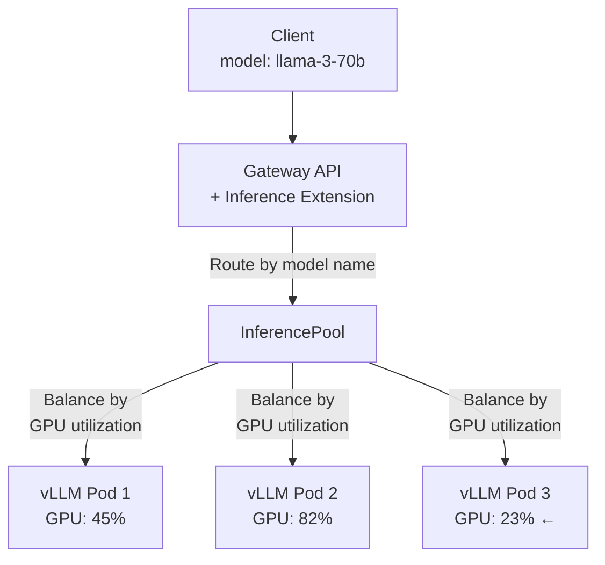

> 💡 **Quick Answer:** The Kubernetes AI Gateway Working Group is building an Inference Extension for Gateway API that adds model-aware routing: route requests to the right backend based on model name, balance load across replicas by GPU utilization (not just connections), and handle model-specific concerns like token rate limiting. Deploy as an extension to any Gateway API implementation (Envoy Gateway, Istio, Kong).

## The Problem

66% of organizations run AI inference on Kubernetes (CNCF 2026 survey), but routing LLM traffic is different from web traffic. You need to: route by model name (e.g., `/v1/chat/completions` with `model: llama-3-70b`), balance load by GPU memory utilization (not round-robin), handle long-running streaming connections, and implement per-model rate limits. Standard HTTPRoute doesn't understand AI inference semantics.



## The Solution

### InferencePool: Model Backend Group

```yaml
# InferencePool groups pods serving the same model
apiVersion: inference.networking.x-k8s.io/v1alpha1
kind: InferencePool
metadata:
  name: llama-3-70b
  namespace: ai-inference
spec:
  # Select pods serving this model
  targetPortNumber: 8000
  selector:
    matchLabels:
      model: llama-3-70b
  # Endpoint picker: balance by least-loaded GPU
  endpointPickerConfig:
    extensionRef:
      name: gpu-aware-picker
```

### InferenceModel: Route Configuration

```yaml
# InferenceModel maps model names to InferencePool
apiVersion: inference.networking.x-k8s.io/v1alpha1
kind: InferenceModel
metadata:
  name: llama-3-70b
  namespace: ai-inference
spec:
  modelName: llama-3-70b             # Match from request body
  criticality: Critical               # Priority level
  poolRef:
    name: llama-3-70b
---
apiVersion: inference.networking.x-k8s.io/v1alpha1
kind: InferenceModel
metadata:
  name: mistral-7b
  namespace: ai-inference
spec:
  modelName: mistral-7b-instruct
  criticality: Standard
  poolRef:
    name: mistral-7b
```

### Gateway API HTTPRoute for AI

```yaml
# Standard Gateway API HTTPRoute pointing to InferencePool
apiVersion: gateway.networking.k8s.io/v1
kind: HTTPRoute
metadata:
  name: ai-inference-route
  namespace: ai-inference
spec:
  parentRefs:
    - name: ai-gateway
      namespace: gateway-system
  rules:
    - matches:
        - path:
            type: PathPrefix
            value: /v1
      backendRefs:
        - group: inference.networking.x-k8s.io
          kind: InferencePool
          name: llama-3-70b
          port: 8000
```

### Gateway with Inference Extension

```yaml
# Gateway with inference-aware controller
apiVersion: gateway.networking.k8s.io/v1
kind: Gateway
metadata:
  name: ai-gateway
  namespace: gateway-system
spec:
  gatewayClassName: envoy-gateway      # Or istio, kong
  listeners:
    - name: http
      port: 80
      protocol: HTTP
    - name: https
      port: 443
      protocol: HTTPS
      tls:
        mode: Terminate
        certificateRefs:
          - name: ai-gateway-cert
```

### vLLM Backend Deployment

```yaml
# Backend pods with model labels for InferencePool selection
apiVersion: apps/v1
kind: Deployment
metadata:
  name: vllm-llama-70b
  namespace: ai-inference
spec:
  replicas: 3
  selector:
    matchLabels:
      model: llama-3-70b
  template:
    metadata:
      labels:
        model: llama-3-70b
        serving-framework: vllm
    spec:
      containers:
        - name: vllm
          image: vllm/vllm-openai:v0.6.3
          args:
            - "--model=meta-llama/Meta-Llama-3-70B-Instruct"
            - "--tensor-parallel-size=4"
            - "--max-model-len=8192"
            - "--gpu-memory-utilization=0.90"
          ports:
            - containerPort: 8000
          resources:
            limits:
              nvidia.com/gpu: 4
          # Expose metrics for GPU-aware load balancing
          env:
            - name: VLLM_USAGE_STATS
              value: "true"
```

### Multi-Model Routing

```yaml
# Route different models to different pools
apiVersion: gateway.networking.k8s.io/v1
kind: HTTPRoute
metadata:
  name: multi-model-route
spec:
  parentRefs:
    - name: ai-gateway
  rules:
    # Small models: fast, cheap
    - matches:
        - headers:
            - name: x-model-class
              value: small
      backendRefs:
        - group: inference.networking.x-k8s.io
          kind: InferencePool
          name: mistral-7b
    
    # Large models: powerful, GPU-intensive
    - matches:
        - headers:
            - name: x-model-class
              value: large
      backendRefs:
        - group: inference.networking.x-k8s.io
          kind: InferencePool
          name: llama-3-70b
    
    # Default: route based on model field in request body
    - backendRefs:
        - group: inference.networking.x-k8s.io
          kind: InferencePool
          name: llama-3-70b
```

### Token-Based Rate Limiting

```yaml
# Rate limit by tokens instead of requests
# (one LLM request can use 1 or 10,000 tokens)
apiVersion: gateway.envoyproxy.io/v1alpha1
kind: BackendTrafficPolicy
metadata:
  name: ai-rate-limit
spec:
  targetRefs:
    - group: gateway.networking.k8s.io
      kind: HTTPRoute
      name: ai-inference-route
  rateLimit:
    type: Global
    global:
      rules:
        - clientSelectors:
            - headers:
                - name: Authorization
                  type: Distinct
          limit:
            requests: 100            # Requests per window
            unit: Minute
```

## Common Issues

| Issue | Cause | Fix |
|-------|-------|-----|
| Requests not routing to right model | InferenceModel `modelName` mismatch | Match exact model string from API request |
| Uneven GPU load | Round-robin ignoring GPU utilization | Use GPU-aware endpoint picker |
| Streaming disconnects | Gateway timeout too low | Increase timeout for SSE/streaming connections |
| 503 during model loading | Pods not ready | Add readiness probe checking `/health` |
| Token rate limit inaccurate | Counting requests not tokens | Use token-counting middleware or KEDA scaler |

## Best Practices

- **Route by model name** — InferenceModel maps API `model` field to backend pools
- **Balance by GPU utilization** — not round-robin; GPU inference is asymmetric
- **Set long timeouts for streaming** — LLM responses stream for 10-60+ seconds
- **Separate pools by model size** — 7B and 70B have very different resource profiles
- **Monitor tokens/second per pool** — this is the real throughput metric for LLMs
- **Use criticality levels** — shed low-priority traffic before impacting critical models

## Key Takeaways

- Kubernetes AI Gateway Working Group is building inference-aware routing
- InferencePool groups backend pods by model; InferenceModel maps model names
- GPU-aware load balancing routes to least-loaded replica (not round-robin)
- Standard Gateway API HTTPRoute integrates with InferencePool backends
- 66% of orgs run AI inference on K8s — this solves their routing problem
- Works with any Gateway API implementation: Envoy Gateway, Istio, Kong
