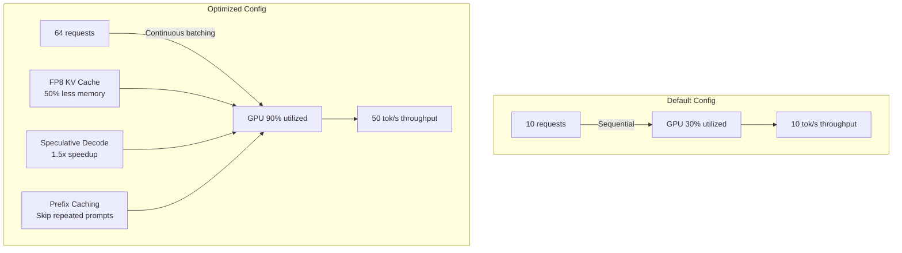

> 💡 **Quick Answer:** Enable continuous batching in vLLM/TRT-LLM to process multiple requests simultaneously (3-5x throughput vs naive batching). Tune KV cache to use 90% of remaining GPU memory. Enable speculative decoding for 1.5-2x speedup on supported models. Use FP8 KV cache for 50% memory savings.

## The Problem

Default LLM inference configurations waste 50-70% of GPU capacity. Naive sequential processing serves one request at a time, KV cache is either too small (high latency) or too large (wastes memory), and quantization isn't applied. Optimizing these parameters can 3-5x throughput without additional hardware.

## The Solution

### Continuous Batching (vLLM)

```yaml
apiVersion: apps/v1
kind: Deployment
metadata:
  name: vllm-optimized
spec:
  template:
    spec:
      containers:
        - name: vllm
          image: registry.example.com/vllm:0.6.0
          args:
            # Continuous batching config
            - --model=/models/llama-3-70b
            - --tensor-parallel-size=2
            - --max-num-batched-tokens=8192
            - --max-num-seqs=64
            - --enable-chunked-prefill
            # KV cache optimization
            - --gpu-memory-utilization=0.92
            - --kv-cache-dtype=fp8_e5m2
            - --enable-prefix-caching
            # Speculative decoding
            - --speculative-model=meta-llama/Llama-3-8B
            - --num-speculative-tokens=5
            # Performance
            - --disable-log-requests
            - --enforce-eager=false
          resources:
            limits:
              nvidia.com/gpu: 2
              memory: 128Gi
```

### Optimization Parameters Explained

| Parameter | Default | Optimized | Impact |
|-----------|---------|-----------|--------|
| `max-num-batched-tokens` | 2048 | 8192 | 3x throughput |
| `max-num-seqs` | 16 | 64 | More concurrent requests |
| `gpu-memory-utilization` | 0.80 | 0.92 | Larger KV cache |
| `kv-cache-dtype` | auto (fp16) | fp8_e5m2 | 50% KV memory savings |
| `enable-prefix-caching` | false | true | Cache repeated prompts |
| `enable-chunked-prefill` | false | true | Better batching |

### TensorRT-LLM Optimization

```yaml
apiVersion: apps/v1
kind: Deployment
metadata:
  name: trtllm-server
spec:
  template:
    spec:
      containers:
        - name: triton
          image: nvcr.io/nvidia/tritonserver:24.07-trtllm-python-py3
          env:
            - name: DECOUPLED_MODE
              value: "true"
            - name: BATCH_SCHEDULER_POLICY
              value: "guaranteed_no_evict"
            - name: MAX_BATCH_SIZE
              value: "64"
            - name: ENABLE_KV_CACHE_REUSE
              value: "true"
            - name: KV_CACHE_FREE_GPU_MEM_FRACTION
              value: "0.9"
```

### Benchmarking Configuration

```bash
# Benchmark with realistic workload
python benchmark_serving.py \
  --model meta-llama/Llama-3-70B \
  --num-prompts 1000 \
  --request-rate 10 \
  --input-len 512 \
  --output-len 256 \
  --endpoint http://vllm-svc:8000/v1/completions

# Key metrics to track:
# - Tokens/second (throughput)
# - Time to First Token (TTFT)
# - Inter-Token Latency (ITL)
# - Request latency p50/p95/p99
```



## Common Issues

**OOM with high gpu-memory-utilization**

Start at 0.85 and increase gradually. Monitor with `nvidia-smi`. Leave headroom for activation memory during long sequences.

**Speculative decoding slower than expected**

Draft model too large or too different from target. Use a model from the same family (Llama 8B for Llama 70B). Reduce `num-speculative-tokens` from 5 to 3 if acceptance rate is low.

## Best Practices

- **Always enable continuous batching** — 3-5x throughput improvement over naive serving
- **FP8 KV cache** — 50% memory savings, minimal quality impact on most models
- **Prefix caching** for repeated prompts — system prompts, few-shot examples
- **Benchmark before deploying** — measure TTFT, ITL, and throughput under realistic load
- **Speculative decoding** for latency-sensitive use cases — 1.5-2x speedup

## Key Takeaways

- Continuous batching processes multiple requests simultaneously — 3-5x throughput
- FP8 KV cache halves memory usage with negligible quality impact
- Speculative decoding uses a small draft model to speed up generation by 1.5-2x
- Prefix caching avoids recomputing shared prompt prefixes across requests
- Default configs waste 50-70% of GPU capacity — always tune before production
