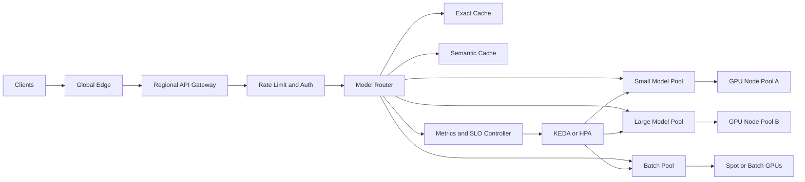

> **Quick Answer:** At 10K requests per second, a Kubernetes AI platform can usually scale by adding replicas, GPU pools, caching, and queue-based autoscaling. At 100K requests per second, the architecture changes: model routing becomes a control plane, caches become tiered, admission control protects SLOs, GPUs are scheduled by topology and cost, and every model pool needs independent capacity management.

## The Problem

Scaling AI inference is not linear. A platform that handles 10K requests per second can fail badly at 100K requests per second even with ten times the GPUs.

The bottlenecks move:

- From pod count to model pool capacity.
- From average latency to tail latency.
- From CPU HPA to queue and token-aware scaling.
- From one shared model endpoint to traffic classes.
- From cluster capacity to regional capacity and failure isolation.

## 10K vs 100K Requests per Second

| Area | Around 10K RPS | Around 100K RPS |
| --- | --- | --- |
| Routing | One gateway or ingress tier | Dedicated model router with weighted pools |
| Scaling metric | Queue depth or requests per second | Queue depth, tokens per second, latency budget, GPU memory |
| Caching | One Redis or semantic cache | Tiered exact, semantic, and prefix caches |
| GPU pools | A few node groups | Multiple accelerator classes and regions |
| Failure domain | Cluster-level | Zone, region, model, and traffic-class isolation |
| Deployment | Rolling updates | Canary, shadow, and capacity prewarming |
| Scheduling | Node selectors and tolerations | Kueue, topology-aware placement, quotas, priority |
| SLO | Endpoint availability | Per-model TTFT, decode rate, and error budget |

## Reference Architecture



## Step 1: Split Traffic by Workload Class

At 10K RPS, teams often expose one `/v1/chat/completions` endpoint and let the model server batch everything together. At 100K RPS, that creates noisy neighbors. Short chat prompts, long context prompts, embeddings, reranking, and batch jobs need separate pools.

```yaml
apiVersion: apps/v1
kind: Deployment
metadata:
  name: model-router
  namespace: ai-serving
spec:
  replicas: 20
  selector:
    matchLabels:
      app: model-router
  template:
    metadata:
      labels:
        app: model-router
    spec:
      containers:
        - name: router
          image: registry.example.com/ai/model-router:2026.07
          ports:
            - containerPort: 8080
          env:
            - name: ROUTING_RULES
              value: |
                routes:
                  - match:
                      path: /v1/chat/completions
                      max_prompt_tokens: 4096
                    service: llama-chat.ai-serving.svc.cluster.local:8000
                  - match:
                      path: /v1/chat/completions
                      min_prompt_tokens: 4097
                    service: llama-long-context.ai-serving.svc.cluster.local:8000
                  - match:
                      path: /v1/embeddings
                    service: embedding-pool.ai-serving.svc.cluster.local:8000
                  - match:
                      header:
                        x-workload-class: batch
                    service: batch-inference.ai-serving.svc.cluster.local:8000
          resources:
            requests:
              cpu: "2"
              memory: 2Gi
            limits:
              cpu: "4"
              memory: 4Gi
```

## Step 2: Move from Replica Scaling to Pool Scaling

At 100K RPS, "the LLM service" is not a single Deployment. It is a fleet of model pools. Each pool has its own SLO, queue, cache behavior, GPU type, and rollout cadence.

```yaml
apiVersion: keda.sh/v1alpha1
kind: ScaledObject
metadata:
  name: llama-chat-pool
  namespace: ai-serving
spec:
  scaleTargetRef:
    name: llama-chat
  minReplicaCount: 16
  maxReplicaCount: 160
  pollingInterval: 10
  cooldownPeriod: 900
  triggers:
    - type: prometheus
      metadata:
        serverAddress: http://prometheus.monitoring.svc:9090
        metricName: chat_waiting_requests
        threshold: "3"
        query: |
          avg(vllm:num_requests_waiting{namespace="ai-serving",pool="chat"})
    - type: prometheus
      metadata:
        serverAddress: http://prometheus.monitoring.svc:9090
        metricName: chat_ttft_p95_seconds
        threshold: "1.2"
        query: |
          histogram_quantile(0.95,
            sum(rate(llm_time_to_first_token_seconds_bucket{pool="chat"}[2m])) by (le)
          )
```

## Step 3: Add Admission Control

At smaller scale, overload becomes slow responses. At larger scale, overload becomes cascading failure: queues grow, clients retry, gateways saturate, and GPUs waste cycles on doomed requests.

Add admission control before the model server.

```yaml
apiVersion: v1
kind: ConfigMap
metadata:
  name: ai-admission-policy
  namespace: ai-serving
data:
  policy.yaml: |
    policies:
      - name: chat-interactive
        match:
          path: /v1/chat/completions
          workloadClass: interactive
        limits:
          maxPromptTokens: 4096
          maxOutputTokens: 1024
          maxQueueSeconds: 2
          shedWhenP95TtftSecondsAbove: 1.5
      - name: long-context
        match:
          workloadClass: long-context
        limits:
          maxPromptTokens: 32768
          maxOutputTokens: 2048
          maxQueueSeconds: 10
          requireReservation: true
      - name: batch
        match:
          workloadClass: batch
        limits:
          maxQueueSeconds: 300
          priority: low
```

## Step 4: Use Tiered Caching

At 10K RPS, a single response cache may be enough. At 100K RPS, you need several cache layers:

- Exact cache for identical prompts and deterministic parameters.
- Prefix cache inside the model server for repeated system prompts and context.
- Semantic cache for near-duplicate questions where business rules allow it.
- Embedding cache for repeated retrieval and ranking inputs.

```yaml
apiVersion: apps/v1
kind: Deployment
metadata:
  name: semantic-cache
  namespace: ai-serving
spec:
  replicas: 12
  selector:
    matchLabels:
      app: semantic-cache
  template:
    metadata:
      labels:
        app: semantic-cache
    spec:
      containers:
        - name: cache
          image: registry.example.com/ai/semantic-cache:2026.07
          env:
            - name: REDIS_URL
              value: redis://redis-cache.ai-serving.svc:6379
            - name: SIMILARITY_THRESHOLD
              value: "0.96"
            - name: MAX_CACHEABLE_PROMPT_TOKENS
              value: "2048"
            - name: CACHE_TTL_SECONDS
              value: "1800"
          resources:
            requests:
              cpu: "4"
              memory: 8Gi
            limits:
              cpu: "8"
              memory: 16Gi
```

## Step 5: Prewarm Capacity Before Traffic Moves

Rolling out a model at 100K RPS without prewarming creates a capacity cliff. New pods are not useful until images are pulled, model weights are mounted, CUDA kernels are initialized, and the first inference has completed.

```yaml
apiVersion: batch/v1
kind: Job
metadata:
  name: prewarm-llama-chat-v18
  namespace: ai-serving
spec:
  parallelism: 40
  completions: 40
  template:
    spec:
      restartPolicy: Never
      containers:
        - name: prewarm
          image: curlimages/curl:8.8.0
          command: ["/bin/sh", "-c"]
          args:
            - |
              for i in $(seq 1 20); do
                curl -sS http://llama-chat-canary:8000/v1/chat/completions \
                  -H 'Content-Type: application/json' \
                  -d '{"model":"llama-chat","messages":[{"role":"user","content":"health check"}],"max_tokens":8}' \
                  >/dev/null
              done
```

## Step 6: Protect GPU Pools with Quotas and Priority

Without quota, a batch experiment can consume GPUs needed for interactive inference. Use separate namespaces, ResourceQuotas, PriorityClasses, and queue admission.

```yaml
apiVersion: scheduling.k8s.io/v1
kind: PriorityClass
metadata:
  name: ai-interactive
value: 100000
globalDefault: false
description: "Interactive AI inference traffic"
---
apiVersion: scheduling.k8s.io/v1
kind: PriorityClass
metadata:
  name: ai-batch
value: 1000
globalDefault: false
description: "Batch AI workloads"
---
apiVersion: v1
kind: ResourceQuota
metadata:
  name: interactive-gpu-quota
  namespace: ai-serving
spec:
  hard:
    requests.nvidia.com/gpu: "256"
    limits.nvidia.com/gpu: "256"
```

## Step 7: Measure the Right SLOs

Availability alone hides a bad AI experience. A model can return HTTP 200 and still violate user expectations.

Track:

- Time to first token p50, p95, p99.
- Tokens per second by model and pool.
- Queue wait time.
- Cache hit ratio by layer.
- GPU memory pressure.
- Request rejection rate by policy.
- Cost per 1,000 input tokens and output tokens.
- Error budget burn per model.

```yaml
apiVersion: monitoring.coreos.com/v1
kind: PrometheusRule
metadata:
  name: ai-serving-slo
  namespace: monitoring
spec:
  groups:
    - name: ai-serving
      rules:
        - alert: LLMHighTimeToFirstToken
          expr: |
            histogram_quantile(0.95,
              sum(rate(llm_time_to_first_token_seconds_bucket{pool="chat"}[5m])) by (le)
            ) > 1.5
          for: 10m
          labels:
            severity: warning
          annotations:
            summary: "LLM chat p95 time to first token is above 1.5s"
        - alert: LLMQueueSaturation
          expr: |
            avg(vllm:num_requests_waiting{pool="chat"}) > 8
          for: 5m
          labels:
            severity: critical
          annotations:
            summary: "LLM chat pool queue is saturated"
```

## Common Issues

**Adding GPUs without removing the bottleneck**

If the bottleneck is the router, cache, object storage, or gateway, more model replicas will not help.

**One model pool for every traffic type**

Interactive chat and batch summarization should not compete in the same queue.

**Ignoring prompt length distribution**

Requests per second is incomplete. Tokens per second and prompt length distribution explain capacity.

**Scaling down too aggressively**

Fast scale-down saves money briefly and then causes cold-start latency during the next traffic spike.

## Best Practices

- Treat model routing as platform infrastructure.
- Create separate pools for interactive, long-context, embeddings, and batch traffic.
- Scale on queues, latency, and tokens, not CPU alone.
- Use tiered caching and measure cache hit rate per layer.
- Prewarm before shifting traffic.
- Reserve GPU capacity for critical traffic classes.
- Make overload explicit with admission control and clear rejection behavior.

## Key Takeaways

- 10K RPS is mostly a scaling problem; 100K RPS is an architecture problem.
- Model pools need independent routing, scaling, and SLOs.
- Tail latency, queue depth, and token throughput matter more than average HTTP latency.
- Caching and admission control are required reliability features.
- GPU scheduling, quota, and rollout prewarming decide whether scale is stable.
