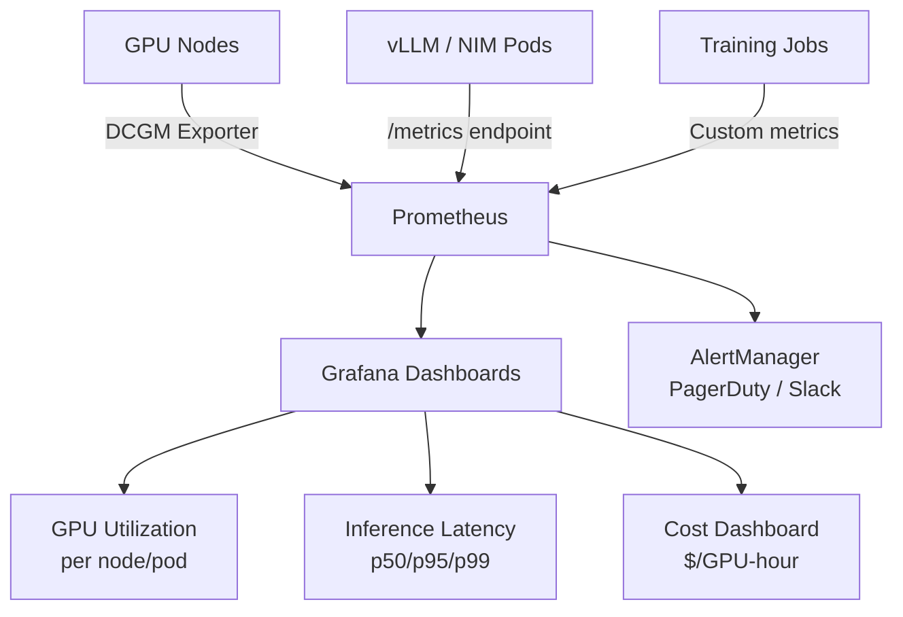

> 💡 **Quick Answer:** Deploy DCGM Exporter as a DaemonSet to expose GPU metrics to Prometheus. Monitor `DCGM_FI_DEV_GPU_UTIL` (utilization), `DCGM_FI_DEV_FB_USED` (memory), `DCGM_FI_DEV_POWER_USAGE` (power), and application-level metrics like inference latency and tokens/second.

## The Problem

Standard Kubernetes monitoring (CPU, memory, network) misses the most important metrics for AI workloads: GPU utilization, GPU memory, tensor core activity, inference latency, and tokens per second. Without GPU-specific monitoring, you can't optimize utilization or detect performance degradation.

## The Solution

### DCGM Exporter DaemonSet

```yaml
apiVersion: apps/v1
kind: DaemonSet
metadata:
  name: dcgm-exporter
  namespace: monitoring
spec:
  selector:
    matchLabels:
      app: dcgm-exporter
  template:
    spec:
      nodeSelector:
        nvidia.com/gpu.present: "true"
      containers:
        - name: dcgm-exporter
          image: nvcr.io/nvidia/k8s/dcgm-exporter:3.3.8-3.6.0-ubuntu22.04
          ports:
            - containerPort: 9400
              name: metrics
          securityContext:
            privileged: true
          volumeMounts:
            - name: device
              mountPath: /dev
      volumes:
        - name: device
          hostPath:
            path: /dev
---
apiVersion: monitoring.coreos.com/v1
kind: ServiceMonitor
metadata:
  name: dcgm-exporter
  namespace: monitoring
spec:
  selector:
    matchLabels:
      app: dcgm-exporter
  endpoints:
    - port: metrics
      interval: 15s
```

### Key GPU Metrics

| Metric | Description | Alert Threshold |
|--------|-------------|-----------------|
| `DCGM_FI_DEV_GPU_UTIL` | GPU compute utilization % | <20% (underused) |
| `DCGM_FI_DEV_FB_USED` | GPU memory used (MB) | >90% of total |
| `DCGM_FI_DEV_GPU_TEMP` | GPU temperature °C | >85°C |
| `DCGM_FI_DEV_POWER_USAGE` | Power consumption (W) | >TDP |
| `DCGM_FI_DEV_SM_CLOCK` | SM clock frequency (MHz) | Throttled below base |
| `DCGM_FI_DEV_XID_ERRORS` | GPU XID error count | >0 |

### Prometheus Alert Rules

```yaml
apiVersion: monitoring.coreos.com/v1
kind: PrometheusRule
metadata:
  name: gpu-alerts
spec:
  groups:
    - name: gpu.rules
      rules:
        - alert: GPUHighTemperature
          expr: DCGM_FI_DEV_GPU_TEMP > 85
          for: 5m
          labels:
            severity: warning
          annotations:
            summary: "GPU {{$labels.gpu}} on {{$labels.node}} is at {{$value}}°C"
        - alert: GPUMemoryNearFull
          expr: DCGM_FI_DEV_FB_USED / DCGM_FI_DEV_FB_FREE > 9
          for: 10m
          labels:
            severity: critical
        - alert: GPULowUtilization
          expr: avg_over_time(DCGM_FI_DEV_GPU_UTIL[1h]) < 20
          for: 2h
          labels:
            severity: info
          annotations:
            summary: "GPU {{$labels.gpu}} underutilized — consider MIG or time-slicing"
        - alert: GPUXIDError
          expr: increase(DCGM_FI_DEV_XID_ERRORS[5m]) > 0
          labels:
            severity: critical
          annotations:
            summary: "GPU XID error detected — possible hardware issue"
```

### Inference Metrics Dashboard

```bash
# vLLM exposes Prometheus metrics at :8000/metrics
# Key inference metrics:
vllm:num_requests_running      # Active requests
vllm:num_requests_waiting      # Queue depth
vllm:avg_generation_throughput  # Tokens/second
vllm:gpu_cache_usage_perc      # KV cache utilization
vllm:e2e_request_latency_seconds_bucket  # Latency histogram
```



## Common Issues

**DCGM Exporter shows 0% utilization but GPUs are in use**

Check DCGM version compatibility with your GPU driver. Some older DCGM versions don't support newer GPUs. Update to latest DCGM.

**GPU metrics missing for MIG instances**

DCGM Exporter needs `--kubernetes-gpu-id-type=device-name` for MIG. Each MIG instance reports separately.

## Best Practices

- **DCGM Exporter on every GPU node** — the standard for GPU metrics on K8s
- **15s scrape interval** — good balance for GPU metrics
- **Alert on XID errors** — they indicate hardware problems before failure
- **Track inference tokens/second** — primary throughput metric for LLM workloads
- **Cost dashboards** — GPU-hours × on-demand pricing per GPU type

## Key Takeaways

- DCGM Exporter exposes 50+ GPU metrics to Prometheus — utilization, memory, temperature, power, errors
- XID errors are the most critical alert — they indicate impending GPU hardware failure
- Inference monitoring: tokens/second, queue depth, and KV cache usage are the key metrics
- GPU underutilization alerts enable cost optimization — MIG or time-slicing for shared access
- Combine GPU metrics with application metrics for full AI workload observability
