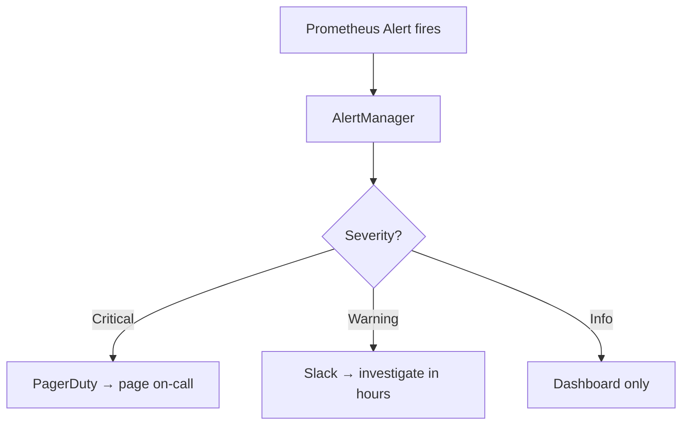

> 💡 **Quick Answer:** Design effective Kubernetes alerts that reduce noise and catch real issues. Covers alert severity tiers, golden signals, runbook links, and alert fatigue prevention.

## The Problem

Engineers frequently search for this topic but find scattered, incomplete guides. This recipe provides a comprehensive, production-ready reference.

## The Solution

### Alert Severity Tiers

```yaml
apiVersion: monitoring.coreos.com/v1
kind: PrometheusRule
metadata:
  name: kubernetes-alerts
spec:
  groups:
    - name: critical-alerts
      rules:
        # CRITICAL: Pages on-call, needs immediate action
        - alert: PodOOMKilled
          expr: kube_pod_container_status_last_terminated_reason{reason="OOMKilled"} > 0
          for: 0m
          labels:
            severity: critical
          annotations:
            summary: "Container {{ $labels.container }} OOMKilled in {{ $labels.pod }}"
            runbook: "https://wiki.example.com/runbooks/oomkilled"

        - alert: NodeNotReady
          expr: kube_node_status_condition{condition="Ready",status="true"} == 0
          for: 5m
          labels:
            severity: critical

    - name: warning-alerts
      rules:
        # WARNING: Slack notification, investigate during business hours
        - alert: HighCPUUsage
          expr: |
            sum(rate(container_cpu_usage_seconds_total[5m])) by (pod, namespace)
            / sum(kube_pod_container_resource_requests{resource="cpu"}) by (pod, namespace)
            > 0.9
          for: 15m
          labels:
            severity: warning
          annotations:
            summary: "Pod {{ $labels.pod }} CPU >90% of request for 15m"

        - alert: PersistentVolumeSpaceLow
          expr: kubelet_volume_stats_available_bytes / kubelet_volume_stats_capacity_bytes < 0.1
          for: 5m
          labels:
            severity: warning
```

### AlertManager Routing

```yaml
# Route critical → PagerDuty, warning → Slack
route:
  group_by: ['alertname', 'namespace']
  group_wait: 30s
  group_interval: 5m
  repeat_interval: 4h
  receiver: 'slack-warnings'
  routes:
    - match:
        severity: critical
      receiver: 'pagerduty-critical'
      repeat_interval: 1h
    - match:
        severity: warning
      receiver: 'slack-warnings'
receivers:
  - name: 'pagerduty-critical'
    pagerduty_configs:
      - service_key: '<key>'
  - name: 'slack-warnings'
    slack_configs:
      - channel: '#k8s-alerts'
        api_url: '<webhook-url>'
```

### The Four Golden Signals

| Signal | What to measure | Alert when |
|--------|----------------|------------|
| **Latency** | Request duration p99 | p99 > 1s for 5m |
| **Traffic** | Requests per second | Drop >50% in 5m |
| **Errors** | Error rate (5xx) | >1% for 5m |
| **Saturation** | CPU/memory/disk usage | >85% for 10m |



## Frequently Asked Questions

### How do I reduce alert fatigue?

Set appropriate `for` durations (don't alert on 1-second spikes), group related alerts, use severity tiers, and add runbook links. Every alert should be actionable.


## Best Practices

- Start with the simplest approach that solves your problem
- Test thoroughly in staging before production
- Monitor and iterate based on real metrics
- Document decisions for your team

## Key Takeaways

- This is essential Kubernetes operational knowledge
- Production-readiness requires proper configuration and monitoring
- Use `kubectl describe` and logs for troubleshooting
- Automate where possible to reduce human error
