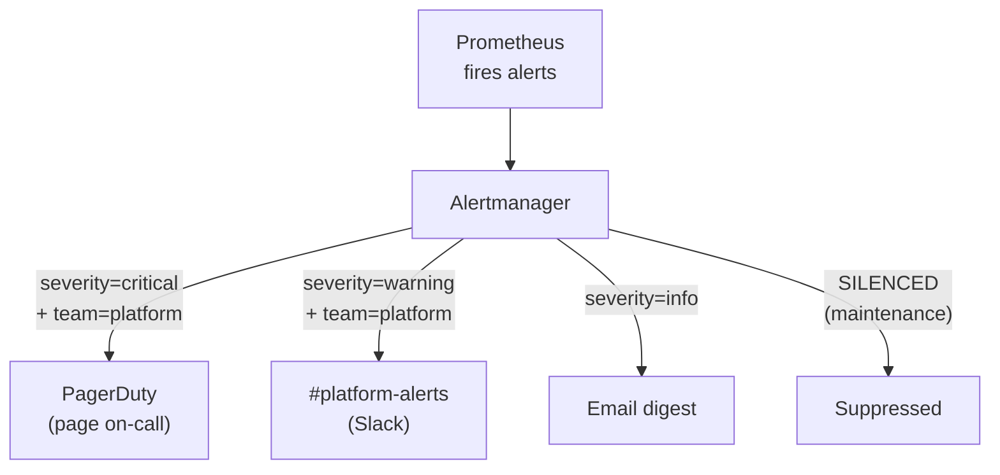

> 💡 **Quick Answer:** Alertmanager receives alerts from Prometheus and routes them to receivers (Slack, PagerDuty, email) based on label matching. Configure routing trees with `route.routes[]`, group related alerts with `group_by`, suppress duplicates with `inhibit_rules`, and temporarily mute known issues with silences. Use `amtool` CLI or the web UI to manage silences.

## The Problem

Without proper routing, all alerts go to one channel and overwhelm on-call teams. Critical pages get buried in noise. Alertmanager solves this by routing alerts to the right people, grouping related alerts into single notifications, suppressing redundant alerts, and allowing temporary silences during maintenance.



## The Solution

### Routing Tree Configuration

```yaml
# alertmanager.yml
global:
  resolve_timeout: 5m
  slack_api_url: 'https://hooks.slack.com/services/T00/B00/xxx'
  pagerduty_url: 'https://events.pagerduty.com/v2/enqueue'

route:
  receiver: 'default-slack'
  group_by: ['alertname', 'namespace', 'service']
  group_wait: 30s                    # Wait before first notification
  group_interval: 5m                 # Wait between grouped updates
  repeat_interval: 4h                # Re-send if not resolved
  
  routes:
    # Critical → PagerDuty (page immediately)
    - match:
        severity: critical
      receiver: 'pagerduty-critical'
      group_wait: 10s                # Page fast
      repeat_interval: 1h
      continue: false
    
    # Warning → team-specific Slack channels
    - match:
        severity: warning
      routes:
        - match:
            team: platform
          receiver: 'slack-platform'
        - match:
            team: data
          receiver: 'slack-data'
        - match_re:
            namespace: 'prod-.*'
          receiver: 'slack-production'
    
    # Info → email digest
    - match:
        severity: info
      receiver: 'email-digest'
      group_wait: 10m
      repeat_interval: 24h

receivers:
  - name: 'default-slack'
    slack_configs:
      - channel: '#alerts-general'
        send_resolved: true
        title: '[{{ .Status | toUpper }}] {{ .CommonLabels.alertname }}'
        text: >-
          {{ range .Alerts }}
          *{{ .Labels.alertname }}* in {{ .Labels.namespace }}
          {{ .Annotations.summary }}
          {{ end }}
  
  - name: 'pagerduty-critical'
    pagerduty_configs:
      - service_key_file: '/etc/alertmanager/pagerduty-key'
        severity: critical
        description: '{{ .CommonLabels.alertname }}: {{ .CommonAnnotations.summary }}'
  
  - name: 'slack-platform'
    slack_configs:
      - channel: '#platform-alerts'
        send_resolved: true
  
  - name: 'slack-data'
    slack_configs:
      - channel: '#data-alerts'
  
  - name: 'email-digest'
    email_configs:
      - to: 'oncall@example.com'
        send_resolved: false

# Inhibition: suppress warning if critical exists for same alert
inhibit_rules:
  - source_match:
      severity: 'critical'
    target_match:
      severity: 'warning'
    equal: ['alertname', 'namespace']
  
  # Don't alert on pods if the node is down
  - source_match:
      alertname: 'NodeDown'
    target_match_re:
      alertname: 'Pod.*'
    equal: ['node']
```

### Managing Silences

```bash
# Install amtool
# (comes with alertmanager binary)

# Create a silence (2-hour maintenance window)
amtool silence add \
  --alertmanager.url=http://alertmanager:9093 \
  --author="oncall" \
  --comment="Scheduled maintenance on gpu-node-3" \
  --duration=2h \
  'node="gpu-node-3"'

# List active silences
amtool silence query --alertmanager.url=http://alertmanager:9093

# Expire a silence early
amtool silence expire --alertmanager.url=http://alertmanager:9093 <silence-id>

# Query current alerts
amtool alert query --alertmanager.url=http://alertmanager:9093
```

### Deploy on Kubernetes

```yaml
apiVersion: monitoring.coreos.com/v1
kind: Alertmanager
metadata:
  name: main
  namespace: monitoring
spec:
  replicas: 3                        # HA: 3 replicas with mesh
  configSecret: alertmanager-config
  resources:
    requests:
      cpu: 100m
      memory: 256Mi
---
apiVersion: v1
kind: Secret
metadata:
  name: alertmanager-config
  namespace: monitoring
type: Opaque
stringData:
  alertmanager.yaml: |
    # Paste routing config here
```

### Test Routing with amtool

```bash
# Test which receiver an alert would route to
amtool config routes test \
  --alertmanager.url=http://alertmanager:9093 \
  severity=critical team=platform namespace=production

# Output: pagerduty-critical

# Show the routing tree
amtool config routes show --alertmanager.url=http://alertmanager:9093
```

## Common Issues

| Issue | Cause | Fix |
|-------|-------|-----|
| Alerts not routing to Slack | Wrong channel name or API URL | Test with `amtool config routes test` |
| Duplicate notifications | `continue: true` on parent route | Set `continue: false` on specific routes |
| Too many grouped alerts | `group_by` too broad | Add specific labels to `group_by` |
| Silence not working | Label mismatch in silence matcher | Check exact label values with `amtool alert query` |
| PagerDuty not receiving | Wrong service key | Verify key in PagerDuty integration settings |

## Best Practices

- **Route by severity first** — critical → page, warning → Slack, info → email
- **Group by alertname + namespace** — reduces notification volume by 10×
- **Use inhibition rules** — suppress pod alerts when the node is down
- **Test routing before deploying** — `amtool config routes test` catches misconfigurations
- **Set `send_resolved: true` for Slack** — teams need to know when issues resolve
- **Create silences for planned maintenance** — prevent unnecessary pages

## Key Takeaways

- Alertmanager routes alerts to receivers based on label matching
- Routing trees enable team-specific channels: platform → #platform-alerts
- Grouping reduces noise: 50 pod alerts become 1 notification
- Inhibition suppresses redundant alerts (warning suppressed when critical fires)
- Silences temporarily mute alerts during maintenance windows
- Always test routing with `amtool` before deploying config changes
