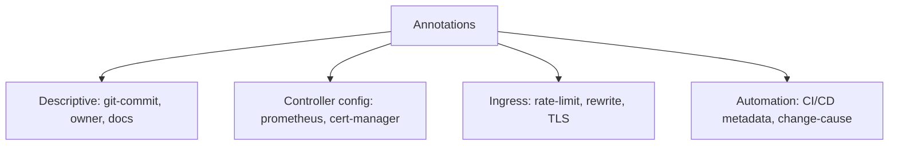

> 💡 **Quick Answer:** Use Kubernetes annotations for metadata, automation triggers, and controller configuration. Covers common annotation patterns, ingress annotations, and Helm labels.

## The Problem

This is one of the most searched Kubernetes topics. Having a comprehensive, well-structured guide helps both beginners and experienced users quickly find what they need.

## The Solution

### Add Annotations

```yaml
apiVersion: v1
kind: Pod
metadata:
  name: web-app
  annotations:
    # Descriptive metadata
    description: "Main web application serving customer traffic"
    git-commit: "abc123def456"
    build-url: "https://ci.example.com/builds/123"
    
    # Controller configuration
    prometheus.io/scrape: "true"
    prometheus.io/port: "9090"
    prometheus.io/path: "/metrics"
    
    # Ingress annotations
    nginx.ingress.kubernetes.io/rate-limit: "100"
    cert-manager.io/cluster-issuer: "letsencrypt-prod"
```

```bash
# Add annotation
kubectl annotate pod web-app owner="team-platform"

# Update
kubectl annotate pod web-app owner="team-frontend" --overwrite

# Remove
kubectl annotate pod web-app owner-

# View
kubectl get pod web-app -o jsonpath='{.metadata.annotations}'
```

### Common Annotation Patterns

| Annotation | Purpose |
|-----------|---------|
| `prometheus.io/scrape: "true"` | Enable Prometheus scraping |
| `cert-manager.io/cluster-issuer` | Auto-TLS certificates |
| `nginx.ingress.kubernetes.io/*` | NGINX ingress config |
| `kubectl.kubernetes.io/last-applied-configuration` | Applied config tracking |
| `kubernetes.io/change-cause` | Rollout change reason |

```bash
# Record change cause (shows in rollout history)
kubectl annotate deployment web-app kubernetes.io/change-cause="Updated to v2.1"
kubectl rollout history deployment web-app
# REVISION  CHANGE-CAUSE
# 1         Initial deployment
# 2         Updated to v2.1
```



## Frequently Asked Questions

### Annotations vs labels?

**Labels** are for identification and selection (Services use them to find pods). **Annotations** are for arbitrary metadata — they can store longer values and aren't used by selectors.

## Best Practices

- **Start simple** — use the basic form first, add complexity as needed
- **Be consistent** — follow naming conventions across your cluster
- **Document your choices** — add annotations explaining why, not just what
- **Monitor and iterate** — review configurations regularly

## Key Takeaways

- This is fundamental Kubernetes knowledge every engineer needs
- Start with the simplest approach that solves your problem
- Use `kubectl explain` and `kubectl describe` when unsure
- Practice in a test cluster before applying to production
