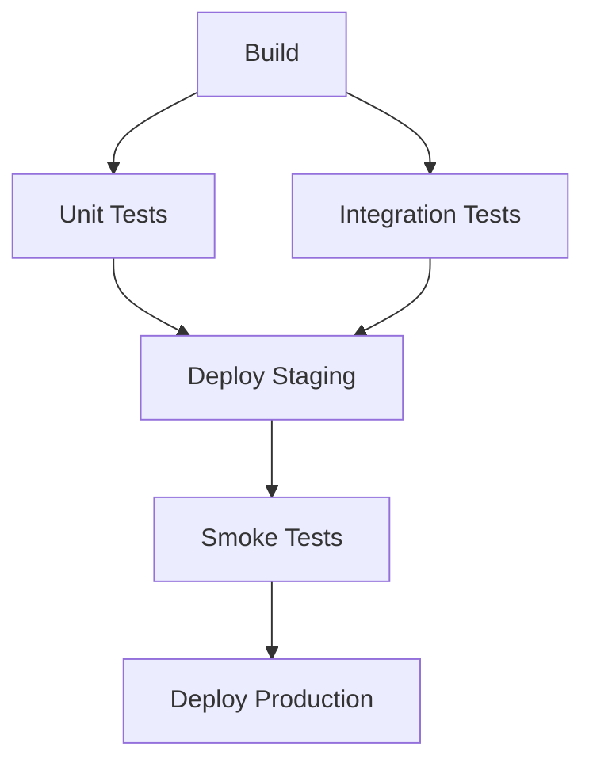

> 💡 **Quick Answer:** Argo Workflows is a CNCF workflow engine that runs each pipeline step as a pod. Install: `kubectl create ns argo && kubectl apply -n argo -f https://github.com/argoproj/argo-workflows/releases/download/<version>/quick-start-minimal.yaml` (or `install.yaml` for production). Define a `Workflow` with sequential/parallel `steps` or a `dag` of tasks with `dependencies`; pass data with parameters and artifacts (S3/GCS/MinIO); schedule with `CronWorkflow`; reuse with `WorkflowTemplate`. Submit with `argo submit wf.yaml --watch`.
>
> **Gotcha:** Output artifacts need an artifact repository (S3/MinIO/GCS) configured — `install.yaml` doesn't ship one.

## The Problem

Kubernetes Jobs are limited:

- No multi-step orchestration
- No artifact passing between steps
- No DAG dependencies
- No conditional execution
- No built-in UI for monitoring

## The Solution

### Install Argo Workflows

```bash
ARGO_VERSION=v3.7.2   # pick the latest from github.com/argoproj/argo-workflows/releases
kubectl create namespace argo
kubectl apply -n argo -f https://github.com/argoproj/argo-workflows/releases/download/${ARGO_VERSION}/install.yaml

# CLI
curl -sLO https://github.com/argoproj/argo-workflows/releases/download/${ARGO_VERSION}/argo-linux-amd64.gz
gunzip argo-linux-amd64.gz && sudo install -m 755 argo-linux-amd64 /usr/local/bin/argo

# UI (HTTPS, self-signed). install.yaml uses client auth: log in with a token
kubectl -n argo port-forward svc/argo-server 2746:2746
argo auth token     # paste into the UI login box
```

For a local sandbox, `quick-start-minimal.yaml` instead also sets up MinIO as artifact repository and server auth mode. The Helm chart is `argo/argo-workflows` from `https://argoproj.github.io/argo-helm`.

Workflow pods run as `spec.serviceAccountName` (default: `default`), which needs at least `create`/`patch` on `workflowtaskresults.argoproj.io` in that namespace — plus whatever your steps do (e.g. `kubectl rollout`).

### Simple Workflow

```yaml
apiVersion: argoproj.io/v1alpha1
kind: Workflow
metadata:
  name: hello-world
spec:
  entrypoint: main
  templates:
  - name: main
    container:
      image: alpine:3.19
      command: [echo, "Hello from Argo Workflows!"]
```

```bash
argo submit hello-world.yaml -n argo --watch
```

### Multi-Step Pipeline

```yaml
apiVersion: argoproj.io/v1alpha1
kind: Workflow
metadata:
  generateName: build-test-deploy-
spec:
  entrypoint: pipeline
  templates:
  - name: pipeline
    steps:
    - - name: build
        template: build-image
    - - name: unit-tests
        template: run-tests
      - name: lint
        template: run-lint
        # unit-tests and lint run in PARALLEL
    - - name: deploy
        template: deploy-app
        # Runs after both tests pass
  
  - name: build-image
    # No Docker daemon in a pod: build with rootless BuildKit (or buildah)
    container:
      image: moby/buildkit:rootless
      command: [buildctl-daemonless.sh]
      args: [build, --frontend, dockerfile.v0, --local, context=., --local, dockerfile=.,
             --output, "type=image,name=registry.example.com/myapp:latest,push=true"]
      securityContext:
        seccompProfile:
          type: Unconfined
        appArmorProfile:
          type: Unconfined
  
  - name: run-tests
    container:
      image: myapp:latest
      command: [pytest, tests/]
  
  - name: run-lint
    container:
      image: myapp:latest
      command: [flake8, src/]
  
  - name: deploy-app
    container:
      image: bitnami/kubectl:1.30
      command: [kubectl, rollout, restart, deployment/myapp]
```

### DAG Workflow

```yaml
apiVersion: argoproj.io/v1alpha1
kind: Workflow
metadata:
  generateName: dag-pipeline-
spec:
  entrypoint: dag
  templates:
  - name: dag
    dag:
      tasks:
      - name: checkout
        template: git-clone
      
      - name: build
        template: build-app
        dependencies: [checkout]
      
      - name: test
        template: run-tests
        dependencies: [build]
      
      - name: security-scan
        template: scan
        dependencies: [build]
      
      - name: deploy
        template: deploy
        dependencies: [test, security-scan]    # Both must succeed
        # outputs.result = stdout of a script/container template
        when: "{{tasks.test.outputs.result}} == passed"
```

### Artifact Passing

```yaml
apiVersion: argoproj.io/v1alpha1
kind: Workflow
metadata:
  generateName: artifacts-
spec:
  entrypoint: pipeline
  templates:
  - name: pipeline
    steps:
    - - name: generate
        template: generate-report
    - - name: process
        template: process-report
        arguments:
          artifacts:
          - name: report
            from: "{{steps.generate.outputs.artifacts.report}}"
  
  - name: generate-report
    container:
      image: python:3.12
      command: [python, -c, "open('/tmp/report.csv', 'w').write('data,value\n1,100\n2,200')"]
    outputs:
      artifacts:
      - name: report
        path: /tmp/report.csv
  
  - name: process-report
    inputs:
      artifacts:
      - name: report
        path: /tmp/input/report.csv
    container:
      image: python:3.12
      command: [python, -c, "print(open('/tmp/input/report.csv').read())"]
```

### Parameters and Conditionals

```yaml
apiVersion: argoproj.io/v1alpha1
kind: Workflow
metadata:
  generateName: conditional-
spec:
  entrypoint: main
  arguments:
    parameters:
    - name: environment
      value: staging
  
  templates:
  - name: main
    steps:
    - - name: build
        template: build
    - - name: deploy-staging
        template: deploy
        arguments:
          parameters:
          - name: env
            value: staging
        when: "{{workflow.parameters.environment}} == staging"
      - name: deploy-production
        template: deploy
        arguments:
          parameters:
          - name: env
            value: production
        when: "{{workflow.parameters.environment}} == production"
  
  - name: build
    container:
      image: alpine
      command: [echo, "Building..."]
  
  - name: deploy
    inputs:
      parameters:
      - name: env
    container:
      image: alpine
      command: [echo, "Deploying to {{inputs.parameters.env}}"]
```

### Retry and Error Handling

```yaml
templates:
- name: flaky-task
  retryStrategy:
    limit: 3
    retryPolicy: Always
    backoff:
      duration: "10s"
      factor: 2
      maxDuration: "1m"
  container:
    image: alpine
    command: [sh, -c, "exit $(( RANDOM % 2 ))"]   # 50% failure rate

- name: with-timeout
  activeDeadlineSeconds: 300     # 5 minute timeout
  container:
    image: long-running:v1
```

### CronWorkflow

```yaml
apiVersion: argoproj.io/v1alpha1
kind: CronWorkflow
metadata:
  name: nightly-etl
spec:
  schedule: "0 2 * * *"          # 2 AM daily
  timezone: "UTC"
  concurrencyPolicy: Replace
  successfulJobsHistoryLimit: 5
  failedJobsHistoryLimit: 3
  workflowSpec:
    entrypoint: etl-pipeline
    templates:
    - name: etl-pipeline
      dag:
        tasks:
        - name: extract
          template: extract-data
        - name: transform
          template: transform
          dependencies: [extract]
        - name: load
          template: load-db
          dependencies: [transform]
```

### WorkflowTemplate (Reusable)

```yaml
apiVersion: argoproj.io/v1alpha1
kind: WorkflowTemplate
metadata:
  name: build-template
spec:
  arguments:
    parameters:
    - name: image
    - name: tag
  templates:
  - name: build
    inputs:
      parameters:
      - name: image
      - name: tag
    container:
      image: moby/buildkit:rootless
      command: [buildctl-daemonless.sh]
      args: [build, --frontend, dockerfile.v0, --local, context=., --local, dockerfile=.,
             --output, "type=image,name={{inputs.parameters.image}}:{{inputs.parameters.tag}},push=true"]

---
# Reference in workflow
apiVersion: argoproj.io/v1alpha1
kind: Workflow
metadata:
  generateName: build-
spec:
  entrypoint: main
  templates:
  - name: main
    steps:
    - - name: build
        templateRef:
          name: build-template
          template: build
        arguments:
          parameters:
          - name: image
            value: myapp
          - name: tag
            value: v2.0
```

## Common Issues

**Workflow pods stuck Pending**

Resource quota exceeded or no matching nodes. Check: `kubectl describe pod <workflow-pod>`.

**`You need to configure artifact storage`**

No default artifact repository exists. Configure S3/GCS/MinIO under `artifactRepository` in the `workflow-controller-configmap` (or an `artifact-repositories` ConfigMap referenced per workflow).

**`forbidden` / `workflowtaskresults.argoproj.io is forbidden`**

The workflow's ServiceAccount lacks RBAC. Bind a Role with `create`,`patch` on `workflowtaskresults` (plus anything the steps call) and set `spec.serviceAccountName`.

**UI shows `Unauthorized`**

`install.yaml` defaults to client auth — use `argo auth token`, configure SSO, or (sandbox only) start argo-server with `--auth-mode=server`.



## Best Practices

- **DAG over steps** for complex pipelines — clearer dependency visualization
- **WorkflowTemplates** for reusable components
- **Retry strategies** on flaky external calls
- **Resource limits** on workflow pods — prevent cluster starvation
- **CronWorkflow** for scheduled ETL, reports, backups
- **`podGC` + `ttlStrategy`** so completed workflow pods and objects don't pile up

## Frequently Asked Questions

### What is Argo Workflows?

A Kubernetes-native workflow engine (CNCF graduated) implemented as a CRD plus controller. Each step of a `Workflow` runs as a pod, so you get Kubernetes scheduling, resource limits and RBAC for CI pipelines, ML/data pipelines and batch jobs.

### Argo Workflows vs Tekton?

Argo Workflows has a stronger UI, DAGs, loops, artifact management and CronWorkflows, and is popular for data/ML pipelines. Tekton focuses on CI/CD with reusable `Task`/`Pipeline` building blocks, Triggers, and Tekton Chains for supply-chain signing; it is the engine behind OpenShift Pipelines. See [Tekton Pipelines](/recipes/deployments/kubernetes-tekton-pipelines-guide/).

### Argo Workflows vs Argo CD?

Different tools. Argo Workflows runs jobs and pipelines (build, test, ETL). Argo CD continuously syncs manifests from Git to the cluster (GitOps CD). A common pattern: a workflow builds and pushes an image and bumps the tag in Git; Argo CD deploys it.

### Steps vs DAG — which should I use?

`steps` is a list of lists: outer items run sequentially, inner items in parallel — fine for linear pipelines. `dag` declares `dependencies` per task, so Argo runs everything as soon as its inputs are ready; it is clearer for fan-out/fan-in graphs.

## Key Takeaways

- Argo Workflows runs multi-step pipelines as Kubernetes pods
- Steps run sequentially; parallel steps in nested arrays
- DAG workflows for complex dependency graphs
- Artifacts pass data between steps (S3, GCS, MinIO)
- CronWorkflow for scheduled pipelines, WorkflowTemplate for reuse
