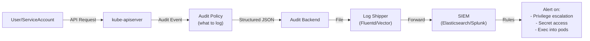

> 💡 **Quick Answer:** Enable kube-apiserver audit logging with a structured policy that captures who did what, when, and from where. Ship logs to a SIEM (Elasticsearch, Splunk, or Loki) and create alerts for privilege escalation, secret access, and unauthorized operations.

## The Problem

Enterprise compliance frameworks (SOC2, HIPAA, PCI-DSS, ISO 27001) require audit trails for all access to sensitive systems. Kubernetes API server audit logs capture every API request, but without proper configuration, you either log nothing (compliance failure) or log everything (storage explosion and noise).



## The Solution

### Audit Policy for Compliance

```yaml
apiVersion: audit.k8s.io/v1
kind: Policy
rules:
  # Don't log health checks and metrics (high volume, low value)
  - level: None
    users: ["system:kube-proxy", "system:apiserver"]
    verbs: ["get", "list", "watch"]
    resources:
      - group: ""
        resources: ["endpoints", "services", "services/status"]

  # Don't log node status updates (very high volume)
  - level: None
    users: ["kubelet", "system:node-*"]
    verbs: ["patch", "update"]
    resources:
      - group: ""
        resources: ["nodes/status"]

  # Log all secret access at RequestResponse level (compliance requirement)
  - level: RequestResponse
    resources:
      - group: ""
        resources: ["secrets"]
    omitStages:
      - RequestReceived

  # Log all RBAC changes at RequestResponse
  - level: RequestResponse
    resources:
      - group: "rbac.authorization.k8s.io"
        resources: ["clusterroles", "clusterrolebindings", "roles", "rolebindings"]

  # Log exec/attach/portforward at RequestResponse (pod access audit)
  - level: RequestResponse
    resources:
      - group: ""
        resources: ["pods/exec", "pods/attach", "pods/portforward"]

  # Log all namespace operations
  - level: RequestResponse
    resources:
      - group: ""
        resources: ["namespaces"]
    verbs: ["create", "delete", "patch", "update"]

  # Log all authentication events
  - level: Metadata
    nonResourceURLs:
      - "/api*"
      - "/version"

  # Log deletion of any resource at Metadata level
  - level: Metadata
    verbs: ["delete", "deletecollection"]

  # Default: log everything else at Metadata level
  - level: Metadata
    omitStages:
      - RequestReceived
```

### Configure API Server

```yaml
# Add to kube-apiserver manifest
spec:
  containers:
    - name: kube-apiserver
      command:
        - kube-apiserver
        # Audit policy
        - --audit-policy-file=/etc/kubernetes/audit/policy.yaml
        # Log to file (for shipping)
        - --audit-log-path=/var/log/kubernetes/audit/audit.log
        - --audit-log-maxage=30
        - --audit-log-maxbackup=10
        - --audit-log-maxsize=100
        # Optional: webhook backend for real-time streaming
        # - --audit-webhook-config-file=/etc/kubernetes/audit/webhook.yaml
      volumeMounts:
        - name: audit-policy
          mountPath: /etc/kubernetes/audit
          readOnly: true
        - name: audit-logs
          mountPath: /var/log/kubernetes/audit
  volumes:
    - name: audit-policy
      hostPath:
        path: /etc/kubernetes/audit
    - name: audit-logs
      hostPath:
        path: /var/log/kubernetes/audit
```

### Ship Logs to SIEM with Vector

```yaml
apiVersion: v1
kind: ConfigMap
metadata:
  name: vector-config
  namespace: logging
data:
  vector.toml: |
    [sources.audit_logs]
    type = "file"
    include = ["/var/log/kubernetes/audit/audit.log"]
    read_from = "beginning"

    [transforms.parse_audit]
    type = "remap"
    inputs = ["audit_logs"]
    source = '''
    . = parse_json!(.message)
    .compliance_tags = []
    if .objectRef.resource == "secrets" {
      .compliance_tags = push(.compliance_tags, "secret-access")
    }
    if .objectRef.resource == "pods/exec" {
      .compliance_tags = push(.compliance_tags, "pod-exec")
    }
    if contains(string!(.verb), "delete") {
      .compliance_tags = push(.compliance_tags, "resource-deletion")
    }
    '''

    [sinks.elasticsearch]
    type = "elasticsearch"
    inputs = ["parse_audit"]
    endpoints = ["https://elasticsearch.logging.svc:9200"]
    index = "k8s-audit-%Y-%m-%d"
```

### Compliance Alert Rules

```yaml
# Prometheus alerting rules for audit events
apiVersion: monitoring.coreos.com/v1
kind: PrometheusRule
metadata:
  name: audit-compliance-alerts
  namespace: monitoring
spec:
  groups:
    - name: kubernetes-audit
      rules:
        - alert: SecretAccessByUnknownUser
          expr: |
            count by (user_username) (
              kube_audit_event{resource="secrets", verb=~"get|list"}
            ) > 10
          for: 5m
          labels:
            severity: warning
            compliance: soc2
          annotations:
            summary: "Unusual secret access pattern by {{ $labels.user_username }}"

        - alert: PodExecInProduction
          expr: |
            count by (user_username, namespace) (
              kube_audit_event{resource="pods/exec", namespace=~"production|payments"}
            ) > 0
          labels:
            severity: critical
            compliance: pci-dss
          annotations:
            summary: "Pod exec in production namespace by {{ $labels.user_username }}"

        - alert: ClusterRoleEscalation
          expr: |
            count by (user_username) (
              kube_audit_event{resource="clusterrolebindings", verb="create"}
            ) > 0
          labels:
            severity: critical
            compliance: soc2
          annotations:
            summary: "ClusterRoleBinding created by {{ $labels.user_username }}"
```

## Common Issues

| Issue | Cause | Fix |
|-------|-------|-----|
| Audit logs fill disk | Logging at `Request` or `RequestResponse` for everything | Use tiered policy — `None` for health checks, `Metadata` as default |
| API server slow after enabling audit | Webhook backend with high latency | Use file backend + async shipping instead of synchronous webhook |
| Missing audit events | Policy rules order matters (first match wins) | Put specific rules before catch-all; `None` rules first |
| Compliance auditor wants user IP | Not in default logs | IP is in `sourceIPs` field of audit event |

## Best Practices

- **Least-verbose first** — put `level: None` rules at the top to exclude noise before catch-all
- **Always log secrets access** — SOC2 and PCI-DSS require audit trails for credential access
- **Log exec/attach** — any interactive pod access must be auditable
- **Retain for compliance period** — SOC2: 1 year, PCI-DSS: 1 year, HIPAA: 6 years
- **Immutable log storage** — ship to write-once storage (S3 Object Lock, Worm) to prevent tampering
- **Tag compliance-relevant events** — add tags at ingestion for easier SIEM queries

## Key Takeaways

- Kubernetes audit logging captures every API request with who, what, when, and from where
- Structure your policy by compliance requirement: secrets access, RBAC changes, pod exec, and deletions
- Ship logs to a SIEM with proper retention for your compliance framework
- Alert on privilege escalation, unusual secret access, and production pod exec in real time
