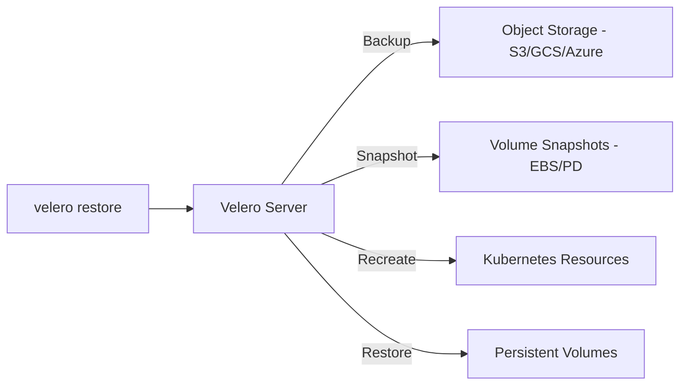

> 💡 **Quick Answer:** Backup and restore Kubernetes clusters with Velero. Covers namespace backups, scheduled backups, disaster recovery, and migration between clusters.

## The Problem

This is one of the most searched Kubernetes topics. A comprehensive, well-structured guide helps engineers of all levels quickly find actionable solutions.

## The Solution

Detailed implementation with production-ready examples below.


### Install Velero

```bash
# Install CLI
brew install velero  # macOS
# or download from https://github.com/vmware-tanzu/velero/releases

# Install server (AWS example)
velero install \
  --provider aws \
  --plugins velero/velero-plugin-for-aws:v1.9.0 \
  --bucket my-velero-backups \
  --backup-location-config region=eu-west-1 \
  --snapshot-location-config region=eu-west-1 \
  --secret-file ./credentials-velero
```

### Create Backups

```bash
# Backup entire cluster
velero backup create full-backup

# Backup specific namespace
velero backup create prod-backup --include-namespaces production

# Backup by label selector
velero backup create app-backup --selector app=web

# Scheduled backup (daily)
velero schedule create daily-backup \
  --schedule="0 2 * * *" \
  --include-namespaces production \
  --ttl 720h   # Keep for 30 days

# Check backup status
velero backup get
velero backup describe full-backup
velero backup logs full-backup
```

### Restore

```bash
# Restore entire backup
velero restore create --from-backup full-backup

# Restore to different namespace
velero restore create --from-backup prod-backup \
  --namespace-mappings production:staging

# Restore specific resources
velero restore create --from-backup full-backup \
  --include-resources deployments,services,configmaps

# Check restore status
velero restore get
velero restore describe <restore-name>
```



## Frequently Asked Questions

### Does Velero backup PVs?

Velero backs up PV metadata. For actual data, it uses volume snapshots (CSI or cloud-provider). For non-snapshot storage, use Velero's File System Backup (restic/kopia).

## Common Issues

Check `kubectl describe` and `kubectl get events` first — most issues have clear error messages pointing to the root cause.

## Best Practices

- **Follow least privilege** — only grant the access that's needed
- **Test in staging** before applying to production
- **Monitor and alert** on key metrics
- **Document your runbooks** for the team

## Key Takeaways

- Essential knowledge for Kubernetes operations
- Start simple and evolve your approach
- Automation reduces human error
- Share knowledge with your team
