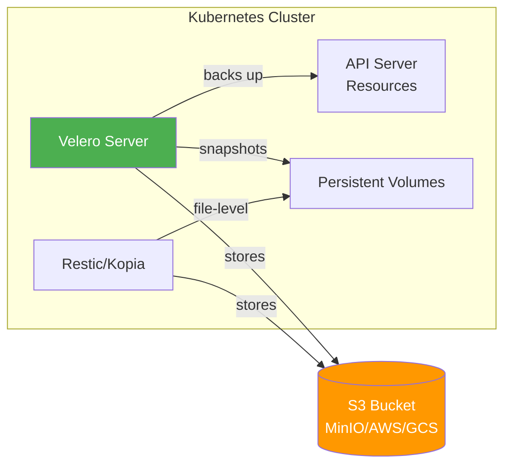

> 💡 **Quick Answer:** Install Velero with `velero install --provider aws --bucket my-backup --secret-file ./credentials`, then schedule backups with `velero schedule create daily --schedule="0 2 * * *"`. Velero backs up Kubernetes resources and persistent volumes to S3-compatible storage, enabling full namespace restore and cluster migration.

## The Problem

Kubernetes clusters need backup and disaster recovery for:

- Accidental namespace or resource deletion
- Cluster migration between environments
- Ransomware and security incident recovery
- Compliance requirements for data retention
- Persistent volume data protection
- etcd corruption or cluster failure

Without a backup strategy, a single `kubectl delete namespace` can destroy weeks of work.

## The Solution

### Architecture



### Install Velero

```bash
# Download Velero CLI
wget https://github.com/vmware-tanzu/velero/releases/download/v1.15.0/velero-v1.15.0-linux-amd64.tar.gz
tar xzf velero-v1.15.0-linux-amd64.tar.gz
sudo mv velero-v1.15.0-linux-amd64/velero /usr/local/bin/

# Create credentials file for S3
cat > credentials-velero << EOF
[default]
aws_access_key_id=<access-key>
aws_secret_access_key=<secret-key>
EOF

# Install Velero with AWS/S3-compatible backend
velero install \
  --provider aws \
  --plugins velero/velero-plugin-for-aws:v1.10.0 \
  --bucket velero-backups \
  --secret-file ./credentials-velero \
  --backup-location-config region=us-east-1,s3ForcePathStyle=true,s3Url=https://s3.example.com \
  --snapshot-location-config region=us-east-1 \
  --use-node-agent \
  --default-volumes-to-fs-backup
```

### On-Demand Backup

```bash
# Backup entire cluster
velero backup create full-cluster-backup

# Backup specific namespace
velero backup create app-backup --include-namespaces production

# Backup specific resources
velero backup create secrets-backup --include-resources secrets,configmaps

# Backup with label selector
velero backup create team-a --selector team=a

# Backup excluding namespaces
velero backup create partial --exclude-namespaces kube-system,velero

# Check backup status
velero backup describe full-cluster-backup
velero backup logs full-cluster-backup
```

### Scheduled Backups

```bash
# Daily backup at 2 AM UTC, retain 30 days
velero schedule create daily-backup \
  --schedule="0 2 * * *" \
  --ttl 720h

# Weekly full backup, retain 90 days
velero schedule create weekly-full \
  --schedule="0 3 * * 0" \
  --ttl 2160h

# Hourly backup of critical namespace
velero schedule create critical-hourly \
  --schedule="0 * * * *" \
  --include-namespaces production \
  --ttl 168h

# List schedules
velero schedule get
```

### Restore

```bash
# Restore entire backup
velero restore create --from-backup full-cluster-backup

# Restore specific namespace
velero restore create --from-backup full-cluster-backup \
  --include-namespaces production

# Restore to different namespace (requires mapping)
velero restore create --from-backup full-cluster-backup \
  --namespace-mappings production:production-restored

# Restore only specific resources
velero restore create --from-backup full-cluster-backup \
  --include-resources deployments,services

# Dry run (preview)
velero restore create --from-backup full-cluster-backup --dry-run

# Check restore status
velero restore describe <restore-name>
velero restore logs <restore-name>
```

### Persistent Volume Backup with Kopia

```yaml
# Annotate pods for file-system backup
apiVersion: v1
kind: Pod
metadata:
  annotations:
    backup.velero.io/backup-volumes: data-volume
spec:
  containers:
  - name: app
    volumeMounts:
    - name: data-volume
      mountPath: /data
  volumes:
  - name: data-volume
    persistentVolumeClaim:
      claimName: app-data
```

### Backup Location Configuration

```yaml
apiVersion: velero.io/v1
kind: BackupStorageLocation
metadata:
  name: secondary
  namespace: velero
spec:
  provider: aws
  objectStorage:
    bucket: velero-backups-secondary
    prefix: cluster-prod
  config:
    region: eu-west-1
    s3ForcePathStyle: "true"
    s3Url: https://minio.example.com
  credential:
    name: secondary-cloud-credentials
    key: cloud
```

## Common Issues

**Backup stuck in "InProgress"**

Node agent (Restic/Kopia) pod may be unhealthy. Check `oc get pods -n velero -l name=node-agent`. Ensure PV mount paths are accessible from the node agent.

**Restore fails with "already exists"**

Resources already exist in the target namespace. Use `--existing-resource-policy=update` to overwrite, or delete the namespace first.

**Large PV backups time out**

Increase `--fs-backup-timeout` (default 4h). For very large volumes, consider CSI snapshots instead of file-level backup.

## Best Practices

- **3-2-1 backup rule** — 3 copies, 2 different media, 1 offsite
- **Test restores regularly** — untested backups are not backups
- **Use CSI snapshots for large volumes** — faster than file-level backup
- **Set TTL on all backups** — prevent unlimited storage growth
- **Encrypt backup storage** — S3 server-side encryption at minimum
- **Backup before cluster upgrades** — restore point if upgrade fails

## Key Takeaways

- Velero backs up Kubernetes resources + persistent volumes to S3-compatible storage
- Schedule daily/weekly backups with automatic TTL-based retention
- Kopia (replacing Restic) provides file-level PV backup for non-CSI volumes
- Namespace mapping enables restore to different namespaces for testing
- Test restores regularly — a backup you haven't tested isn't a backup
