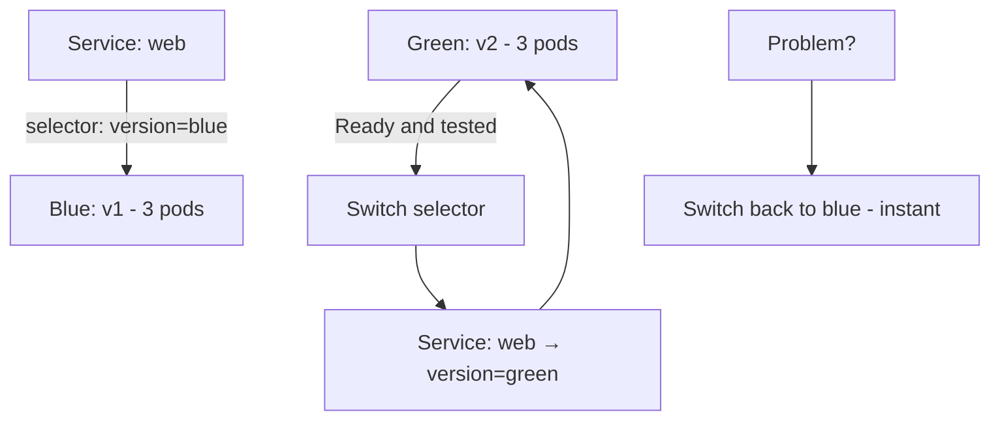

> 💡 **Quick Answer:** deployments

## The Problem

This is a fundamental Kubernetes topic that engineers search for frequently. A comprehensive reference with production-ready examples saves hours of trial and error.

## The Solution

### Native Blue-Green with Service Selector

```yaml
# Blue deployment (current production)
apiVersion: apps/v1
kind: Deployment
metadata:
  name: web-blue
spec:
  replicas: 3
  selector:
    matchLabels:
      app: web
      version: blue
  template:
    metadata:
      labels:
        app: web
        version: blue
    spec:
      containers:
        - name: web
          image: my-app:v1
---
# Green deployment (new version)
apiVersion: apps/v1
kind: Deployment
metadata:
  name: web-green
spec:
  replicas: 3
  selector:
    matchLabels:
      app: web
      version: green
  template:
    metadata:
      labels:
        app: web
        version: green
    spec:
      containers:
        - name: web
          image: my-app:v2
---
# Switch traffic by updating selector
apiVersion: v1
kind: Service
metadata:
  name: web
spec:
  selector:
    app: web
    version: blue     # ← Change to "green" to switch
  ports:
    - port: 80
```

```bash
# Deploy green alongside blue
kubectl apply -f web-green.yaml

# Test green (port-forward to green directly)
kubectl port-forward deployment/web-green 8080:80

# Switch traffic: blue → green
kubectl patch svc web -p '{"spec":{"selector":{"version":"green"}}}'

# Instant rollback: green → blue
kubectl patch svc web -p '{"spec":{"selector":{"version":"blue"}}}'

# Clean up old version after confirming
kubectl delete deployment web-blue
```

### Blue-Green vs Canary vs Rolling

| Strategy | Rollback Speed | Resource Cost | Risk |
|----------|---------------|---------------|------|
| Blue-Green | Instant (switch selector) | 2x (both versions running) | Low |
| Canary | Fast (scale down canary) | ~10% extra | Very low |
| Rolling Update | Slow (`rollout undo`) | ~25% extra | Medium |



## Frequently Asked Questions

### Blue-green vs rolling update?

**Blue-green**: run both versions fully, switch traffic instantly, instant rollback. Costs 2x resources during deployment. **Rolling update**: gradually replace pods, lower resource cost, slower rollback.

## Best Practices

- Start with the simplest configuration that meets your needs
- Test changes in staging before production
- Use `kubectl describe` and events for troubleshooting
- Document your decisions for the team

## Key Takeaways

- This is essential Kubernetes knowledge for production operations
- Follow the principle of least privilege and minimal configuration
- Monitor and iterate based on real-world behavior
- Automation reduces human error and improves consistency
