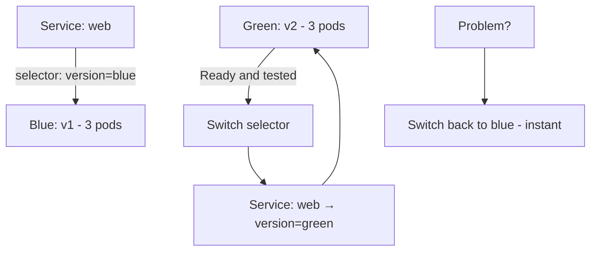

> 💡 **Quick Answer:** Run two identical environments — blue (current) and green (new) — behind one Service. Switch traffic instantly by patching the Service selector: `kubectl patch svc web -p '{"spec":{"selector":{"version":"green"}}}'`. Rollback is the same command in reverse. Costs 2x resources while both run.

## The Problem

You want to deploy a new version with the ability to instantly switch back to the old version if something goes wrong — without the slow, gradual exposure of a rolling update.

## The Solution

### Native Blue-Green with Service Selector

```yaml
# Blue deployment (current production)
apiVersion: apps/v1
kind: Deployment
metadata:
  name: web-blue
spec:
  replicas: 3
  selector:
    matchLabels:
      app: web
      version: blue
  template:
    metadata:
      labels:
        app: web
        version: blue
    spec:
      containers:
        - name: web
          image: my-app:v1
---
# Green deployment (new version)
apiVersion: apps/v1
kind: Deployment
metadata:
  name: web-green
spec:
  replicas: 3
  selector:
    matchLabels:
      app: web
      version: green
  template:
    metadata:
      labels:
        app: web
        version: green
    spec:
      containers:
        - name: web
          image: my-app:v2
---
# Switch traffic by updating selector
apiVersion: v1
kind: Service
metadata:
  name: web
spec:
  selector:
    app: web
    version: blue     # ← Change to "green" to switch
  ports:
    - port: 80
```

```bash
# Deploy green alongside blue
kubectl apply -f web-green.yaml

# Test green (port-forward to green directly)
kubectl port-forward deployment/web-green 8080:80

# Switch traffic: blue → green
kubectl patch svc web -p '{"spec":{"selector":{"version":"green"}}}'

# Instant rollback: green → blue
kubectl patch svc web -p '{"spec":{"selector":{"version":"blue"}}}'

# Clean up old version after confirming
kubectl delete deployment web-blue
```

### Full Walkthrough: Test Before Switching, Then Roll Back or Clean Up

```bash
# 1. Deploy green alongside the running blue version
kubectl apply -f web-green.yaml
kubectl rollout status deployment/web-green

# 2. Test green directly before it takes production traffic —
#    create a throwaway Service pointed only at green
kubectl expose deployment web-green --name=web-test --port=80 --target-port=8080
kubectl run test-pod --rm -it --image=curlimages/curl -- curl http://web-test/health
kubectl delete service web-test

# 3. Switch production traffic: blue → green
kubectl patch svc web -p '{"spec":{"selector":{"version":"green"}}}'
kubectl describe service web | grep Selector   # confirm the switch

# 4. Instant rollback if something's wrong: green → blue
kubectl patch svc web -p '{"spec":{"selector":{"version":"blue"}}}'

# 5. Once confident, remove the old version
kubectl delete deployment web-blue
```

Automate the switch/rollback with a small script so it's a single, auditable command instead of hand-typed patches:

```bash
#!/bin/bash
# blue-green-switch.sh <service> <blue|green>
SERVICE_NAME=${1:-web}
TARGET_VERSION=${2:-green}
kubectl patch service "$SERVICE_NAME" -p "{\"spec\":{\"selector\":{\"version\":\"$TARGET_VERSION\"}}}"
kubectl get endpoints "$SERVICE_NAME"
kubectl get service "$SERVICE_NAME" -o jsonpath='{.spec.selector}'
```

### Blue-Green vs Canary vs Rolling

| Strategy | Rollback Speed | Resource Cost | Risk |
|----------|---------------|---------------|------|
| Blue-Green | Instant (switch selector) | 2x (both versions running) | Low |
| Canary | Fast (scale down canary) | ~10% extra | Very low |
| Rolling Update | Slow (`rollout undo`) | ~25% extra | Medium |



## Frequently Asked Questions

### Blue-green vs rolling update?

**Blue-green**: run both versions fully, switch traffic instantly, instant rollback. Costs 2x resources during deployment. **Rolling update**: gradually replace pods, lower resource cost, slower rollback.

## Best Practices

- **Keep both environments identical** — same resource requests/limits, ConfigMaps, Secrets, and env vars, so the only difference is the image version
- **Always test green before switching** — verify readiness and run smoke tests against it directly, not through the production Service
- **Watch pods and logs after switching** — `kubectl get pods -l app=web -w` and `kubectl logs -l version=green --tail=100` catch problems the switch itself won't surface
- **Plan for database migrations separately** — blue-green swaps traffic instantly, but schema changes usually can't be rolled back as cleanly as the Service selector
- **Automate the switch** — a script removes typos from a high-stakes `kubectl patch` command

## Key Takeaways

- Blue-green gives instant rollback: switching back is the same `kubectl patch` command in reverse
- Requires 2x resources temporarily — both versions run at full replica count during the cutover
- Test the green environment directly (port-forward or a throwaway Service) before it takes production traffic
- Database migrations need their own handling — they don't roll back with the Service selector
- More complex and resource-hungry than rolling updates, but avoids serving mixed versions during the rollout
