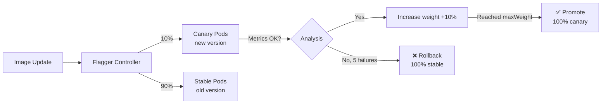

> 💡 **Quick Answer:** Install Flagger, create a `Canary` resource targeting your Deployment, define success metrics (error rate < 1%, p99 latency < 500ms), and set traffic step weights. Flagger progressively shifts traffic from stable to canary, rolling back automatically if metrics fail.

## The Problem

Standard Kubernetes rolling updates are all-or-nothing — once started, all pods eventually run the new version. If the new version has subtle bugs (increased latency, intermittent errors), the damage is done before you notice. Canary deployments expose the new version to a small percentage of traffic first, with automatic rollback if metrics degrade.

## The Solution

### Install Flagger

```bash
helm install flagger flagger/flagger \
  --namespace flagger-system \
  --create-namespace \
  --set meshProvider=nginx \
  --set prometheus.install=true
```

### Canary Resource

```yaml
apiVersion: flagger.app/v1beta1
kind: Canary
metadata:
  name: my-app
  namespace: production
spec:
  targetRef:
    apiVersion: apps/v1
    kind: Deployment
    name: my-app
  ingressRef:
    apiVersion: networking.k8s.io/v1
    kind: Ingress
    name: my-app
  autoscalerRef:
    apiVersion: autoscaling/v2
    kind: HorizontalPodAutoscaler
    name: my-app
  service:
    port: 8080
  analysis:
    interval: 1m
    threshold: 5
    maxWeight: 50
    stepWeight: 10
    metrics:
      - name: request-success-rate
        thresholdRange:
          min: 99
        interval: 1m
      - name: request-duration
        thresholdRange:
          max: 500
        interval: 1m
    webhooks:
      - name: load-test
        url: http://flagger-loadtester.flagger-system/
        metadata:
          cmd: "hey -z 1m -q 10 -c 2 http://my-app-canary.production:8080/"
```

### Traffic Progression

```
Step 1: 10% canary, 90% stable  → check metrics
Step 2: 20% canary, 80% stable  → check metrics
Step 3: 30% canary, 70% stable  → check metrics
Step 4: 40% canary, 60% stable  → check metrics
Step 5: 50% canary, 50% stable  → check metrics
Promote: 100% canary → becomes new stable
```

If any step fails the metric threshold 5 times (`threshold: 5`), Flagger rolls back to stable.



## Common Issues

**Canary stuck in "Progressing" state**

Check Flagger logs: `kubectl logs -n flagger-system deploy/flagger`. Common cause: Prometheus not scraping the canary pods, or metric names don't match.

**Canary always rolls back**

Lower metric thresholds or increase `threshold` (number of allowed failures). Verify baseline metrics of the stable version meet the same thresholds.

## Best Practices

- **Start with `stepWeight: 10` and `maxWeight: 50`** — conservative progression
- **Include load testing webhook** — canary needs traffic to generate meaningful metrics
- **Set `threshold: 5`** — allow some metric fluctuation before rollback
- **Monitor with `kubectl get canaries`** — shows current weight and status
- **Use Flagger with GitOps** (Argo CD / Flux) — image updates trigger canary automatically

## Key Takeaways

- Flagger automates canary deployments with metric-driven traffic shifting
- Progressive traffic increase (10% → 20% → 50%) with automatic rollback on failure
- Works with NGINX Ingress, Istio, Linkerd, and other mesh providers
- Define success criteria with request-success-rate and latency metrics
- `threshold` controls how many failed checks before rollback — not too sensitive, not too lenient
