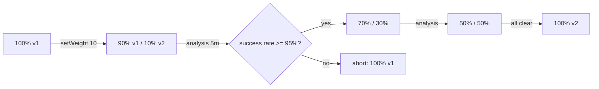

> 💡 **Quick Answer:** A canary release sends a small share of traffic to the new version, compares its metrics with stable, then promotes or rolls back. Without extra tooling: run a `web-stable` and a `web-canary` Deployment behind one Service that selects only `app: web` — traffic follows the pod ratio (9+1 ≈ 10%). For exact percentages use two Services and Gateway API `HTTPRoute` weights (or Istio). For automated steps and metric-based rollback use Argo Rollouts or Flagger.

## Native Kubernetes Canary (Replica Ratio)

```yaml
# Stable: 9 pods ≈ 90%
apiVersion: apps/v1
kind: Deployment
metadata:
  name: web-stable
spec:
  replicas: 9
  selector:
    matchLabels:
      app: web
      track: stable
  template:
    metadata:
      labels:
        app: web
        track: stable
    spec:
      containers:
        - name: web
          image: my-app:v1
          readinessProbe:
            httpGet: {path: /ready, port: 8080}
---
# Canary: 1 pod ≈ 10%
apiVersion: apps/v1
kind: Deployment
metadata:
  name: web-canary
spec:
  replicas: 1
  selector:
    matchLabels:
      app: web
      track: canary
  template:
    metadata:
      labels:
        app: web
        track: canary
    spec:
      containers:
        - name: web
          image: my-app:v2
          readinessProbe:
            httpGet: {path: /ready, port: 8080}
---
# Service selects BOTH tracks
apiVersion: v1
kind: Service
metadata:
  name: web
spec:
  selector:
    app: web
  ports:
    - port: 80
      targetPort: 8080
```

```bash
# 10% → 25% → 50% → 100%
kubectl scale deployment web-stable --replicas=3          # 1/(3+1) = 25%
kubectl scale deployment web-stable --replicas=1          # 50%

# Promote: move stable to v2, then remove canary
kubectl set image deployment/web-stable web=my-app:v2
kubectl scale deployment web-stable --replicas=9
kubectl rollout status deployment/web-stable
kubectl scale deployment web-canary --replicas=0

# Roll back: kill the canary
kubectl scale deployment web-canary --replicas=0
```

Limits: granularity is 1/total pods, the split is per connection (keep-alive and HTTP/2 clients stick to one pod), and you can't target specific users. Fine for internal services; use weighted routing for anything user-facing.

## Weighted Canary with Gateway API

Give each track its own Service (`web-stable` selects `track: stable`, `web-canary` selects `track: canary`), then weight them:

```yaml
apiVersion: gateway.networking.k8s.io/v1
kind: HTTPRoute
metadata:
  name: web
spec:
  parentRefs:
    - name: public-gateway
  hostnames: ["web.example.com"]
  rules:
    # Opt-in canary for testers
    - matches:
        - headers:
            - name: X-Canary
              value: "true"
      backendRefs:
        - name: web-canary
          port: 80
    # Everyone else: 95/5 split
    - backendRefs:
        - name: web-stable
          port: 80
          weight: 95
        - name: web-canary
          port: 80
          weight: 5
```

```bash
# Step weights up; replica counts are now independent of the split
kubectl patch httproute web --type=json -p='[
  {"op":"replace","path":"/spec/rules/1/backendRefs/0/weight","value":75},
  {"op":"replace","path":"/spec/rules/1/backendRefs/1/weight","value":25}]'

curl -H "X-Canary: true" https://web.example.com   # always hits canary
```

More on Gateway API routing: [canary with Gateway API](/recipes/deployments/canary-deployment-gateway-api-traffic-splitting/). The same pattern works with an Istio `VirtualService` (`route[].weight`) — see [Istio traffic management](/recipes/networking/kubernetes-istio-traffic-management/).

## Automated Canary with Argo Rollouts

```yaml
apiVersion: argoproj.io/v1alpha1
kind: Rollout
metadata:
  name: web
spec:
  replicas: 10
  selector:
    matchLabels:
      app: web
  template:
    metadata:
      labels:
        app: web
    spec:
      containers:
        - name: web
          image: my-app:v2
  strategy:
    canary:
      canaryService: web-canary
      stableService: web-stable
      trafficRouting:                 # without this, setWeight is approximated by pod count
        plugins:
          argoproj-labs/gatewayAPI:
            httpRoute: web
            namespace: default
      analysis:                       # background analysis from step 1
        templates:
          - templateName: success-rate
        startingStep: 1
        args:
          - name: service-name
            value: web-canary
      steps:
        - setWeight: 10
        - pause: {duration: 5m}
        - setWeight: 30
        - pause: {duration: 5m}
        - setWeight: 50
        - pause: {duration: 10m}
---
apiVersion: argoproj.io/v1alpha1
kind: AnalysisTemplate
metadata:
  name: success-rate
spec:
  args:
    - name: service-name
  metrics:
    - name: success-rate
      interval: 60s
      failureLimit: 2                 # abort + rollback after 2 failed measurements
      successCondition: result[0] >= 0.95
      provider:
        prometheus:
          address: http://prometheus.monitoring:9090
          query: |
            sum(rate(http_requests_total{service="{{args.service-name}}",status!~"5.."}[5m]))
            / sum(rate(http_requests_total{service="{{args.service-name}}"}[5m]))
```

```bash
kubectl argo rollouts set image web web=my-app:v3
kubectl argo rollouts get rollout web -w
kubectl argo rollouts promote web      # skip remaining pause
kubectl argo rollouts abort web        # back to 100% stable
```

The Gateway API integration is an Argo Rollouts plugin that must be registered in the `argo-rollouts-config` ConfigMap; built-in `trafficRouting` providers include Istio, NGINX, ALB, SMI and Traefik. See the [Argo Rollouts guide](/recipes/deployments/kubernetes-argo-rollouts-guide/). [Flagger](/recipes/deployments/kubernetes-canary-deployment-flagger/) does the same by watching a normal Deployment.



## What to Measure

Compare canary vs stable on the **same** metrics and time window, not canary vs a fixed threshold only:

- 5xx rate and error ratio per `track` label
- p95/p99 latency
- Pod restarts / OOMKilled (`kube_pod_container_status_restarts_total`)
- Business signals (checkout success, queue lag) for high-risk changes

Label metrics with the `track` or Rollouts `rollouts-pod-template-hash` so dashboards can split them.

## Common Issues

**Canary gets far more or less than expected traffic** — replica-ratio canary with long-lived connections, or a Service that selects only one track. Check `kubectl get endpointslices -l kubernetes.io/service-name=web`.

**Canary never receives traffic** — canary pods not Ready, or the canary Service selector doesn't match `track: canary`.

**Sessions flip between versions** — per-request weighting breaks sticky sessions. Use header/cookie matching for session-bound users or make both versions session-compatible.

**Database migrations** — the canary and stable share the database. Migrations must be backward compatible (expand/contract) or the rollback path breaks.

## Frequently Asked Questions

### How do I do a canary deployment in Kubernetes without a service mesh?

Run two Deployments (stable and canary) with a shared `app` label and a Service selecting only that label; the pod ratio sets the split. For precise weights without a mesh, use Gateway API `HTTPRoute` `backendRefs[].weight`.

### Native canary vs Argo Rollouts?

Native canary is manual scaling and approximate. Argo Rollouts automates weight steps, pauses, metric analysis and automatic rollback, and integrates with Gateway API, Istio and ingress controllers. Use Rollouts or Flagger for production services with real traffic.

### How many canary pods do I need?

With replica-ratio canaries, 1 of N pods gives ~1/N of traffic. With weighted routing, one or two canary pods are enough as long as they can handle the assigned percentage — size them for the weight's peak load.

### What's the difference between canary and blue-green?

Canary shifts a small percentage first and increases gradually; blue-green flips all traffic at once between two full environments. See [deployment strategies](/recipes/deployments/deployment-strategies/).
