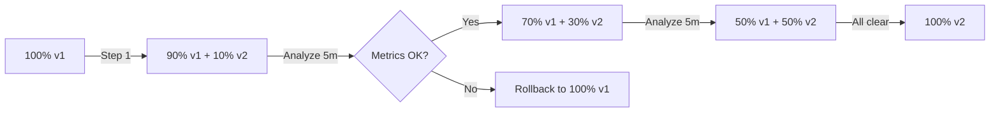

> 💡 **Quick Answer:** deployments

## The Problem

This is a fundamental Kubernetes topic that engineers search for frequently. A comprehensive reference with production-ready examples saves hours of trial and error.

## The Solution

### Native Kubernetes Canary

```yaml
# Stable: 90% traffic
apiVersion: apps/v1
kind: Deployment
metadata:
  name: web-stable
spec:
  replicas: 9
  selector:
    matchLabels:
      app: web
      version: stable
  template:
    metadata:
      labels:
        app: web
        version: stable
    spec:
      containers:
        - name: web
          image: my-app:v1
---
# Canary: 10% traffic (1 out of 10 pods)
apiVersion: apps/v1
kind: Deployment
metadata:
  name: web-canary
spec:
  replicas: 1
  selector:
    matchLabels:
      app: web
      version: canary
  template:
    metadata:
      labels:
        app: web
        version: canary
    spec:
      containers:
        - name: web
          image: my-app:v2
---
# Service selects BOTH (app: web)
apiVersion: v1
kind: Service
metadata:
  name: web
spec:
  selector:
    app: web     # Matches both stable and canary
  ports:
    - port: 80
```

### Argo Rollouts (Automated Canary)

```yaml
apiVersion: argoproj.io/v1alpha1
kind: Rollout
metadata:
  name: web-app
spec:
  replicas: 10
  strategy:
    canary:
      steps:
        - setWeight: 10        # 10% to canary
        - pause: {duration: 5m}
        - setWeight: 30        # 30%
        - pause: {duration: 5m}
        - setWeight: 50        # 50%
        - pause: {duration: 10m}
      # Automated analysis
      analysis:
        templates:
          - templateName: success-rate
        startingStep: 1
        args:
          - name: service-name
            value: web
  selector:
    matchLabels:
      app: web
  template:
    metadata:
      labels:
        app: web
    spec:
      containers:
        - name: web
          image: my-app:v2
---
# Auto-rollback if error rate > 5%
apiVersion: argoproj.io/v1alpha1
kind: AnalysisTemplate
metadata:
  name: success-rate
spec:
  metrics:
    - name: success-rate
      interval: 60s
      successCondition: result[0] >= 0.95
      provider:
        prometheus:
          address: http://prometheus:9090
          query: |
            sum(rate(http_requests_total{service="{{args.service-name}}",status=~"2.."}[5m]))
            / sum(rate(http_requests_total{service="{{args.service-name}}"}[5m]))
```



## Frequently Asked Questions

### Native canary vs Argo Rollouts?

Native K8s canary is manual (adjust replica counts). Argo Rollouts automates the process with traffic splitting, metric analysis, and automatic rollback. Use Argo Rollouts for production.

### How many canary pods do I need?

At least 1 pod gets ~10% of traffic (if you have 10 total). For more precise traffic splitting, use Istio or a service mesh that supports weighted routing.

## Best Practices

- Start with the simplest configuration that meets your needs
- Test changes in staging before production
- Use `kubectl describe` and events for troubleshooting
- Document your decisions for the team

## Key Takeaways

- This is essential Kubernetes knowledge for production operations
- Follow the principle of least privilege and minimal configuration
- Monitor and iterate based on real-world behavior
- Automation reduces human error and improves consistency
