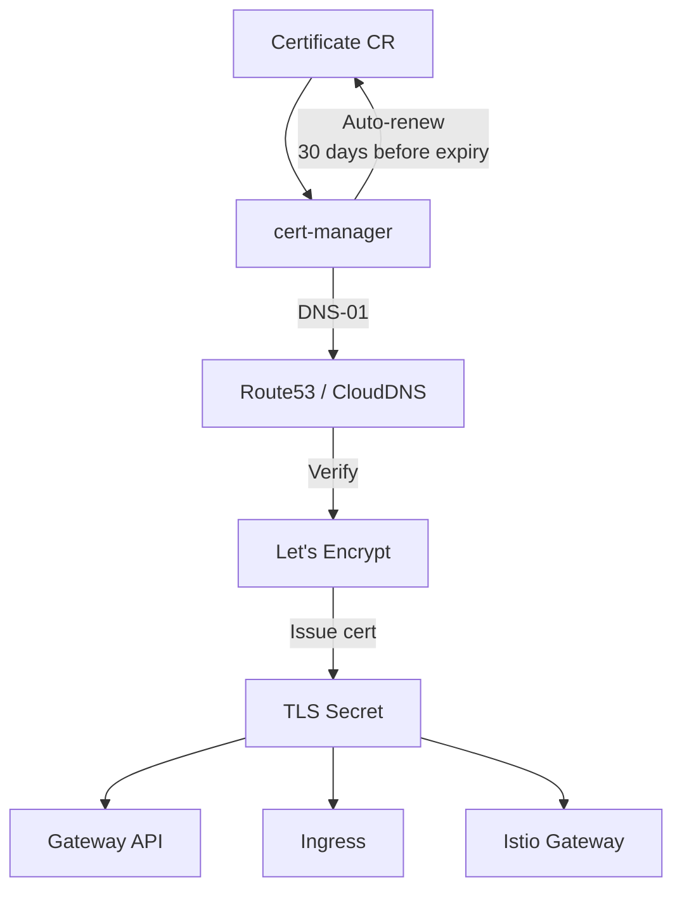

> 💡 **Quick Answer:** Use DNS-01 challenge for wildcard certificates (`*.example.com`). Configure `Certificate` resources with 60-day duration and 30-day renewBefore for safe rotation. Share certificates across namespaces with `trust-manager` or `reflector`. Integrate with Gateway API via `gateway.networking.k8s.io/v1` references.

## The Problem

HTTP-01 challenges only work for individual domains and require port 80 access. Wildcard certificates, internal services, and air-gapped clusters need DNS-01. Managing certificates across multiple namespaces and integrating with service mesh adds complexity.

## The Solution

### Wildcard Certificate with DNS-01

```yaml
apiVersion: cert-manager.io/v1
kind: ClusterIssuer
metadata:
  name: letsencrypt-prod
spec:
  acme:
    email: admin@example.com
    server: https://acme-v2.api.letsencrypt.org/directory
    privateKeySecretRef:
      name: letsencrypt-prod-key
    solvers:
      - dns01:
          route53:
            region: us-east-1
            hostedZoneID: Z1234567890
---
apiVersion: cert-manager.io/v1
kind: Certificate
metadata:
  name: wildcard-cert
  namespace: production
spec:
  secretName: wildcard-tls
  duration: 2160h      # 90 days
  renewBefore: 720h    # 30 days before expiry
  issuerRef:
    name: letsencrypt-prod
    kind: ClusterIssuer
  dnsNames:
    - "example.com"
    - "*.example.com"
```

### Gateway API Integration

```yaml
apiVersion: gateway.networking.k8s.io/v1
kind: Gateway
metadata:
  name: main-gateway
  annotations:
    cert-manager.io/cluster-issuer: letsencrypt-prod
spec:
  gatewayClassName: cilium
  listeners:
    - name: https
      protocol: HTTPS
      port: 443
      tls:
        mode: Terminate
        certificateRefs:
          - name: wildcard-tls
            namespace: production
```

### Cross-Namespace Certificate Sharing

```yaml
# Using trust-manager to distribute CA bundle
apiVersion: trust.cert-manager.io/v1alpha1
kind: Bundle
metadata:
  name: internal-ca
spec:
  sources:
    - secret:
        name: internal-ca-cert
        key: ca.crt
  target:
    configMap:
      key: ca-bundle.crt
    namespaceSelector:
      matchLabels:
        needs-internal-ca: "true"
```

### Certificate Monitoring

```yaml
apiVersion: monitoring.coreos.com/v1
kind: PrometheusRule
metadata:
  name: cert-alerts
spec:
  groups:
    - name: certificates
      rules:
        - alert: CertificateExpiringSoon
          expr: certmanager_certificate_expiration_timestamp_seconds - time() < 7 * 24 * 3600
          labels:
            severity: warning
          annotations:
            summary: "Certificate {{ $labels.name }} expires in < 7 days"
```



## Common Issues

**DNS-01 challenge fails — timeout waiting for DNS propagation**

Increase DNS propagation wait: add `--dns01-recursive-nameservers=8.8.8.8:53` to cert-manager args. Some DNS providers have slow propagation.

**Certificate stuck in "Issuing"**

Check events: `kubectl describe certificate wildcard-cert`. Common causes: DNS credentials wrong, rate limits hit, or ACME account deactivated.

## Best Practices

- **DNS-01 for wildcards and internal services** — works without port 80
- **60-day duration, 30-day renewBefore** — safe margin for renewal failures
- **Monitor with Prometheus** — alert if cert expires in <7 days
- **trust-manager for CA distribution** — cleanest way to share certs across namespaces
- **Gateway API integration** — annotate Gateway for automatic cert provisioning

## Key Takeaways

- DNS-01 challenges enable wildcard certificates and work without public port 80
- cert-manager auto-renews certificates before expiry (configurable renewBefore)
- trust-manager distributes CA bundles across namespaces automatically
- Gateway API integration: annotate the Gateway, cert-manager handles the rest
- Monitor certificate expiration with Prometheus alerts — catch renewal failures early
