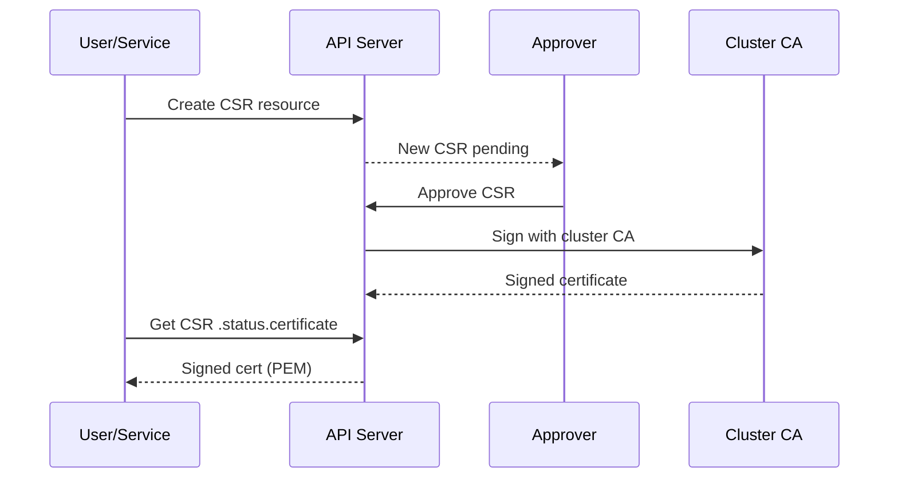

> 💡 **Quick Answer:** The CSR API lets you request certificates signed by the cluster CA. Create a CSR resource, approve it (manually or via controller), then retrieve the signed certificate from `.status.certificate`.

## The Problem

Internal services need TLS certificates signed by a trusted CA. Options:
- Self-signed certs (no trust chain)
- External CA (complex, slow)
- cert-manager (requires installation)

The CSR API provides a built-in certificate workflow using the cluster CA — no external tools needed for internal mTLS.

## The Solution

### Generate Key and CSR

```bash
# Generate private key
openssl genrsa -out app.key 2048

# Create CSR (specify the service DNS names)
openssl req -new -key app.key -subj "/CN=web-api.production.svc" \
  -addext "subjectAltName=DNS:web-api.production.svc,DNS:web-api.production.svc.cluster.local" \
  -out app.csr

# Base64 encode the CSR
CSR_BASE64=$(cat app.csr | base64 | tr -d '\n')
```

### Submit CSR to Kubernetes

```yaml
apiVersion: certificates.k8s.io/v1
kind: CertificateSigningRequest
metadata:
  name: web-api-tls
spec:
  request: ${CSR_BASE64}
  signerName: kubernetes.io/kubelet-serving
  usages:
    - digital signature
    - key encipherment
    - server auth
  expirationSeconds: 31536000  # 1 year
```

### Approve and Retrieve

```bash
# List pending CSRs
kubectl get csr

# Approve the CSR
kubectl certificate approve web-api-tls

# Retrieve the signed certificate
kubectl get csr web-api-tls -o jsonpath='{.status.certificate}' | base64 -d > app.crt

# Create a TLS secret
kubectl create secret tls web-api-tls \
  --cert=app.crt \
  --key=app.key \
  -n production
```

### Auto-Approval with RBAC

```yaml
apiVersion: rbac.authorization.k8s.io/v1
kind: ClusterRole
metadata:
  name: csr-approver
rules:
  - apiGroups: ["certificates.k8s.io"]
    resources: ["certificatesigningrequests/approval"]
    verbs: ["update"]
  - apiGroups: ["certificates.k8s.io"]
    resources: ["signers"]
    resourceNames: ["kubernetes.io/kubelet-serving"]
    verbs: ["approve"]
```

### User Certificate (kubectl access)

```bash
# Generate user key and CSR
openssl genrsa -out developer.key 2048
openssl req -new -key developer.key -subj "/CN=developer/O=dev-team" -out developer.csr
```

```yaml
apiVersion: certificates.k8s.io/v1
kind: CertificateSigningRequest
metadata:
  name: developer-access
spec:
  request: <base64-encoded-csr>
  signerName: kubernetes.io/kube-apiserver-client
  usages:
    - client auth
  expirationSeconds: 86400  # 24 hours
```



## Common Issues

**CSR stuck in Pending**
No approver is configured for the signer. Approve manually:
```bash
kubectl certificate approve <csr-name>
```

**Certificate not trusted by other pods**
The cluster CA certificate must be in the trust store. Mount it from:
```bash
kubectl get cm kube-root-ca.crt -n <namespace>
```

**Wrong signerName**
- `kubernetes.io/kube-apiserver-client` — client certs (user auth)
- `kubernetes.io/kubelet-serving` — kubelet serving certs
- `kubernetes.io/legacy-unknown` — custom use (not auto-approved)

**CSR denied/expired**
CSRs have a TTL. Recreate if expired:
```bash
kubectl delete csr web-api-tls
# Resubmit
```

## Best Practices

- Use cert-manager for automated certificate lifecycle (renewal, revocation)
- Use CSR API for one-off internal certificates or bootstrapping
- Set short `expirationSeconds` for user certificates (24-72 hours)
- Automate approval only for well-scoped signerNames with RBAC
- Store private keys in Kubernetes Secrets (or external vault)
- Use `kubernetes.io/kubelet-serving` signer for service TLS
- Rotate certificates before expiry (80% of lifetime)

## Key Takeaways

- CSR API provides built-in certificate signing without external tools
- Three built-in signers: kube-apiserver-client, kubelet-serving, legacy-unknown
- CSRs require approval (manual or controller-based)
- Signed certificate available in `.status.certificate` (base64-encoded PEM)
- `expirationSeconds` controls certificate lifetime
- For production workloads, prefer cert-manager over raw CSR API
