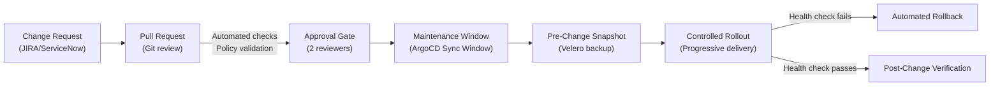

> 💡 **Quick Answer:** Implement change management with ArgoCD sync windows (maintenance windows), PR-based approval gates, automated pre-flight checks, and Velero snapshots before every change. Track all changes via Git commits with JIRA ticket references.

## The Problem

Enterprise operations require controlled change management. Uncoordinated changes to production Kubernetes clusters cause outages, compliance violations, and audit failures. You need a process that ensures changes are reviewed, approved, tested, scheduled during maintenance windows, and reversible — while maintaining the speed benefits of GitOps.



## The Solution

### ArgoCD Sync Windows (Maintenance Windows)

```yaml
apiVersion: argoproj.io/v1alpha1
kind: AppProject
metadata:
  name: production
  namespace: argocd
spec:
  description: Production applications
  syncWindows:
    # Allow syncs only during maintenance window
    - kind: allow
      schedule: "0 2 * * 2,4"  # Tue/Thu 02:00-06:00 UTC
      duration: 4h
      applications: ["*"]
      namespaces: ["production-*"]
      clusters: ["https://prod.k8s.example.com"]

    # Block all syncs during business hours
    - kind: deny
      schedule: "0 8 * * 1-5"  # Mon-Fri 08:00-18:00 UTC
      duration: 10h
      applications: ["*"]
      namespaces: ["production-*"]

    # Emergency: always allow security patches
    - kind: allow
      schedule: "* * * * *"
      duration: 24h
      applications: ["security-*"]
      manualSync: true
```

### PR-Based Approval Gates

```yaml
# .github/CODEOWNERS
# Require platform team review for infra changes
/platform/ @platform-team
/clusters/ @platform-team @sre-team

# Require app team + SRE review for production
/services/*/overlays/production/ @sre-team
```

```yaml
# GitHub Actions: pre-flight checks before merge
name: Change Validation
on:
  pull_request:
    paths:
      - 'services/**'
      - 'platform/**'

jobs:
  validate:
    runs-on: ubuntu-latest
    steps:
      - uses: actions/checkout@v4

      - name: Validate Kubernetes manifests
        run: |
          kubectl kustomize services/*/overlays/production/ | kubeval --strict

      - name: Check resource quotas
        run: |
          for dir in services/*/overlays/production/; do
            kubectl kustomize "$dir" | python3 scripts/check-quotas.py
          done

      - name: Policy check (Kyverno CLI)
        run: |
          kyverno apply policies/ --resource <(kubectl kustomize services/*/overlays/production/)

      - name: Diff against live cluster
        run: |
          argocd app diff <app-name> --local services/api-gateway/overlays/production/
```

### Pre-Change Backup

```bash
#!/bin/bash
# pre-change-backup.sh — Run before every production change
set -euo pipefail

CHANGE_ID="${1:?Usage: pre-change-backup.sh <CHANGE-ID>}"
TIMESTAMP=$(date +%Y%m%d-%H%M%S)

echo "=== Creating pre-change backup for ${CHANGE_ID} ==="

# Velero backup of affected namespaces
velero backup create "pre-change-${CHANGE_ID}-${TIMESTAMP}" \
  --include-namespaces=production \
  --snapshot-volumes=true \
  --labels="change-id=${CHANGE_ID}" \
  --wait

echo "=== Backup completed: pre-change-${CHANGE_ID}-${TIMESTAMP} ==="
echo "=== Rollback command: velero restore create --from-backup pre-change-${CHANGE_ID}-${TIMESTAMP} ==="
```

### Automated Rollback on Failure

```yaml
# ArgoCD Application with automated rollback
apiVersion: argoproj.io/v1alpha1
kind: Application
metadata:
  name: api-gateway
  namespace: argocd
spec:
  source:
    repoURL: https://git.example.com/apps/api-gateway.git
    targetRevision: main
    path: overlays/production
  destination:
    server: https://prod.k8s.example.com
    namespace: production
  syncPolicy:
    automated:
      prune: true
      selfHeal: true
    retry:
      limit: 3
      backoff:
        duration: 30s
        factor: 2
        maxDuration: 5m
```

```bash
# Manual rollback to previous Git revision
argocd app rollback api-gateway

# Or restore from Velero backup
velero restore create --from-backup pre-change-CHG-1234-20260408-020000
```

### Change Audit Trail

```bash
# Every Git commit references a change ticket
git commit -m "CHG-1234: Upgrade api-gateway to v2.5.0

Change: Upgrade api-gateway from v2.4.3 to v2.5.0
Risk: Medium
Rollback: Revert this commit or restore Velero backup
Approved-by: @sre-lead, @platform-lead
Tested: staging-us-east (2026-04-07)
Maintenance-window: Tue 2026-04-08 02:00-06:00 UTC"
```

## Common Issues

| Issue | Cause | Fix |
|-------|-------|-----|
| Sync blocked outside window | Change not in maintenance window | Request emergency sync window or wait for next window |
| Rollback doesn't restore PV data | Velero backup didn't include volumes | Always use `--snapshot-volumes=true` |
| PR checks pass but deploy fails | Staging != production config | Use identical Kustomize overlays, diff against live cluster |
| Audit trail incomplete | Commits without ticket references | Enforce commit message format with Git hooks |

## Best Practices

- **Every change has a ticket** — no production changes without a tracked change request
- **Two-person review** — require at least 2 approvers for production changes
- **Backup before change** — Velero snapshot is your safety net; automated, not optional
- **Progressive rollout** — canary → staged → full, never all-at-once in production
- **Post-change verification** — automated health checks within 30 minutes of deployment
- **Freeze periods** — block all non-emergency changes during holidays and major events

## Key Takeaways

- ArgoCD sync windows enforce when changes can be applied to production
- PR-based approval with CODEOWNERS ensures the right people review every change
- Pre-change Velero backups provide reliable rollback for any failure scenario
- Git commit messages with ticket references create a complete audit trail
- Automated pre-flight checks catch policy violations before they reach production
