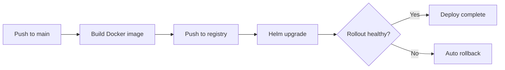

> 💡 **Quick Answer:** Build a complete CI/CD pipeline for Kubernetes with GitHub Actions. Covers Docker build, image push, Helm deploy, and automated rollback on failure.

## The Problem

This is one of the most searched Kubernetes topics. A comprehensive, well-structured guide helps engineers of all levels quickly find actionable solutions.

## The Solution

Detailed implementation with production-ready examples below.


### GitHub Actions CI/CD Pipeline

```yaml
# .github/workflows/deploy.yaml
name: Build and Deploy to Kubernetes

on:
  push:
    branches: [main]

env:
  REGISTRY: ghcr.io
  IMAGE_NAME: ${{ github.repository }}

jobs:
  build-and-push:
    runs-on: ubuntu-latest
    permissions:
      contents: read
      packages: write
    steps:
      - uses: actions/checkout@v4
      
      - name: Log in to Container Registry
        uses: docker/login-action@v3
        with:
          registry: ${{ env.REGISTRY }}
          username: ${{ github.actor }}
          password: ${{ secrets.GITHUB_TOKEN }}
      
      - name: Build and push Docker image
        uses: docker/build-push-action@v5
        with:
          context: .
          push: true
          tags: |
            ${{ env.REGISTRY }}/${{ env.IMAGE_NAME }}:${{ github.sha }}
            ${{ env.REGISTRY }}/${{ env.IMAGE_NAME }}:latest

  deploy:
    needs: build-and-push
    runs-on: ubuntu-latest
    steps:
      - uses: actions/checkout@v4
      
      - name: Set up kubectl
        uses: azure/setup-kubectl@v3
      
      - name: Set up kubeconfig
        run: |
          mkdir -p $HOME/.kube
          echo "${{ secrets.KUBECONFIG }}" | base64 -d > $HOME/.kube/config
      
      - name: Deploy with Helm
        run: |
          helm upgrade --install my-app ./charts/my-app \
            --namespace production \
            --set image.tag=${{ github.sha }} \
            --wait --timeout 5m
      
      - name: Verify deployment
        run: |
          kubectl rollout status deployment/my-app -n production --timeout=300s
      
      - name: Rollback on failure
        if: failure()
        run: |
          helm rollback my-app -n production
```

### Pipeline Stages



## Frequently Asked Questions

### How do I store kubeconfig securely?

Base64-encode your kubeconfig and store it as a GitHub secret. For production, use OIDC federation with your cloud provider (no static credentials).

## Common Issues

Check `kubectl describe` and `kubectl get events` first — most issues have clear error messages pointing to the root cause.

## Best Practices

- **Follow least privilege** — only grant the access that's needed
- **Test in staging** before applying to production
- **Monitor and alert** on key metrics
- **Document your runbooks** for the team

## Key Takeaways

- Essential knowledge for Kubernetes operations
- Start simple and evolve your approach
- Automation reduces human error
- Share knowledge with your team
