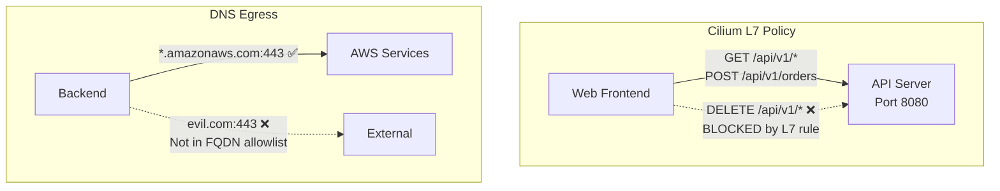

> 💡 **Quick Answer:** Use `CiliumNetworkPolicy` for L7-aware rules that filter on HTTP methods, paths, and headers — not just L3/L4 ports. Enable DNS-based egress policies to allow traffic to `*.amazonaws.com` without hardcoding IP ranges. Use `CiliumClusterwideNetworkPolicy` for cluster-wide defaults.

## The Problem

Standard Kubernetes NetworkPolicy operates at L3/L4 only — you can allow port 443 but can't distinguish between `GET /api/read` and `DELETE /api/data`. Cilium's eBPF-based policies add L7 visibility, DNS-aware rules, and identity-based security that goes beyond IP addresses.

## The Solution

### L7 HTTP-Aware Policy

```yaml
apiVersion: cilium.io/v2
kind: CiliumNetworkPolicy
metadata:
  name: api-l7-policy
  namespace: production
spec:
  endpointSelector:
    matchLabels:
      app: api-server
  ingress:
    - fromEndpoints:
        - matchLabels:
            app: web-frontend
      toPorts:
        - ports:
            - port: "8080"
              protocol: TCP
          rules:
            http:
              - method: GET
                path: "/api/v1/.*"
              - method: POST
                path: "/api/v1/orders"
                headers:
                  - 'Content-Type: application/json'
```

Only allows GET on `/api/v1/*` and POST on `/api/v1/orders` with JSON content type.

### DNS-Based Egress

```yaml
apiVersion: cilium.io/v2
kind: CiliumNetworkPolicy
metadata:
  name: allow-aws-egress
spec:
  endpointSelector:
    matchLabels:
      app: backend
  egress:
    - toFQDNs:
        - matchPattern: "*.amazonaws.com"
        - matchPattern: "*.s3.amazonaws.com"
      toPorts:
        - ports:
            - port: "443"
    - toEndpoints:
        - matchLabels:
            k8s:io.kubernetes.pod.namespace: kube-system
            k8s-app: kube-dns
      toPorts:
        - ports:
            - port: "53"
              protocol: UDP
```

### Cluster-Wide Default Deny

```yaml
apiVersion: cilium.io/v2
kind: CiliumClusterwideNetworkPolicy
metadata:
  name: default-deny-all
spec:
  endpointSelector: {}
  ingress:
    - fromEndpoints:
        - matchLabels:
            reserved:host: ""
  egress:
    - toEndpoints:
        - matchLabels:
            k8s:io.kubernetes.pod.namespace: kube-system
      toPorts:
        - ports:
            - port: "53"
              protocol: UDP
```

### Troubleshooting

```bash
# Check policy status
cilium endpoint list
cilium policy get

# Monitor dropped traffic
cilium monitor --type drop

# Hubble observability
hubble observe --namespace production --verdict DROPPED
```



## Common Issues

**DNS-based policy not working — all egress blocked**

You must allow egress to kube-dns (port 53) for FQDN rules to work. Cilium needs DNS responses to learn IP-to-FQDN mappings.

**L7 policy causing high latency**

L7 inspection adds 1-2ms per request. Use L7 policies only where needed (sensitive APIs). Use L3/L4 for bulk traffic.

## Best Practices

- **L7 policies for sensitive APIs only** — adds latency overhead
- **DNS egress over IP-based** — IPs change, FQDNs don't
- **Always allow DNS egress** — required for FQDN-based policies to function
- **CiliumClusterwideNetworkPolicy for defaults** — default-deny at cluster level
- **Hubble for visibility** — monitor dropped traffic before enforcing policies

## Key Takeaways

- Cilium extends Kubernetes NetworkPolicy with L7 HTTP awareness and DNS-based rules
- Filter on HTTP methods, paths, and headers — not just ports
- DNS-based egress policies adapt to IP changes automatically
- CiliumClusterwideNetworkPolicy applies default deny across all namespaces
- Hubble provides real-time visibility into allowed and dropped traffic
