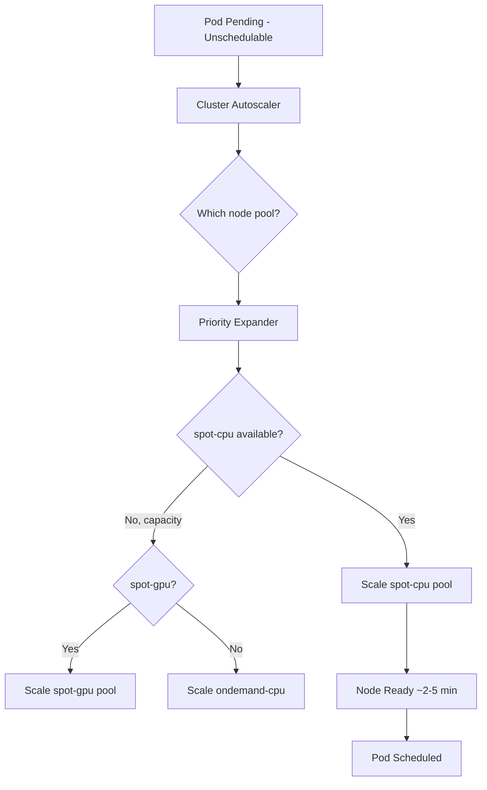

> 💡 **Quick Answer:** Fine-tune the Kubernetes Cluster Autoscaler with expanders, priority-based scaling, mixed instance policies, and GPU node pool autoscaling for production clusters.

## The Problem

The default Cluster Autoscaler config works for simple cases but falls apart in production: GPU nodes scale too aggressively, spot instances aren't preferred over on-demand, and the autoscaler picks the wrong node pool when multiple can satisfy a pending pod. Advanced tuning of expanders, priorities, and timing is essential.

## The Solution

### Expander Strategies

```yaml
# Cluster Autoscaler Deployment with priority expander
apiVersion: apps/v1
kind: Deployment
metadata:
  name: cluster-autoscaler
  namespace: kube-system
spec:
  template:
    spec:
      containers:
        - name: cluster-autoscaler
          image: registry.k8s.io/autoscaling/cluster-autoscaler:v1.30.0
          command:
            - ./cluster-autoscaler
            - --v=4
            - --cloud-provider=aws
            - --expander=priority          # Use priority-based expansion
            - --scale-down-enabled=true
            - --scale-down-delay-after-add=10m
            - --scale-down-delay-after-delete=1m
            - --scale-down-unneeded-time=10m
            - --scale-down-utilization-threshold=0.5
            - --skip-nodes-with-local-storage=false
            - --skip-nodes-with-system-pods=true
            - --balance-similar-node-groups=true
            - --max-node-provision-time=15m
            - --max-graceful-termination-sec=600
            - --max-total-unready-percentage=45
            - --ok-total-unready-count=3
```

### Priority Expander Configuration

```yaml
apiVersion: v1
kind: ConfigMap
metadata:
  name: cluster-autoscaler-priority-expander
  namespace: kube-system
data:
  priorities: |-
    100:
      - spot-cpu-pool          # Highest priority: cheap spot instances
    80:
      - spot-gpu-pool          # Second: spot GPU nodes
    50:
      - ondemand-cpu-pool      # Fallback: on-demand CPU
    30:
      - ondemand-gpu-pool      # Expensive: on-demand GPU
    10:
      - high-memory-pool       # Last resort: specialized nodes
```

### GPU Node Pool Autoscaling

```yaml
# AWS EKS managed node group with GPU
apiVersion: eksctl.io/v1alpha5
kind: ClusterConfig
metadata:
  name: ml-cluster
  region: us-east-1

managedNodeGroups:
  - name: gpu-spot
    instanceTypes:
      - g5.xlarge
      - g5.2xlarge
      - g4dn.xlarge
    spot: true
    minSize: 0                # Scale to zero when no GPU workloads
    maxSize: 20
    desiredCapacity: 0
    labels:
      node-type: gpu
      nvidia.com/gpu.present: "true"
    taints:
      - key: nvidia.com/gpu
        value: "true"
        effect: NoSchedule
    tags:
      k8s.io/cluster-autoscaler/enabled: "true"
      k8s.io/cluster-autoscaler/ml-cluster: "owned"
      k8s.io/cluster-autoscaler/node-template/label/nvidia.com/gpu.present: "true"
      k8s.io/cluster-autoscaler/node-template/taint/nvidia.com/gpu: "true:NoSchedule"
      k8s.io/cluster-autoscaler/node-template/resources/nvidia.com/gpu: "1"

  - name: cpu-spot
    instanceTypes:
      - m6i.xlarge
      - m6i.2xlarge
      - m5.xlarge
      - m5.2xlarge
    spot: true
    minSize: 2
    maxSize: 50
    labels:
      node-type: cpu
    tags:
      k8s.io/cluster-autoscaler/enabled: "true"
```

### Scale-Down Tuning

```bash
# Key scale-down parameters explained:
# --scale-down-delay-after-add=10m     Wait 10 min after adding a node before considering scale-down
# --scale-down-delay-after-delete=1m   Wait 1 min after removing a node
# --scale-down-unneeded-time=10m       Node must be unneeded for 10 min before removal
# --scale-down-utilization-threshold=0.5  Node is "unneeded" if utilization < 50%

# For GPU nodes — more conservative (GPU startup is slow)
# Use annotations on node groups:
kubectl annotate node gpu-node-1 \
  cluster-autoscaler.kubernetes.io/scale-down-disabled=true   # Never auto-remove this node

# Pod Disruption Budgets protect critical workloads during scale-down
```

```yaml
apiVersion: policy/v1
kind: PodDisruptionBudget
metadata:
  name: training-pdb
spec:
  minAvailable: 1
  selector:
    matchLabels:
      app: ml-training
```

### Mixed Instance Policy (Cost Optimization)

```yaml
# AWS Auto Scaling Group with mixed instances
# Prefer cheapest instance that fits the workload
apiVersion: eksctl.io/v1alpha5
kind: ClusterConfig

managedNodeGroups:
  - name: general-mixed
    instanceTypes:
      - m6i.xlarge       # Primary
      - m6i.2xlarge      # Larger fallback
      - m5.xlarge        # Previous gen (cheaper)
      - m5a.xlarge       # AMD (cheapest)
      - c6i.xlarge       # Compute-optimized alternative
    spot: true
    minSize: 3
    maxSize: 100
    instanceSelector:
      cpuArchitecture: x86_64
      vCpusMin: 4
      vCpusMax: 8
      memoryMiBMin: 8192
```

### Monitoring Autoscaler Health

```yaml
apiVersion: v1
kind: ServiceMonitor
metadata:
  name: cluster-autoscaler
  namespace: monitoring
spec:
  selector:
    matchLabels:
      app: cluster-autoscaler
  endpoints:
    - port: metrics
      interval: 30s
```

```promql
# Key metrics to watch
cluster_autoscaler_unschedulable_pods_count          # Pods waiting for nodes
cluster_autoscaler_nodes_count                       # Current node count
cluster_autoscaler_scaled_up_nodes_total             # Scale-up events
cluster_autoscaler_scaled_down_nodes_total           # Scale-down events
cluster_autoscaler_function_duration_seconds          # Autoscaler loop time
cluster_autoscaler_last_activity                      # Last scaling activity
```



## Common Issues

| Issue | Cause | Fix |
|-------|-------|-----|
| Nodes not scaling up | Missing ASG tags | Add `k8s.io/cluster-autoscaler/enabled` tag |
| GPU nodes never scale to zero | System pods on GPU nodes | Add `skipNodesWithSystemPods=false` or use taints |
| Wrong node pool selected | Default random expander | Switch to priority expander |
| Scale-down too aggressive | Low utilization threshold | Increase to 0.6-0.7 |
| Spot interruption chaos | No fallback to on-demand | Use priority expander with on-demand fallback |

## Best Practices

- Use **priority expander** in production — random/least-waste are unpredictable
- Set **GPU node pools to minSize: 0** with taints — only scale when GPU workloads arrive
- Enable **balance-similar-node-groups** for even distribution across AZs
- Set **PodDisruptionBudgets** on all stateful workloads before enabling scale-down
- Monitor **unschedulable_pods_count** — if always >0, autoscaler may be stuck
- Use **spot instances** for fault-tolerant workloads, on-demand for databases/stateful

## Key Takeaways

- Priority expander gives you control over which node pool scales first
- GPU node autoscaling requires proper taints, tags, and resource templates
- Scale-down tuning prevents thrashing — 10-minute delays are a good default
- Mixed instance types with spot reduce costs 60-70% vs on-demand
- Always have an on-demand fallback for critical workloads
