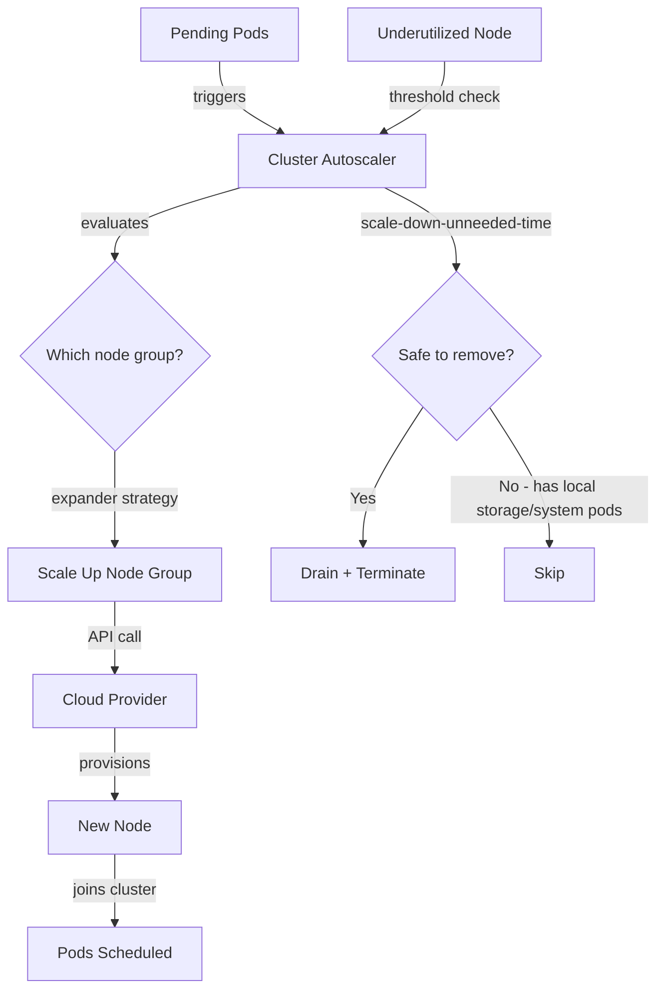

> 💡 **Quick Answer:** Cluster Autoscaler adds nodes when pods are Pending (unschedulable) and removes underutilized nodes after `scale-down-delay-after-add` (default 10m). Configure with `--scale-down-utilization-threshold=0.5`, `--scale-down-unneeded-time=10m`, and node group min/max sizes.

## The Problem

- Pods stuck in Pending because no node has enough resources
- Paying for idle nodes during off-peak hours
- GPU nodes sitting empty but too expensive to keep
- Scale-down too aggressive (kills nodes during brief dips)
- Scale-up too slow (pods wait minutes for new nodes)

## The Solution

### Core Configuration Flags

```yaml
apiVersion: apps/v1
kind: Deployment
metadata:
  name: cluster-autoscaler
  namespace: kube-system
spec:
  template:
    spec:
      containers:
        - name: cluster-autoscaler
          image: registry.k8s.io/autoscaling/cluster-autoscaler:v1.30.1
          command:
            - ./cluster-autoscaler
            - --v=4
            - --cloud-provider=aws
            # Scale-up settings
            - --scan-interval=10s
            - --max-node-provision-time=15m
            # Scale-down settings
            - --scale-down-enabled=true
            - --scale-down-delay-after-add=10m
            - --scale-down-delay-after-delete=0s
            - --scale-down-delay-after-failure=3m
            - --scale-down-unneeded-time=10m
            - --scale-down-utilization-threshold=0.5
            # Node group discovery
            - --node-group-auto-discovery=asg:tag=k8s.io/cluster-autoscaler/enabled,k8s.io/cluster-autoscaler/my-cluster
            # Expander (how to choose which node group to scale)
            - --expander=least-waste
            # Safety
            - --skip-nodes-with-local-storage=false
            - --skip-nodes-with-system-pods=true
            - --balance-similar-node-groups=true
            - --max-graceful-termination-sec=600
```

### Key Parameters Explained

| Parameter | Default | Description |
|-----------|---------|-------------|
| `scale-down-delay-after-add` | 10m | Wait before scale-down after adding a node |
| `scale-down-unneeded-time` | 10m | Node must be underutilized this long before removal |
| `scale-down-utilization-threshold` | 0.5 | Node utilization below this = candidate for removal |
| `scan-interval` | 10s | How often to check for pending pods |
| `max-node-provision-time` | 15m | Max wait for node to become ready |
| `expander` | random | Strategy: random, most-pods, least-waste, priority |

### EKS Configuration

```bash
# EKS managed node group (auto-discovered)
eksctl create nodegroup \
  --cluster my-cluster \
  --name general \
  --node-type m5.xlarge \
  --nodes-min 2 \
  --nodes-max 20 \
  --asg-access

# GPU node group
eksctl create nodegroup \
  --cluster my-cluster \
  --name gpu-workers \
  --node-type p3.2xlarge \
  --nodes-min 0 \
  --nodes-max 8 \
  --asg-access
```

```yaml
# EKS Helm values
autoDiscovery:
  clusterName: my-cluster
  tags:
    - k8s.io/cluster-autoscaler/enabled
    - k8s.io/cluster-autoscaler/my-cluster
awsRegion: us-east-1
extraArgs:
  scale-down-delay-after-add: 10m
  scale-down-utilization-threshold: "0.5"
  skip-nodes-with-local-storage: "false"
  expander: least-waste
```

### GKE Configuration

```bash
# GKE has built-in autoscaling (no separate deployment needed)
gcloud container clusters update my-cluster \
  --enable-autoscaling \
  --min-nodes=2 \
  --max-nodes=20 \
  --node-pool=default-pool

# Per-node-pool settings
gcloud container node-pools update gpu-pool \
  --cluster=my-cluster \
  --enable-autoscaling \
  --min-nodes=0 \
  --max-nodes=8 \
  --location-policy=ANY

# Autoscaling profile
gcloud container clusters update my-cluster \
  --autoscaling-profile=optimize-utilization  # More aggressive scale-down
```

### Priority Expander (GPU workloads)

```yaml
# Choose which node group scales up first
apiVersion: v1
kind: ConfigMap
metadata:
  name: cluster-autoscaler-priority-expander
  namespace: kube-system
data:
  priorities: |-
    50:
      - .*gpu.*           # GPU nodes are expensive — lowest priority
    100:
      - .*spot.*          # Try spot instances first
    200:
      - .*general.*       # General purpose — default choice
```

### Scale-to-Zero for GPU Nodes

```yaml
# Node group with min=0 for expensive GPU instances
# Cluster Autoscaler scales to 0 when no GPU pods are pending
# Requires: GPU node group with proper taints

# Taint GPU nodes so only GPU workloads land there
# k8s.io/cluster-autoscaler/node-template/taint/nvidia.com/gpu=:NoSchedule
```

### Annotations for Scale-Down Protection

```bash
# Prevent a specific node from being scaled down
kubectl annotate node worker-5 "cluster-autoscaler.kubernetes.io/scale-down-disabled=true"

# Safe-to-evict annotation on pods
# Prevents node scale-down if this pod is running
kubectl annotate pod important-job "cluster-autoscaler.kubernetes.io/safe-to-evict=false"
```

### Architecture



## Common Issues

| Issue | Cause | Fix |
|-------|-------|-----|
| Pods pending but no scale-up | Node group at max | Increase `--nodes-max` |
| Scale-down not happening | `scale-down-delay-after-add` too long | Reduce to 5m for dev clusters |
| Wrong node type scales up | Random expander | Use `least-waste` or `priority` expander |
| Node takes >15min to join | Slow AMI/image pull | Increase `max-node-provision-time` |
| GPU nodes never scale to 0 | DaemonSet pods prevent removal | Add `safe-to-evict=true` to DaemonSet pods |
| Flapping (scale up → down → up) | threshold too aggressive | Increase `scale-down-unneeded-time` to 15m |

## Best Practices

1. **Set `scale-down-delay-after-add: 10m`** — prevents immediate scale-down after scale-up
2. **Use `least-waste` expander** — picks the node group that wastes least resources
3. **Scale GPU nodes to zero** — taint + min=0 saves significant cost
4. **Set `balance-similar-node-groups=true`** — spreads across AZs
5. **Use PodDisruptionBudgets** — control how many pods can be evicted during scale-down

## Key Takeaways

- Scale-up triggers on Pending pods; scale-down triggers on underutilization (<50% by default)
- `scale-down-delay-after-add` (10m default) prevents thrashing after node addition
- Use `priority` expander for cost-optimized node group selection (spot → on-demand → GPU)
- GKE has native autoscaling; EKS/AKS need the Cluster Autoscaler deployment
- Scale-to-zero GPU nodes with taints + `min: 0` to avoid idle GPU costs
